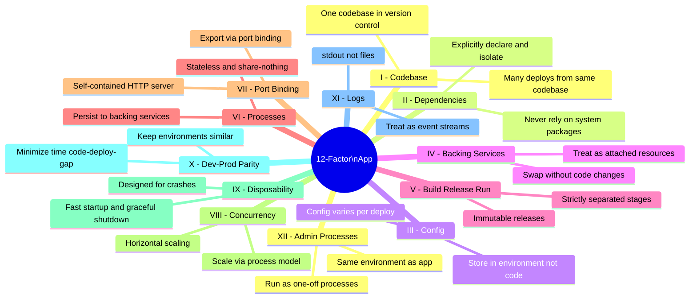
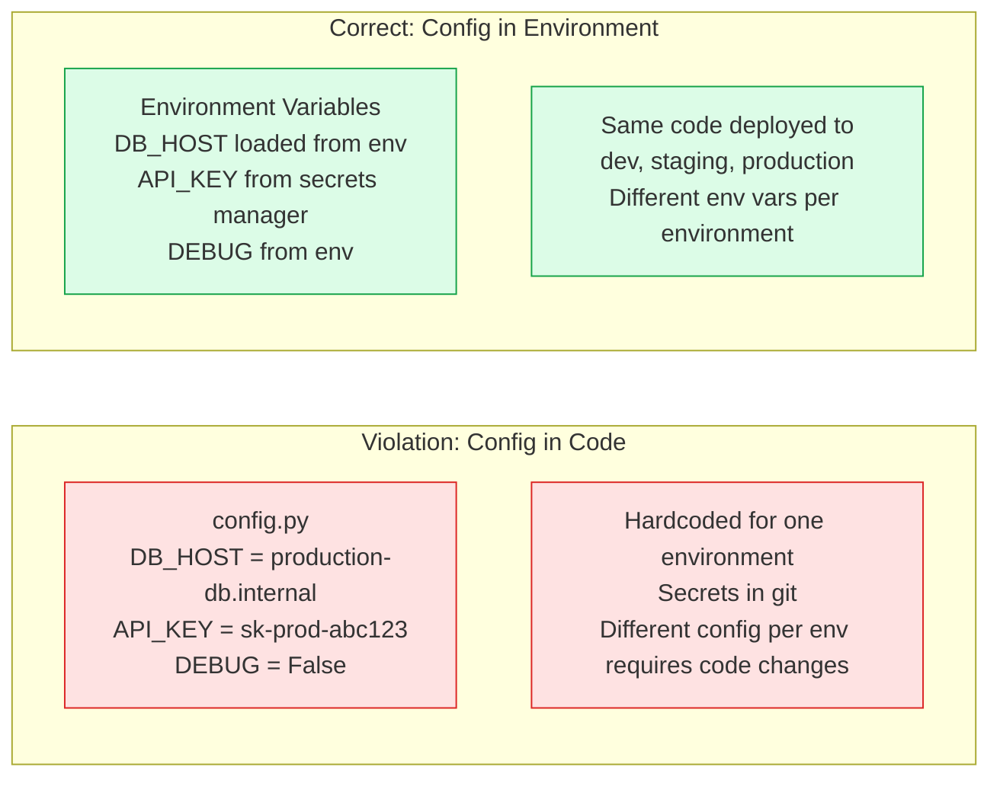
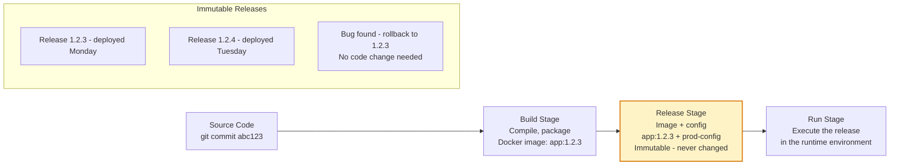
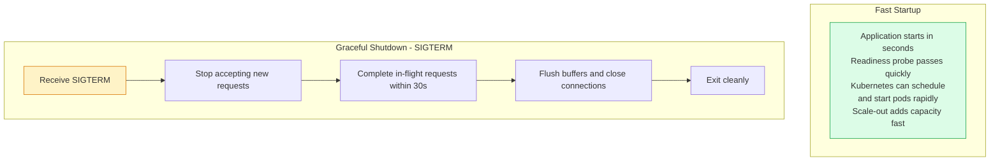

# The Twelve-Factor App

The Twelve-Factor App is a methodology for building software-as-a-service applications that are portable, scalable, and maintainable. Formalized by Heroku engineers based on patterns from deploying thousands of applications, these twelve factors remain the canonical guide for cloud-native application design.

## The Twelve Factors

## Config Management (Factor III)

## Build-Release-Run (Factor V)

## Disposability (Factor IX)

## Key Concepts

- **I. Codebase**: One codebase per application tracked in version control. Multiple deploys (dev, staging, prod) come from the same codebase. Different apps are different codebases, with shared code extracted into libraries.

- **II. Dependencies**: All dependencies must be explicitly declared in a dependency manifest (requirements.txt, package.json, go.mod) and never rely on implicit system-level packages. Dependency isolation (virtualenv, node_modules) ensures the declared dependencies are the actual runtime dependencies.

- **III. Config**: Any configuration that varies between deploys (database URLs, API keys, feature flags) must be stored in environment variables, not in code. The test: could the codebase be made public without compromising credentials? Config-in-code fails this test.

- **IV. Backing Services**: Treat all backing services (databases, caches, message brokers, email services) as attached resources, accessible via URL in config. Swap a local Postgres for an RDS instance without code changes — only the config URL changes.

- **V. Build, Release, Run**: Strictly separate the build stage (compile code), release stage (combine build with config into an immutable release), and run stage (execute the release). Immutable releases enable rollback — redeploy a previous release.

- **VI. Processes**: Applications execute as stateless, share-nothing processes. State is externalised to backing services (databases, caches). This enables horizontal scaling — any process can handle any request.

- **XI. Logs**: Applications should write logs to stdout as an event stream without managing log files or log rotation. The execution environment (Docker, Kubernetes) captures stdout and routes it to the appropriate log aggregator.

- **XII. Admin Processes**: Database migrations, one-time scripts, and admin tasks run as one-off processes in the same environment as the application (same release, same config). Never run admin tasks on production machines with a different environment than the app.

## Trade-offs

| Factor | Benefit | Requirement |
|--------|---------|-------------|
| Config in env vars | One codebase for all envs | Env var management infrastructure |
| Stateless processes | Trivial horizontal scaling | External state stores |
| Immutable releases | Instant rollback | Artifact storage, registry |
| Logs as stdout | No log management in app | Log aggregation infrastructure |

## When to Apply

- Apply all twelve factors to new applications from day one
- Retroactively applying to existing apps: start with Factor III (config) and Factor VI (stateless) as they have the highest ROI for cloud deployment
- Factor XI (logs as stdout) is immediately beneficial for containerized applications
