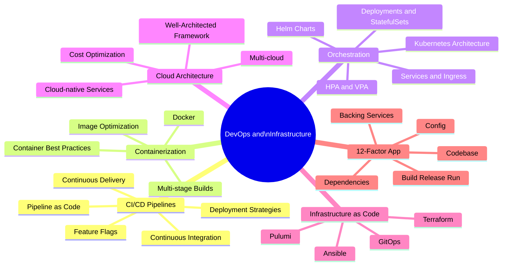

# DevOps and Infrastructure

DevOps bridges the gap between software development and operations by automating the delivery pipeline, standardizing infrastructure through code, and fostering a culture of shared responsibility for production systems. Modern DevOps practices dramatically accelerate the feedback loop from code commit to production.

## Overview

## Topics in This Section

| File | Topic | Key Concepts |
|------|-------|--------------|
| [01_cicd_pipelines.md](01_cicd_pipelines.md) | CI/CD Pipelines | Pipeline design, deployment strategies, feature flags |
| [02_containerization_orchestration.md](02_containerization_orchestration.md) | Containers & K8s | Docker, Kubernetes, HPA, Helm |
| [03_cloud_architecture.md](03_cloud_architecture.md) | Cloud Architecture | Multi-cloud, cloud-native, cost optimization |
| [04_iac.md](04_iac.md) | Infrastructure as Code | Terraform, Pulumi, GitOps |
| [05_twelve_factor_app.md](05_twelve_factor_app.md) | 12-Factor App | Portable, scalable application design |
