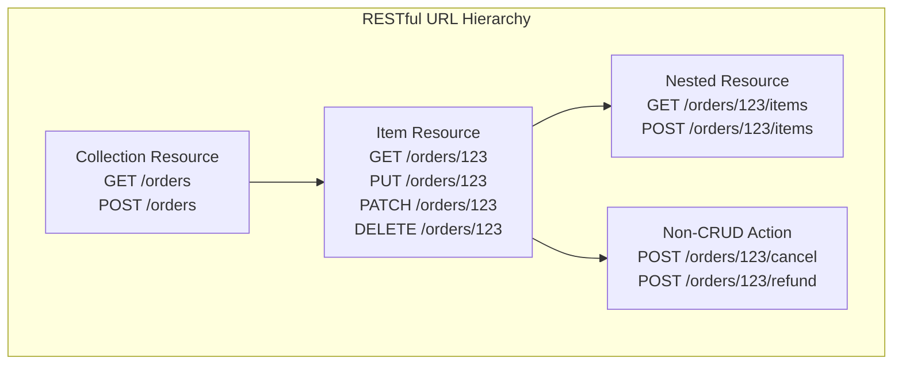
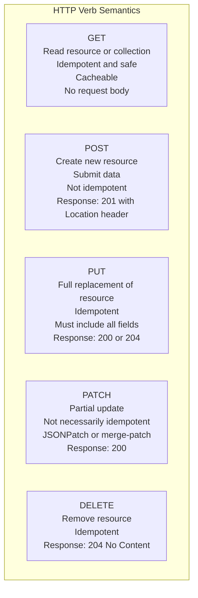
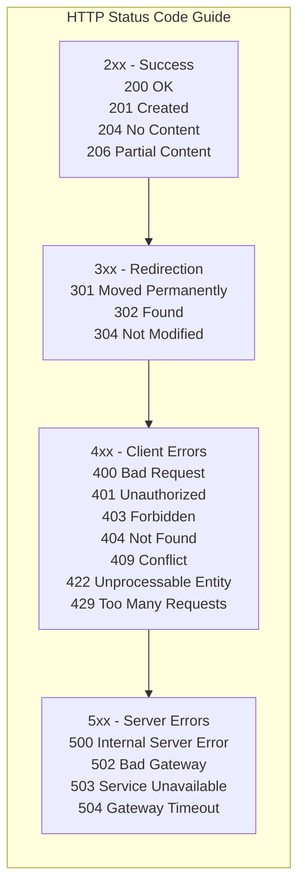
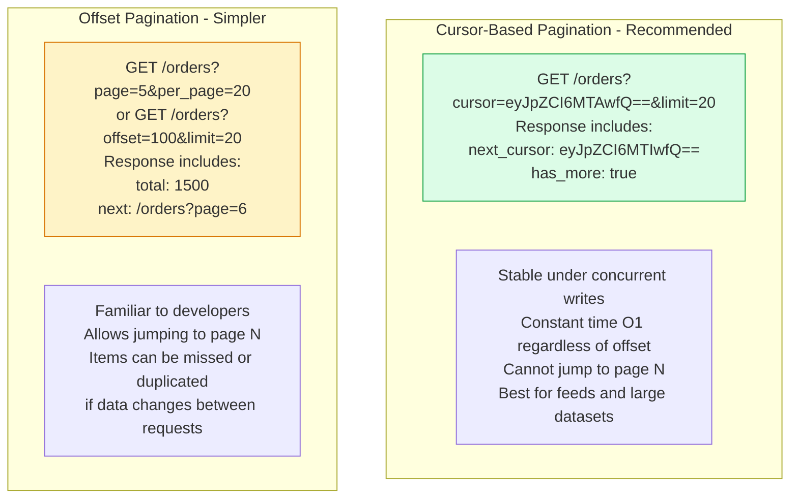

REST (Representational State Transfer) is the dominant architectural style for public and internal HTTP APIs. A well-designed REST API is resource-oriented, uses HTTP conventions correctly, and is consistent enough that clients can predict how to interact with new endpoints.

## Resource Hierarchy and URL Design



## HTTP Verbs and Semantics



## HTTP Status Codes



## API Versioning Strategies

```mermaid
graph TD
    subgraph URLPath[URL Path Versioning]
        UP[/v1/orders\n/v2/orders\nMost common\nEasiest to test and debug\nVersion in URL is explicit]
        style UP fill:#dcfce7,stroke:#16a34a
    end

    subgraph Header[Header Versioning]
        H[Accept: application/vnd.api+json;version=2\nCleaner URLs\nHarder to test in browser\nHidden version]
        style H fill:#dbeafe,stroke:#2563eb
    end

    subgraph QueryParam[Query Parameter]
        QP[/orders?version=2\nEasy to default\nOften discouraged]
        style QP fill:#fef3c7,stroke:#d97706
    end

    subgraph Strategy[Versioning Strategy]
        S1[Never break existing consumers]
        S2[Add fields - backward compatible]
        S3[Remove fields - require major version bump]
        S4[Change field semantics - require major version bump]
        S5[Support N and N-1 versions simultaneously]
    end
```

## Pagination Design



## Key Concepts

- **Resource Naming**: Use nouns, not verbs, for URLs. Resources should be plural: `/users`, `/orders`, `/products`. Sub-resources express hierarchy: `/orders/123/items`. Actions that don't fit CRUD use POST with a verb-noun URL: `POST /orders/123/cancel`.

- **Idempotency**: GET, PUT, and DELETE are idempotent — calling them multiple times produces the same result. POST is not idempotent — repeated calls create multiple resources. Use idempotency keys (client-provided unique ID per request) to make POST safely retryable.

- **HATEOAS**: Hypermedia as the Engine of Application State — responses include links to related actions and resources. Enables client-driven navigation without prior knowledge of URL structure. Rarely implemented in practice due to complexity.

- **API Versioning**: Breaking changes require a new major version. Breaking changes include: removing or renaming fields, changing field types, changing semantics of existing fields. Non-breaking changes (adding optional fields, adding new endpoints) can be deployed to existing versions.

- **Pagination**: Use cursor-based pagination for large, frequently changing datasets (social media feeds). Use offset pagination for stable, sortable datasets where users need to jump to arbitrary pages. Always include a `Link` header or `links` object with next/prev/first/last URLs.

- **Error Response Format**: Standardize error responses across all endpoints. Include: HTTP status code, machine-readable error code, human-readable message, and where appropriate, a validation errors array. The RFC 7807 Problem Details format is a widely adopted standard.

- **Content Negotiation**: Support `Accept` header for response format (JSON, XML) and `Accept-Language` for locale. Always default to JSON for REST APIs.

## Trade-offs

| Decision | Benefit | Cost |
|----------|---------|------|
| URL versioning | Explicit, easy to test | Version prefix in all URLs |
| Cursor pagination | Stable, scalable | Cannot jump to page N |
| HATEOAS | Client discovery | Implementation complexity |
| Strict REST | Consistency, tooling | Some workflows don't fit |

## When to Apply

- Strict REST for public APIs — consumers rely on predictability
- Pragmatic REST for internal APIs — prioritize simplicity over purity
- Never change the semantics of existing fields — add new ones instead
- Support the previous major version for at least 12 months after introducing the next