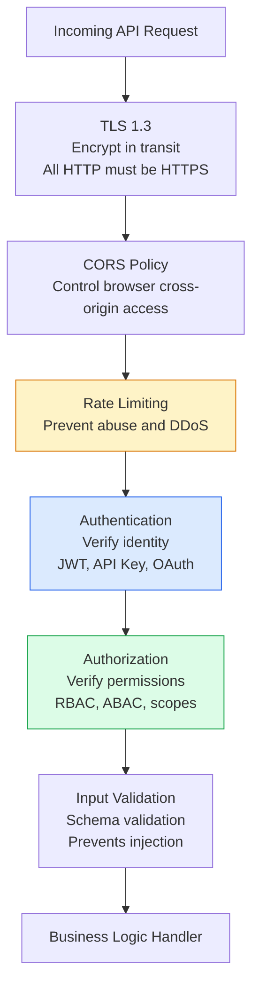
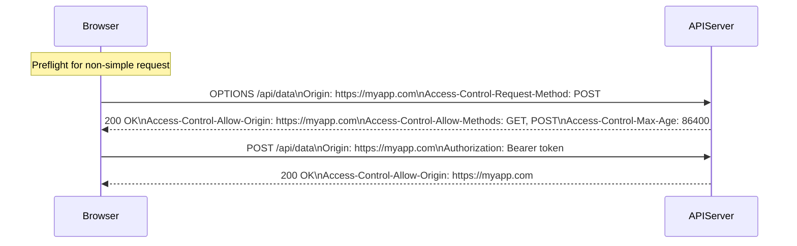
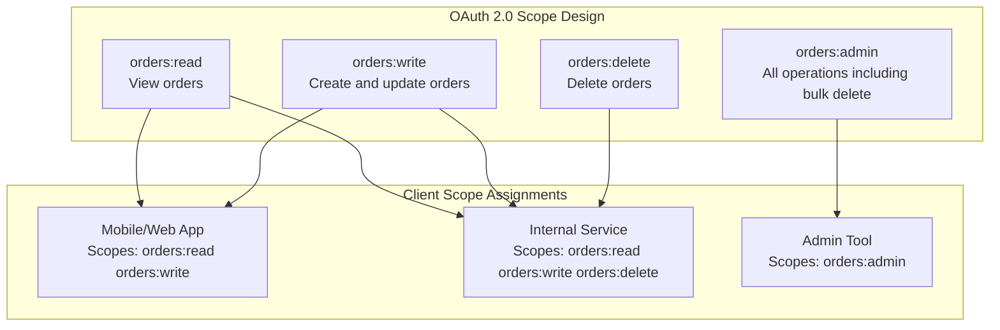
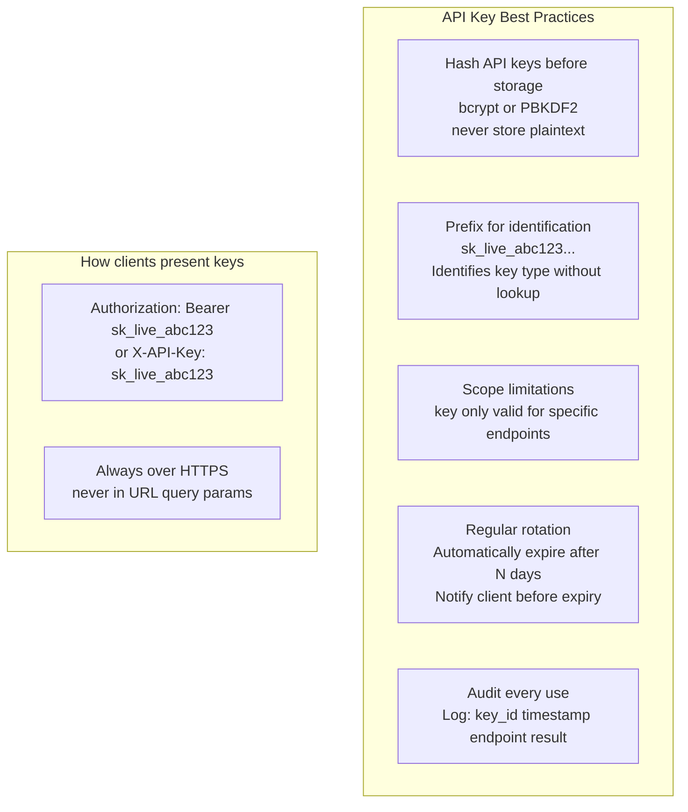

# API Security

API security protects endpoints from unauthorized access, abuse, and attacks. Every public API is a potential attack surface. Security must be implemented at multiple layers — authentication, authorization, input validation, rate limiting, and transport security.

## API Security Layers

## CORS Configuration

## OAuth2 API Authorization Scopes

## API Key Security

## Key Concepts

- **TLS/HTTPS**: All APIs must use TLS — this is non-negotiable. Redirect HTTP to HTTPS with `301`. Use HSTS (HTTP Strict Transport Security) to tell browsers to always use HTTPS. Never transmit API keys, tokens, or sensitive data over HTTP.

- **CORS (Cross-Origin Resource Sharing)**: A browser security mechanism that restricts which origins can make API calls. For APIs consumed by web browsers, configure CORS explicitly. Avoid `Access-Control-Allow-Origin: *` for APIs that accept credentials — specify the exact allowed origins.

- **Input Validation**: Validate all inputs at the API boundary — type, format, length, and range. Reject invalid inputs immediately with a 400 error and details. Never trust client data. Use JSON Schema or OpenAPI request body validation. This is the primary defense against injection attacks.

- **Rate Limiting**: Apply rate limits to all public API endpoints by client ID or IP. Return `429 Too Many Requests` with `Retry-After` when limits are exceeded. Different endpoints may warrant different limits (bulk operations: lower limits, read operations: higher limits).

- **OAuth 2.0 Scopes**: Define fine-grained permission scopes for your API. Clients request only the scopes they need. Server validates that the token's scopes include the required scope for each endpoint. This enables principle of least privilege at the API level.

- **API Key Management**: Hash API keys before storing them (treat like passwords). Include a human-readable prefix to identify key purpose. Log every API key use. Implement key rotation and expiry. Alert on unusual usage patterns (high error rate, unusual geographic distribution).

- **Security Headers**: Set security headers on all responses: `X-Content-Type-Options: nosniff`, `X-Frame-Options: DENY`, `Content-Security-Policy`, `Strict-Transport-Security`. These protect browser-based consumers from common attacks.

## Trade-offs

| Control | Security | DX Impact |
|---------|---------|-----------|
| Strict CORS | Good | Medium (need domain allowlist) |
| Short token expiry | Good | Higher (more re-authentication) |
| Granular scopes | Good | Medium (more OAuth configuration) |
| Input schema validation | High | Low (returns clear errors) |
| Rate limiting | Medium | Medium (can block legitimate bursts) |

## When to Apply

- TLS: always — zero exceptions
- Input validation: on every API endpoint
- Rate limiting: on all public endpoints before launch
- OAuth scopes: when building multi-tenant APIs with different client permission levels
- API key hashing: before storing any API keys in a database
