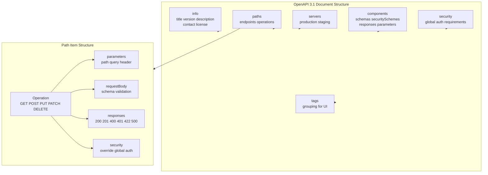
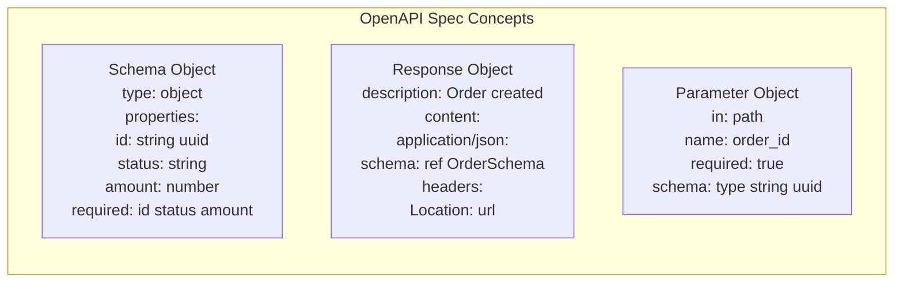
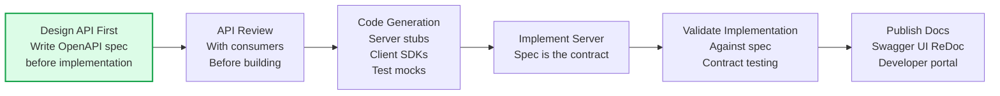
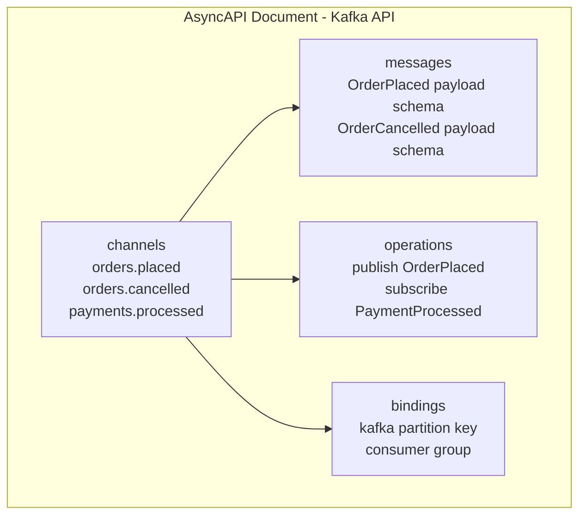

API documentation is the primary interface between API providers and consumers. Good documentation enables developers to integrate quickly without support. The OpenAPI Specification is the industry standard for documenting REST APIs; AsyncAPI covers event-driven APIs.

## OpenAPI Specification Structure

## OpenAPI Example

## Documentation-Driven Development

## AsyncAPI for Event-Driven APIs

## Key Concepts

- **OpenAPI Specification (OAS)**: A language-agnostic standard for describing HTTP APIs. The spec document (YAML or JSON) describes every endpoint, parameter, request body, response schema, and security requirement. Tools generate documentation UIs (Swagger UI, ReDoc), client SDKs, server stubs, and test cases from the spec.

- **Design-First vs. Code-First**: Design-first writes the API spec before implementation, enabling API design review with consumers before engineering effort is committed. Code-first generates the spec from annotations in code — faster to start but risks implementation-shaped API design.

- **API Reference Documentation**: Documents every endpoint: what it does, all parameters, request and response schemas, possible error codes, and example requests/responses. Must be accurate — wrong documentation is worse than no documentation.

- **Getting Started Guide**: A tutorial-style guide that walks a new developer from zero to first successful API call in 15 minutes. Code examples in popular languages (Python, JavaScript, Go, Java). This is often more important than the reference documentation for developer adoption.

- **AsyncAPI**: The OpenAPI equivalent for event-driven and message-based APIs. Describes Kafka topics, AMQP exchanges, WebSocket channels — the messages they carry, their schemas, and the operations (publish/subscribe). Enables generating consumers and producers from the spec.

- **SDK Generation**: OpenAPI specs can be used to generate typed client SDKs (using tools like OpenAPI Generator, Speakeasy, Stainless). SDKs dramatically improve developer experience — instead of constructing raw HTTP requests, developers use idiomatic library calls with type safety.

- **Changelog and Deprecation Policy**: Document every API change. Announce deprecations in the API response via `Sunset` and `Deprecation` headers. Give consumers at least 12 months notice before removing deprecated functionality.

## Trade-offs

| Approach | DX Quality | Engineering Overhead |
|---------|------------|---------------------|
| Design-first | High (reviewed design) | Medium |
| Code-first | Lower (implementation-shaped) | Lower |
| Hand-written docs | Potentially high | High (maintenance) |
| Generated SDK | Very high | Medium (spec quality matters) |
| Interactive docs (Swagger) | High | Low (generated from spec) |

## When to Apply

- Design-first for all public or partner-facing APIs
- Code-first for internal APIs with a single consumer team
- Always publish machine-readable specs (OpenAPI) even for internal APIs — enables contract testing
- Generate SDKs for public APIs with significant developer ecosystems