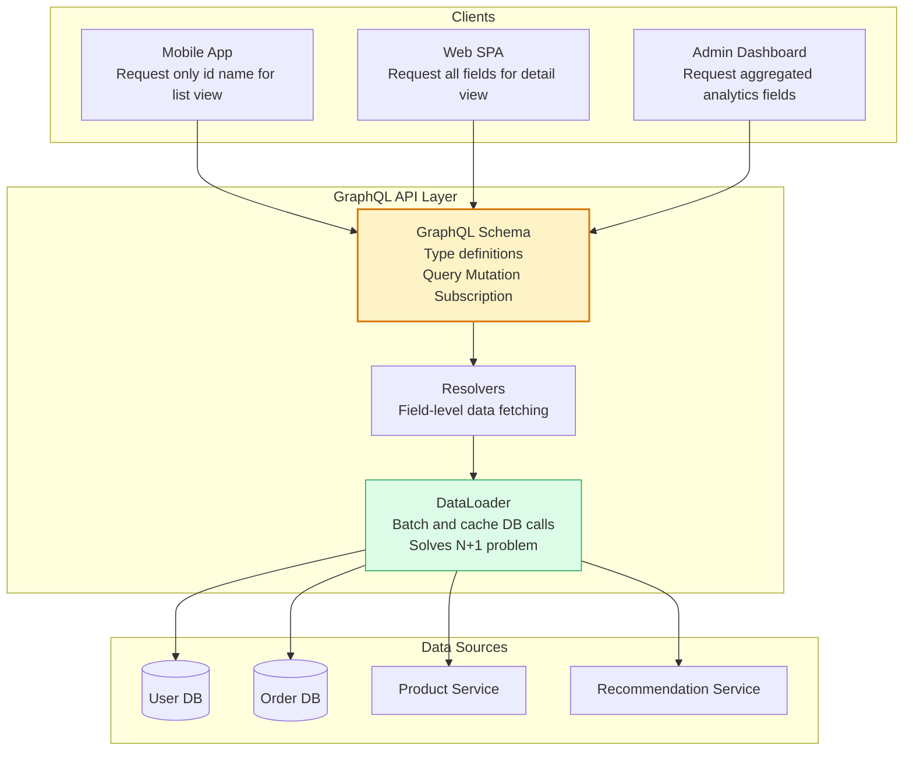
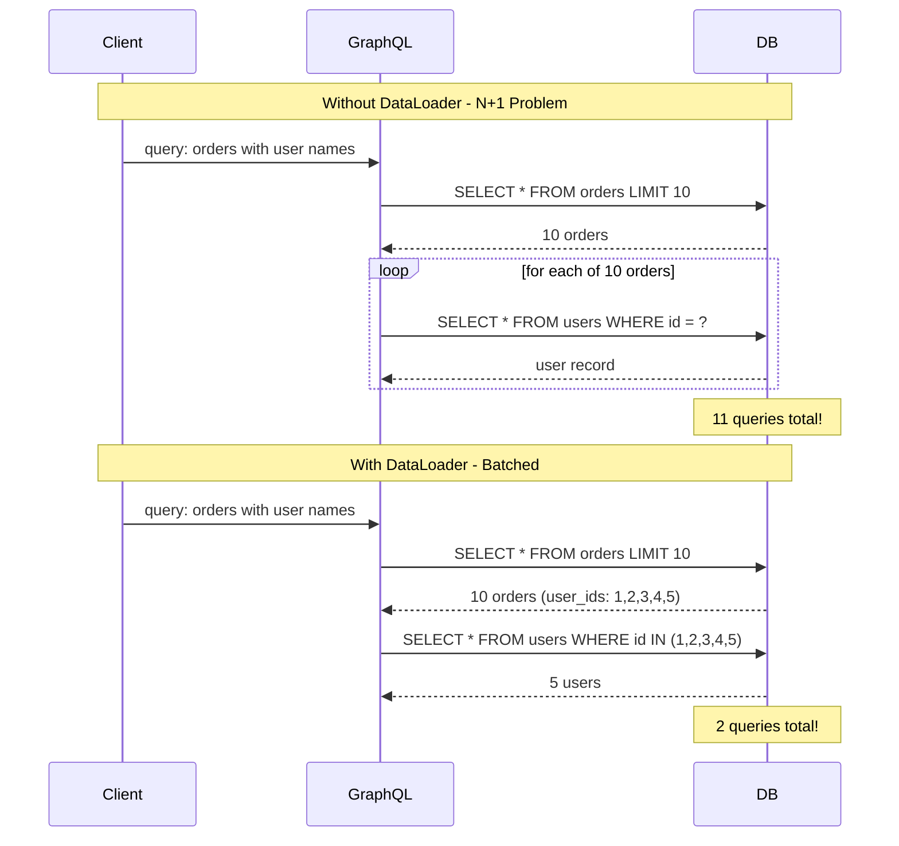
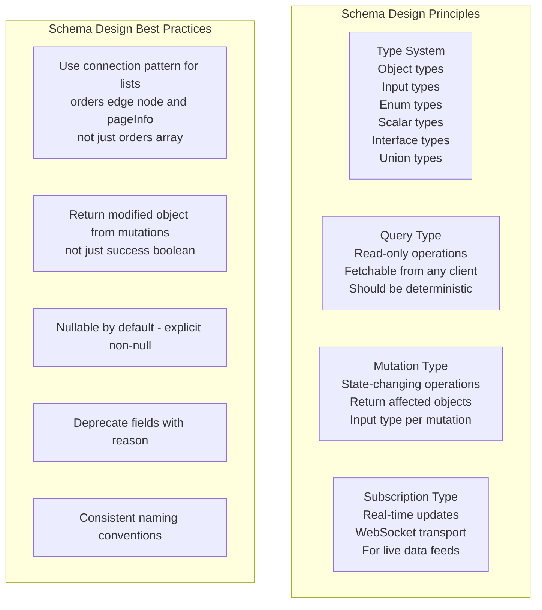
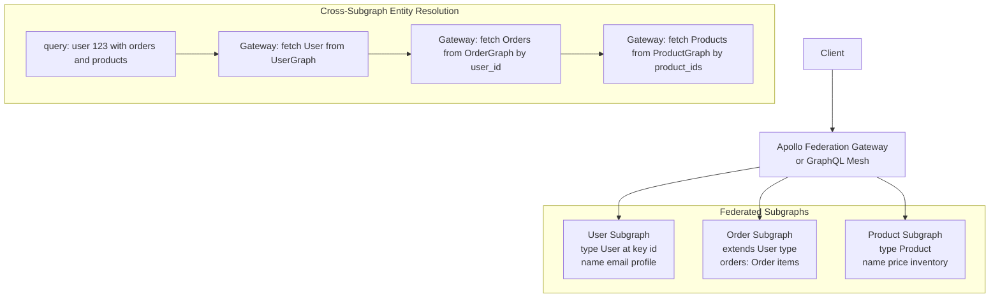

# GraphQL Design

GraphQL is a query language and runtime for APIs that enables clients to request exactly the data they need. Unlike REST (where the server defines what each endpoint returns), GraphQL puts data-fetching control in the client's hands — eliminating over-fetching and under-fetching.

## GraphQL Architecture

## N+1 Problem and DataLoader Solution

## GraphQL Schema Design

## GraphQL Federation

## Key Concepts

- **Schema as Contract**: The GraphQL schema defines the entire API surface — all types, fields, queries, mutations, and subscriptions. It is strongly typed and self-documenting (via introspection). Changes to the schema affect all clients, so schema evolution requires the same care as REST versioning.

- **Resolvers**: Each field in the schema has a resolver function that fetches the data for that field. Resolvers can call databases, microservices, or any data source. Nested resolvers enable composing data from multiple sources in a single query.

- **N+1 Problem**: A common GraphQL performance anti-pattern. When resolving a list of objects, and each object's resolver makes a database call for a related entity, the result is N+1 queries for N items. The DataLoader pattern solves this by batching and deduplicating resolver calls within a single request.

- **DataLoader**: A utility (originally by Facebook) that batches multiple resolver calls in a single tick into one batched data load. All individual "fetch user by ID" calls made during one request are batched into a single "fetch users by IDs" call. Also caches results within the request to avoid duplicate fetches.

- **Mutations and Input Types**: Mutations should use dedicated Input types (not the same types as output objects) to allow separate evolution of write and read contracts. Mutations should return the modified objects so clients can update their caches without additional queries.

- **Federation (Apollo Federation)**: A microservices pattern for GraphQL where each team owns a subgraph (partial schema). A gateway stitches subgraphs into a unified schema. Entities (types with a key) can be extended across subgraphs — the Order subgraph can add `orders` field to the `User` type owned by the User subgraph.

- **Introspection**: GraphQL APIs are self-describing — clients can query the schema itself (`__schema`, `__type` queries). Tools like GraphiQL use introspection to provide autocompletion and documentation. Disable introspection in production for public APIs to limit schema exposure.

## Trade-offs

| Aspect | GraphQL | REST |
|--------|---------|------|
| Client control | High | Low |
| Over/under fetching | Solved | Common |
| Caching | Hard (query-specific) | Easy (HTTP cache) |
| N+1 risk | High | Low |
| Type safety | Built-in | Via OpenAPI |
| Tooling maturity | Growing | Very mature |
| Learning curve | Higher | Lower |

## When to Use

- **GraphQL**: APIs with many diverse clients (mobile, web, partner) with different data needs; complex graph-shaped data; frontend teams that want control over data fetching
- **Avoid**: Simple CRUD APIs, APIs with heavy caching requirements, teams not ready for DataLoader complexity
- **Federation**: When multiple teams own different parts of the graph and need independent deployment
