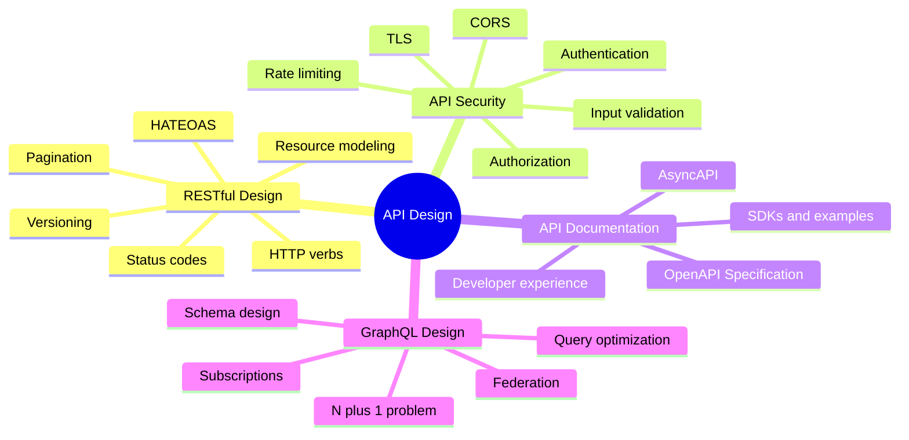

APIs are contracts between systems. A well-designed API is intuitive, stable, secure, and self-documenting. A poorly designed API is a maintenance burden that breaks clients on every change. API design decisions are among the hardest to reverse because they affect all existing consumers.

## Overview

## Topics in This Section

| File | Topic | Key Concepts |
|------|-------|--------------|
| [01_restful_design.md](01_restful_design.md) | RESTful Design | Resources, HTTP verbs, versioning, pagination |
| [02_api_security.md](02_api_security.md) | API Security | AuthN/AuthZ, rate limiting, CORS |
| [03_api_documentation.md](03_api_documentation.md) | API Documentation | OpenAPI, AsyncAPI, developer experience |
| [04_graphql_design.md](04_graphql_design.md) | GraphQL Design | Schema, N+1 problem, federation |