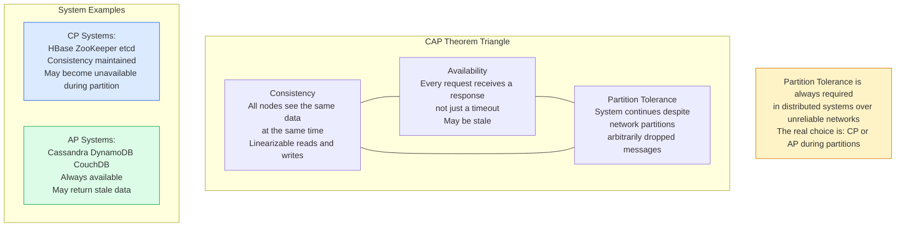
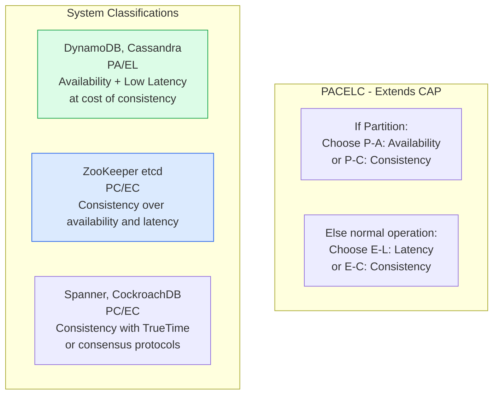
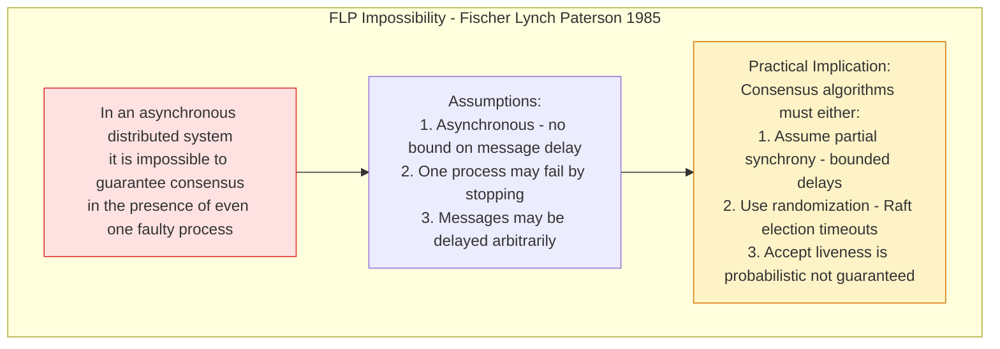

# Fundamental Theorems of Distributed Systems

The fundamental theorems of distributed systems establish the theoretical limits of what is possible in distributed computation. They explain why designing distributed systems requires accepting certain trade-offs that cannot be engineered away.

## CAP Theorem



## PACELC Theorem



## FLP Impossibility



## Two Generals Problem

```mermaid
sequenceDiagram
    participant G1 as General 1
    participant Messenger
    participant G2 as General 2

    G1->>Messenger: Attack at dawn message
    Note over Messenger: Messenger may be captured
    Messenger--xG2: Message lost

    G1->>Messenger: Attack at dawn (retry)
    Messenger->>G2: Attack at dawn
    G2->>Messenger: Acknowledged
    Note over Messenger: Ack may also be lost
    Messenger--xG1: Ack lost

    Note over G1: G1 doesn't know if G2 got message
    Note over G2: G2 doesn't know if G1 knows G2 agreed

    Conclusion[Conclusion: With unreliable communication\nbetween two parties, it is impossible to\nachieve guaranteed common knowledge\nof a shared state through any finite number of messages]
```

## Key Concepts

- **CAP Theorem**: A distributed system can provide at most two of three guarantees: Consistency (all nodes see the same data), Availability (every request gets a non-error response), and Partition Tolerance (system operates despite network partitions). Since partitions are unavoidable in real networks, the practical choice is between CP (consistent but may become unavailable) and AP (always available but may return stale data) during partition events.

- **Nuance in CAP**: CAP is often misapplied. The consistency in CAP is linearizability (a very strong model). Many systems provide weaker consistency (causal, eventual) that don't directly map to CAP. CAP also applies only during a network partition — most of the time, systems operate without partitions and can optimize for both consistency and availability.

- **PACELC Theorem**: Extends CAP by explicitly considering the latency-consistency trade-off during normal (non-partition) operation. Most distributed systems sacrifice some consistency for lower latency even when there are no network partitions — this trade-off is invisible in the CAP framework.

- **FLP Impossibility**: In a purely asynchronous system (no bounds on message delay), no consensus protocol can guarantee termination (liveness) in the presence of even a single process failure. This is why practical consensus algorithms (Raft, Paxos) assume partial synchrony — message delays are bounded but unknown.

- **Two Generals Problem**: Demonstrates that achieving common knowledge (both parties knowing that both parties know a fact) over an unreliable channel requires infinite messages — it is provably impossible. This is the theoretical basis for why distributed commit protocols (2PC) cannot guarantee atomicity under all failure scenarios.

- **Byzantine Generals Problem**: Extends Two Generals to a multi-party scenario where some parties may be actively malicious (sending false messages), not just silent. Byzantine Fault Tolerance (BFT) consensus requires 3f+1 nodes to tolerate f malicious nodes. Used in blockchain systems; too expensive for most distributed databases.

## Trade-offs

The theorems don't describe trade-offs — they describe impossibilities. The designer's job is to choose which property to sacrifice during the specific failure modes their system encounters, and ensure those choices align with business requirements.

| System Property Sacrificed | When | Example |
|---------------------------|------|---------|
| Consistency during partition | Partition occurs | Cassandra returns stale data |
| Availability during partition | Partition occurs | ZooKeeper rejects requests |
| Latency for consistency | Normal operation | Raft requires quorum acknowledgment |
| Consistency for latency | Normal operation | DynamoDB eventually consistent reads |

## When to Apply

- Use CAP/PACELC when choosing between databases and distributed systems — they tell you what the system promises under failure
- Understand that choosing "AP" means you need to handle stale reads and conflicting writes in your application logic
- FLP explains why Raft uses randomized election timeouts rather than a deterministic algorithm
