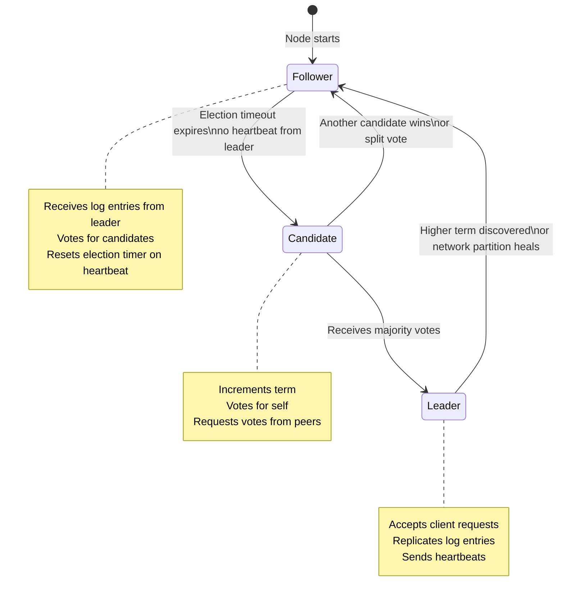
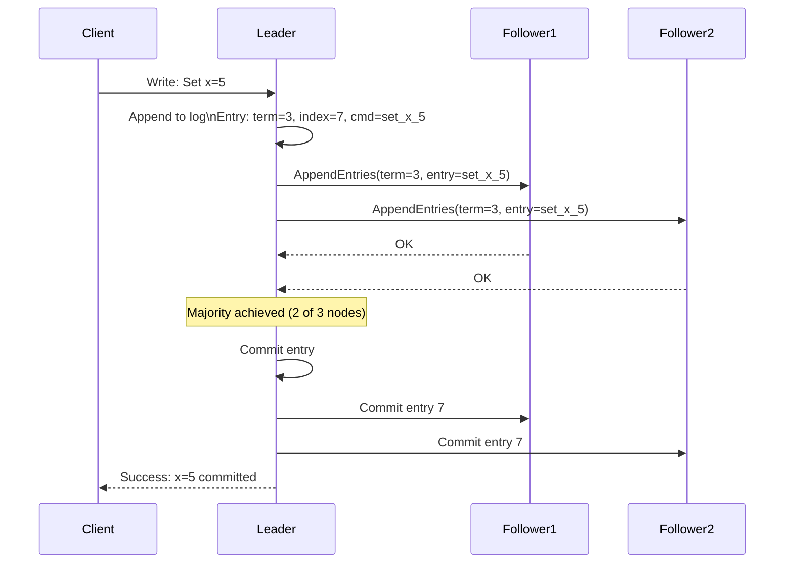
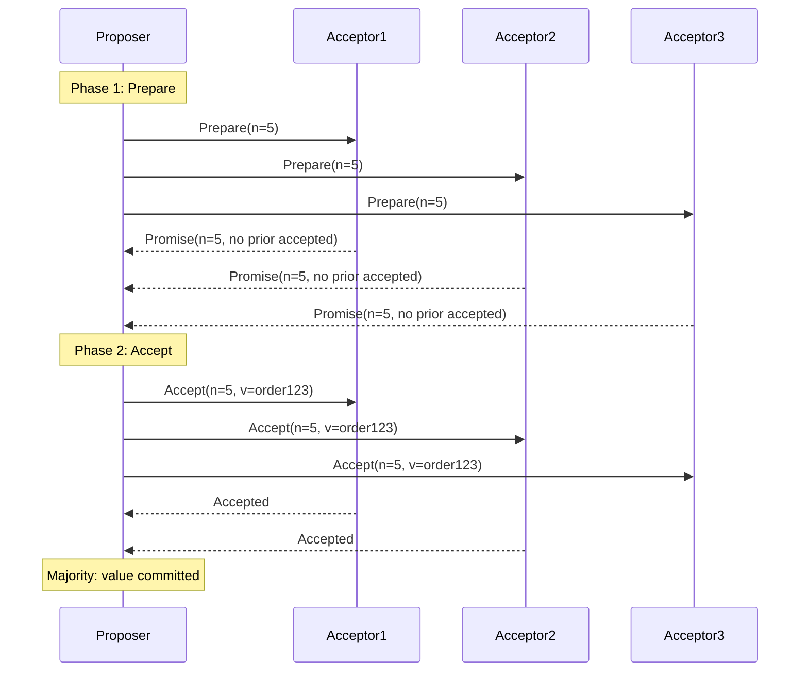

Consensus algorithms enable a distributed cluster of nodes to agree on a single value or sequence of values, even in the presence of node failures. Consensus is the foundation of replicated state machines, distributed locks, leader election, and linearizable databases.

## Raft Consensus Overview

## Raft Log Replication

## Paxos Overview

## Key Concepts

- **Consensus Problem**: Given a set of N nodes that may fail independently, reach agreement on a single value. Requirements: validity (agreed value must have been proposed), agreement (all non-faulty nodes agree on the same value), termination (all non-faulty nodes eventually decide).

- **Raft**: A consensus algorithm designed for understandability, providing the same safety guarantees as Paxos with a simpler conceptual model. Raft decomposes consensus into three problems: leader election, log replication, and safety. A strong leader replicates all entries to followers; entries are committed once a majority have acknowledged them.

- **Leader Election in Raft**: Each node has an election timeout (random 150-300ms). If a follower doesn't receive a heartbeat before its timeout, it becomes a candidate and requests votes. A candidate wins if it receives votes from a majority of nodes. Randomized timeouts prevent split votes from persisting.

- **Raft Log Commitment**: A log entry is committed when the leader has replicated it to a majority (quorum) of nodes. Only committed entries are applied to the state machine. A crash before commitment means the entry may be lost — this is correct behaviour.

- **Paxos**: The original consensus algorithm (Lamport, 1989), proven correct but notoriously difficult to understand and implement. Multi-Paxos extends single-decree Paxos to a replicated log. Most practical Paxos implementations (Google Chubby) are closer to the Paxos Made Live paper than the original.

- **Quorum**: A majority of nodes (N/2 + 1). Writes must be acknowledged by a quorum before being considered committed. Reads must query a quorum to guarantee seeing the latest committed write. A quorum of write nodes and a quorum of read nodes are guaranteed to overlap, ensuring reads see committed writes.

- **Byzantine Fault Tolerance (PBFT)**: Consensus in the presence of malicious nodes (Byzantine faults). Requires 3f+1 nodes to tolerate f Byzantine nodes. Used in permissioned blockchains and high-security coordination systems. Orders of magnitude more expensive than crash-failure-only consensus.

## Trade-offs

| Algorithm | Safety | Understandability | Performance | Byzantine |
|-----------|--------|-------------------|-------------|-----------|
| Raft | Yes | High | Good | No |
| Multi-Paxos | Yes | Low | Good | No |
| PBFT | Yes | Medium | Poor | Yes |
| Viewstamped Replication | Yes | Medium | Good | No |

## When to Apply

- Raft is implemented in: etcd (Kubernetes), CockroachDB, TiKV, Consul
- Use these systems when you need linearizable distributed state, leader election, or distributed locks
- Do not implement consensus algorithms yourself — use battle-tested implementations