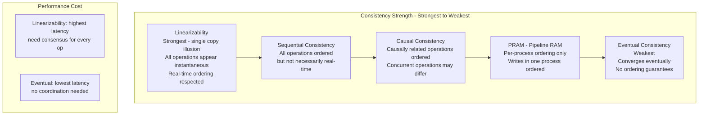
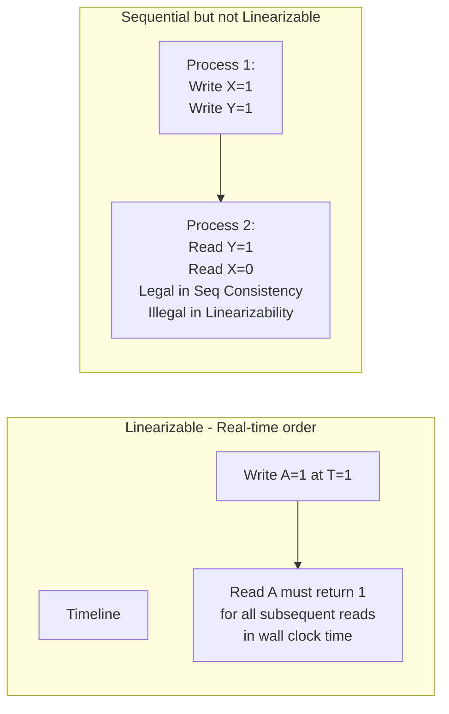
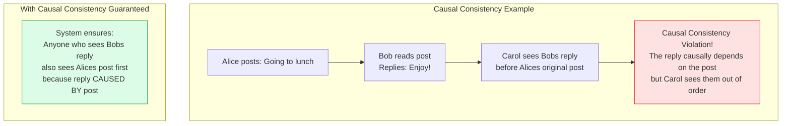
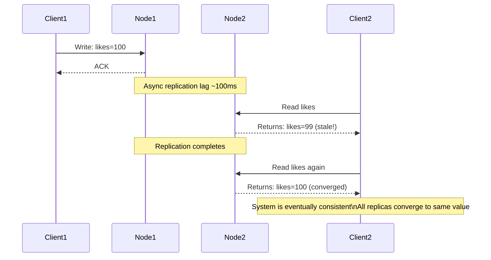

Consistency models define the guarantees a distributed system makes about the order in which operations appear to execute. Different models offer different trade-offs between correctness and performance. Choosing the right model requires understanding what ordering guarantees the application actually needs.

## Consistency Model Hierarchy

## Linearizability vs Sequential Consistency

## Causal Consistency

## Eventual Consistency in Practice

## Key Concepts

- **Linearizability (Atomicity)**: The strongest consistency model. Every operation appears to execute instantaneously at some point between its invocation and completion, and the global ordering respects real-time ordering. Reads always see the latest committed write. Requires coordination on every operation. Implemented by: single-leader databases with synchronous replication, etcd, ZooKeeper.

- **Sequential Consistency**: All operations from all processes appear in a single global order that is consistent with the order within each individual process. Does not need to respect real-time ordering across processes. Weaker than linearizability — two concurrent writes could appear in different orders to different readers, but each reader sees a consistent ordering.

- **Causal Consistency**: Operations that are causally related (write-then-read, read-then-write) appear in causal order to all nodes. Concurrent operations (no causal relationship) may appear in different orders. Causally consistent reads never see a reply before the original message. More available than linearizability with fewer anomalies than eventual consistency.

- **Eventual Consistency**: Given sufficient time with no new updates, all replicas will converge to the same value. No ordering guarantees — reads may return stale values. Very high availability. Used by DNS, Cassandra, DynamoDB (default), Amazon S3. Requires conflict resolution for concurrent writes (last-write-wins, CRDTs, application-level merge).

- **Read Your Writes (Session Consistency)**: A client always reads its own most recent writes. Weaker than linearizability but stronger than eventual consistency. Can be implemented by routing each client's reads to the same replica or by tracking write timestamps.

- **Monotonic Reads**: Once a process reads a value, subsequent reads will not return older values. Prevents a process from seeing value `v`, then later seeing an older value. Simple to implement with sticky routing.

- **CRDT (Conflict-free Replicated Data Types)**: Data structures that can be concurrently updated and deterministically merged without coordination. Examples: G-Counter (grow-only counter), OR-Set (observed-remove set). Enable eventually consistent systems to maintain correct semantics without coordination.

## Trade-offs

| Model | Correctness | Latency | Availability | Use Case |
|-------|------------|---------|-------------|---------|
| Linearizability | Strongest | Highest | Lower | Financial transactions, config |
| Sequential | Strong | High | Lower | Chat messages |
| Causal | Good | Medium | Good | Social media, collaboration |
| Eventual | Weakest | Lowest | Highest | DNS, shopping cart, CDN |

## When to Apply

- **Linearizability**: Financial data, inventory, any "exactly-once" counting, leader election
- **Causal**: Social media feeds, collaborative editing, comment systems
- **Eventual**: Product ratings, analytics counters, DNS, content delivery — where approximate correctness is acceptable
- **Read Your Writes**: Any system where a user makes a change and needs to see it reflected immediately in the UI