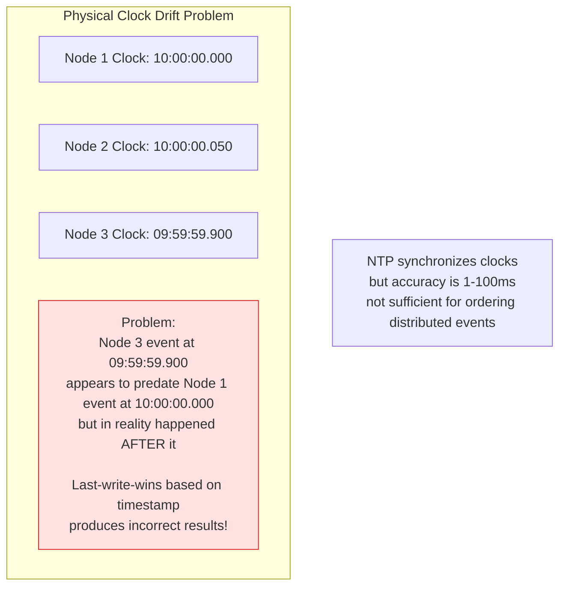
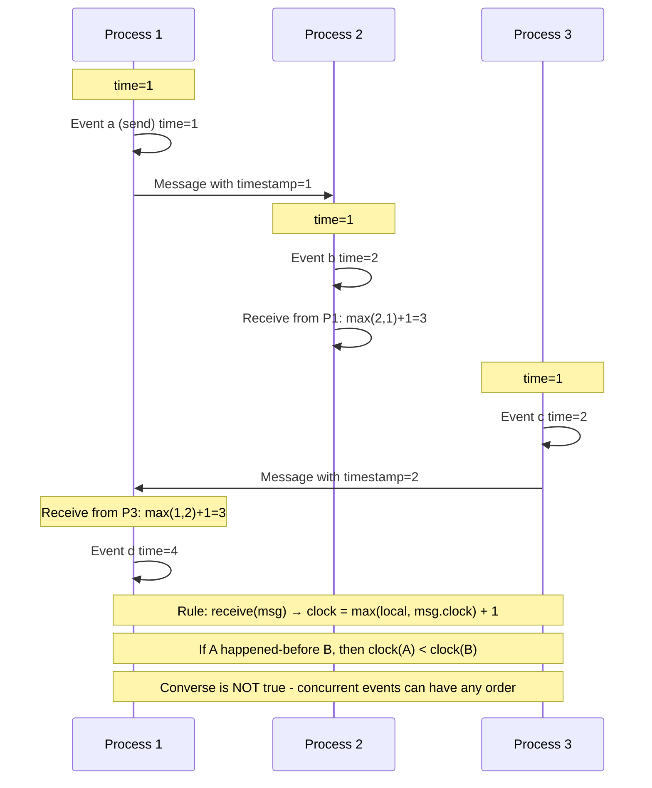
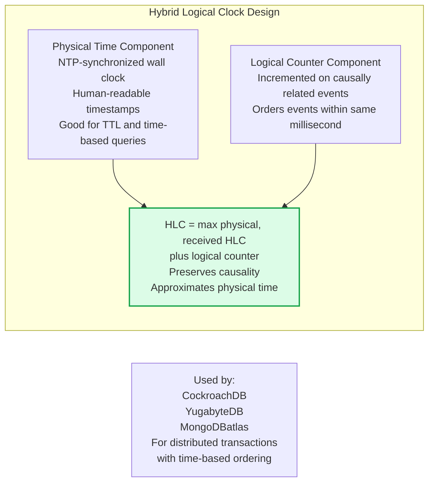

Time and ordering are fundamental challenges in distributed systems. Clocks drift, messages are delayed arbitrarily, and there is no global "now". Logical clocks provide ordering without relying on synchronized physical clocks, enabling correct reasoning about causality and event ordering.

## Physical Clock Problems



## Lamport Logical Clocks



## Vector Clocks

```mermaid
graph TD
    subgraph VectorClockExample[Vector Clock Example - 3 Nodes]
        Init[Initial state:\nN1: 0,0,0\nN2: 0,0,0\nN3: 0,0,0]

        E1[N1 local event\nN1: 1,0,0]
        E2[N2 local event\nN2: 0,1,0]
        E3[N1 sends to N2\nN1: 2,0,0\nN2 receives: max = 2,1,0 + N2 inc = 2,2,0]
        E4[N3 local event\nN3: 0,0,1]

        Init --> E1 & E2 & E4
        E1 & E2 --> E3

        Comparison[Comparing vectors:\nA happens-before B if A[i] <= B[i] for all i\nand A[i] < B[i] for at least one i\nConcurrent if neither A < B nor B < A]
    end
```

## Hybrid Logical Clocks (HLC)



## Key Concepts

- **Clock Drift**: Physical clocks on different machines drift over time and are not perfectly synchronized even with NTP (Network Time Protocol). NTP accuracy is typically 1-100ms, insufficient for ordering events in a distributed system where message delivery is measured in microseconds.

- **Lamport Logical Clocks**: A monotonically increasing integer counter attached to every event and message. Rules: (1) increment counter before each local event, (2) when sending a message, attach current counter, (3) when receiving a message, set counter to max(local, received) + 1. If event A happens-before event B, then L(A) < L(B). The converse is false — concurrent events can have any Lamport order.

- **Happens-Before Relation**: Event A happens-before event B if: (1) A and B are in the same process and A comes first, (2) A is the sending and B is the receiving of the same message, or (3) there is a transitive chain. Events that are not connected by happens-before are **concurrent** — their order is undefined and unimportant.

- **Vector Clocks**: An array of counters, one per process. Capture causal relationships completely — vector clocks can determine whether any two events are causally related or concurrent. A happens-before B iff A[i] ≤ B[i] for all i and A[j] < B[j] for some j. Used by Dynamo-style databases for conflict detection.

- **Version Vectors**: Similar to vector clocks but track the version of each replica's latest update. Used by Riak, Voldemort, and DynamoDB to detect conflicting writes in multi-master replication.

- **Hybrid Logical Clocks (HLC)**: Combines physical time (wall clock) with a logical counter. The physical component keeps HLC close to NTP time (for human-readable timestamps and TTL-based operations); the logical component provides causality ordering. Used by CockroachDB and YugabyteDB for distributed transaction timestamps.

- **TrueTime (Google Spanner)**: Google's GPS and atomic clock-based API that provides a time interval [earliest, latest] within which the current time falls, with a bounded uncertainty of a few milliseconds. Spanner uses this to implement external consistency (linearizability) globally by waiting out the uncertainty interval before committing.

## Trade-offs

| Clock Type | Causality Tracking | Space | Physical Time | Systems |
|-----------|------------------|-------|--------------|---------|
| Physical (NTP) | No | O(1) | Approximate | Logs, TTL |
| Lamport | Partial (no concurrent detection) | O(1) | No | Event ordering |
| Vector Clocks | Full | O(N) | No | Conflict detection |
| HLC | Full | O(1) | Approximate | Distributed DBs |
| TrueTime | Full | O(1) | Exact (bounded) | Spanner |

## When to Apply

- **Lamport clocks**: When you need total event ordering and don't need to distinguish concurrent events
- **Vector clocks**: When you need to detect causally unrelated (concurrent) operations — required for CRDT and conflict detection in eventually consistent systems
- **HLC**: When you need both causality and approximate real-time ordering in a distributed database
- **Physical time only**: Never for distributed event ordering — only for human-readable timestamps and approximate TTL-based expiry