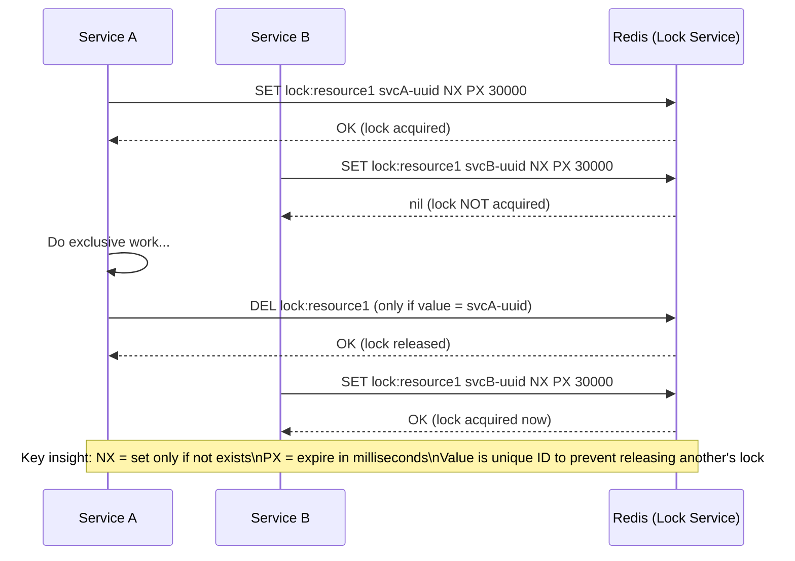
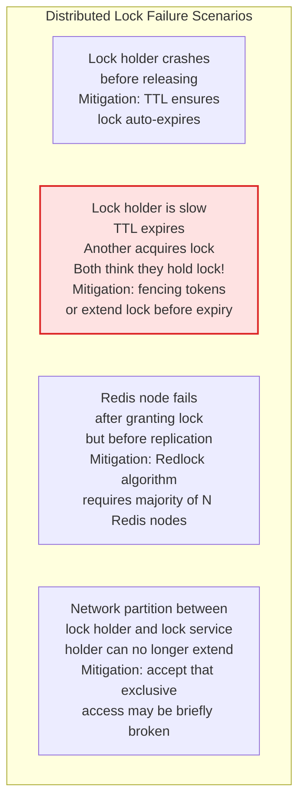
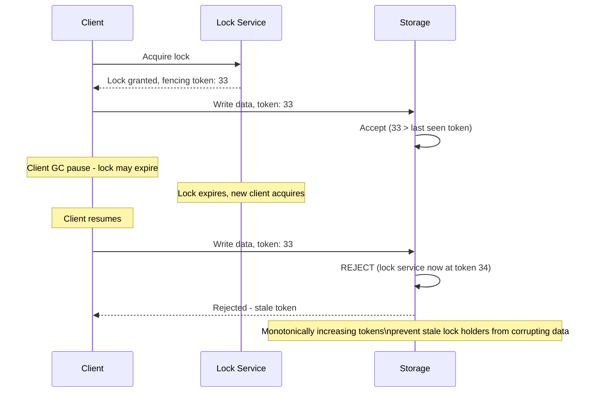
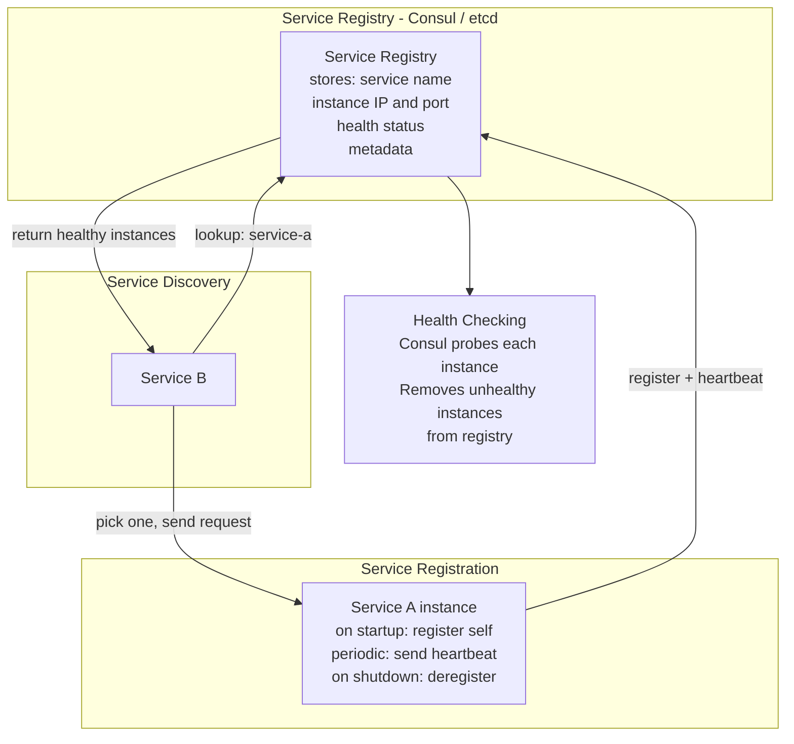

Distributed coordination solves the problem of multiple nodes agreeing on shared state and coordinating actions — tasks that are trivial with a single thread but require careful design in distributed systems where nodes can fail independently.

## Distributed Locking

## Distributed Lock Failure Modes

## Fencing Tokens

## Service Registry and Discovery

## Key Concepts

- **Distributed Lock**: A mutual exclusion mechanism that spans multiple processes. Implemented using a shared coordination service (Redis, ZooKeeper, etcd). Critical properties: (1) Mutual exclusion — only one holder at a time, (2) No deadlock — lock expires automatically via TTL if holder crashes, (3) Fault tolerance — survives failure of non-majority nodes.

- **Fencing Tokens**: A monotonically increasing token issued with each lock grant. The storage system accepts only writes with tokens greater than the last seen token. Prevents a slow/GC-paused lock holder from writing after the lock has expired and been re-granted to another client. Solves the "process resumes after pause thinks it still holds the lock" problem.

- **Redlock Algorithm**: A distributed lock algorithm using multiple independent Redis nodes. A client acquires the lock on a majority (N/2+1) of nodes. If it succeeds within a validity time, the lock is held. Provides stronger guarantees than single-node Redis lock but has known correctness concerns under certain timing scenarios (Martin Kleppmann's critique).

- **Service Registry**: A centralized directory of available service instances with their network addresses and health status. Enables dynamic service discovery — services register on startup and deregister on shutdown. Health checks remove unhealthy instances automatically.

- **Gossip Protocol**: A method for nodes to exchange state information peer-to-peer (like gossip spreading through a social network). Each node periodically selects random peers and exchanges information. Eventually, all nodes converge to the same state. Used by Cassandra, Consul, and Redis Cluster for cluster membership and failure detection.

- **Phi Accrual Failure Detector**: A probabilistic failure detection algorithm that outputs a continuously growing suspicion value (phi) rather than a binary alive/dead judgment. Allows applications to tune their failure detection sensitivity. Used by Akka and Cassandra.

- **Distributed Coordination Services**: ZooKeeper, etcd, and Consul provide primitives (leader election, distributed locks, service discovery, configuration management) built on top of consensus algorithms. These are the coordination backbone of distributed systems.

## Trade-offs

| Mechanism | Correctness | Availability | Complexity |
|-----------|------------|-------------|-----------|
| Single Redis lock | Good (single point failure) | Medium | Low |
| Redlock | Better | Medium | Medium |
| ZooKeeper lock | Strong | Depends on quorum | Medium |
| etcd lock | Strong | Depends on quorum | Medium |
| Gossip (no lock) | Eventual | High | Medium |

## When to Apply

- **Distributed locks**: Any resource that must not be concurrently modified (scheduled job, file write, database record) across multiple processes
- **Always use fencing tokens**: When the locked resource supports a conditional write mechanism
- **Service registry**: All microservices deployments — enables dynamic discovery and health-based routing
- **ZooKeeper/etcd**: When strong consistency is required for coordination — leader election, config management