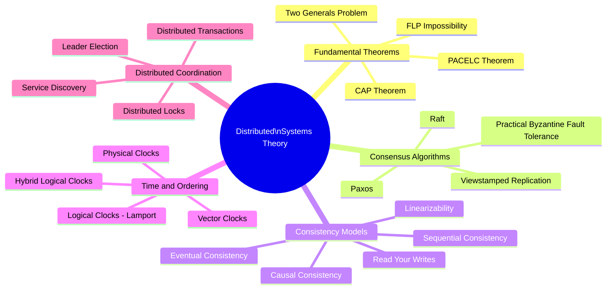

Distributed systems theory provides the mathematical and theoretical foundations for reasoning about distributed computation. Understanding these theorems and models is essential for making correct claims about consistency, availability, and correctness in systems that span multiple nodes.

## Overview

## Topics in This Section

| File | Topic | Key Concepts |
|------|-------|--------------|
| [01_fundamental_theorems.md](01_fundamental_theorems.md) | Fundamental Theorems | CAP, PACELC, FLP, Two Generals |
| [02_consensus_algorithms.md](02_consensus_algorithms.md) | Consensus Algorithms | Raft, Paxos, Byzantine fault tolerance |
| [03_consistency_models.md](03_consistency_models.md) | Consistency Models | Linearizability, causal, eventual |
| [04_time_ordering.md](04_time_ordering.md) | Time and Ordering | Lamport clocks, vector clocks, HLC |
| [05_distributed_coordination.md](05_distributed_coordination.md) | Distributed Coordination | Locks, leader election, service registry |