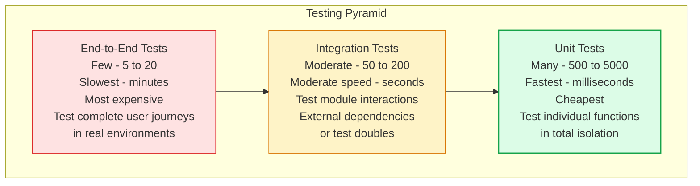
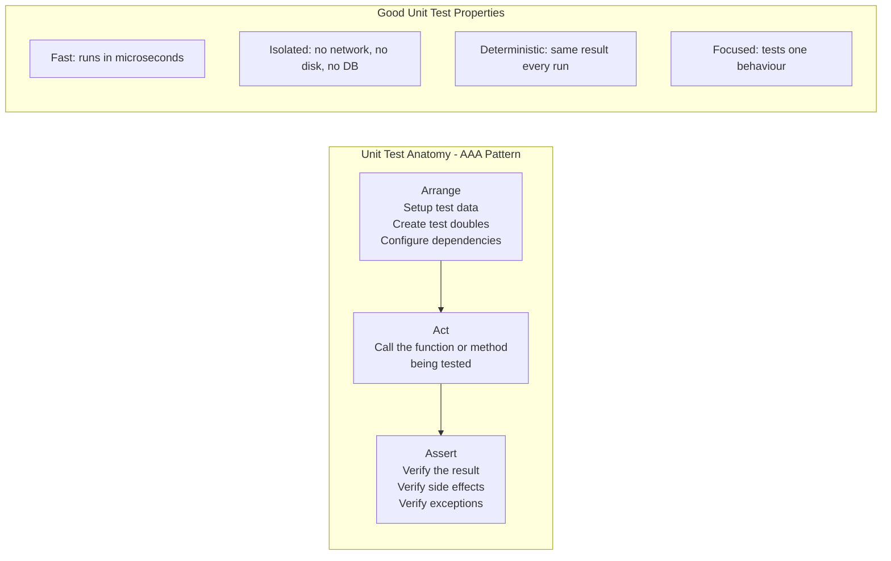
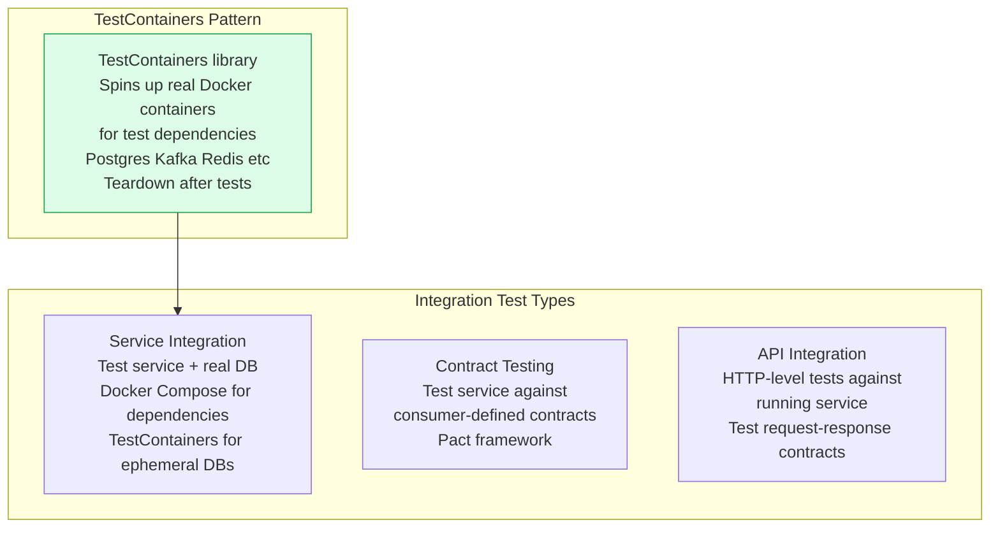
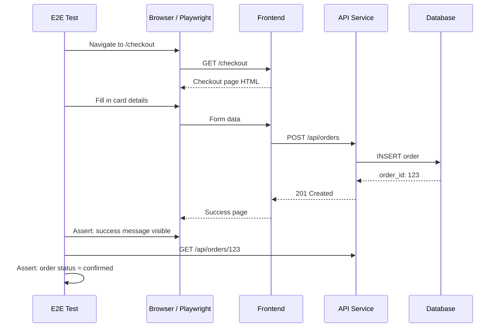

The testing pyramid describes the optimal distribution of test types by count and purpose. Many fast, cheap unit tests form the base; fewer, slower integration tests form the middle; a small number of end-to-end tests form the top. This distribution maximizes feedback speed while ensuring broad coverage.

## Testing Pyramid

## Unit Testing

## Integration Testing Approaches

## End-to-End Testing

## Key Concepts

- **Testing Pyramid**: The pyramid shape reflects the ideal distribution: many fast unit tests (broad coverage, fast feedback), some integration tests (verify components work together), few E2E tests (verify complete user journeys). An "ice cream cone" (many E2E, few unit tests) is the anti-pattern — slow, flaky, expensive to maintain.

- **Unit Tests**: Test a single function, method, or class in complete isolation. All external dependencies (databases, HTTP calls, file systems) are replaced with test doubles. The goal: every code path and edge case has a corresponding fast test. Coverage target: 80%+ statement coverage.

- **Integration Tests**: Test multiple components working together. Can test service + real database (using TestContainers), service + message broker, or API endpoint behaviour. Slower than unit tests but catch integration bugs (SQL schema mismatches, serialization errors, configuration mistakes) that unit tests cannot.

- **End-to-End (E2E) Tests**: Test complete user workflows through the deployed application. Playwright, Cypress, or Selenium drive a real browser. Selenium Grid or Playwright in CI runs against a staging environment. E2E tests catch real user-visible regressions but are slow (minutes), fragile (UI changes break tests), and expensive to maintain.

- **Test Coverage**: A measure of how much production code is executed by tests. Statement coverage (% of lines executed) and branch coverage (% of conditional branches covered) are the standard metrics. High coverage does not guarantee correct tests — tests can execute code without asserting correctness.

- **Flaky Tests**: Tests that produce different results on successive runs with the same code. Usually caused by time dependencies, async timing issues, shared state between tests, or non-deterministic data. Flaky tests erode confidence in the test suite. Track and fix flakiness aggressively.

- **TestContainers**: A library (available for Java, Python, Go) that manages Docker containers for test dependencies. Instead of mocking a database, spin up a real Postgres container for the test session and tear it down after. Eliminates mock-vs-reality discrepancies.

## Trade-offs

| Test Type | Speed | Cost | Confidence | Maintenance |
|-----------|-------|------|-----------|-------------|
| Unit | Very fast | Low | Code logic | Low |
| Integration | Moderate | Medium | Component interaction | Medium |
| E2E | Slow | High | User journey | High |

## When to Apply

- **Write unit tests first** for all business logic, domain models, and utility functions
- **Add integration tests** for service boundaries — how your service talks to databases, message brokers, and other services
- **Limit E2E tests** to critical user journeys (registration, checkout, core workflow) — the scenarios where failure is most painful
- Target 70-80% unit test coverage; 90%+ of E2E tests must be green before every production deployment