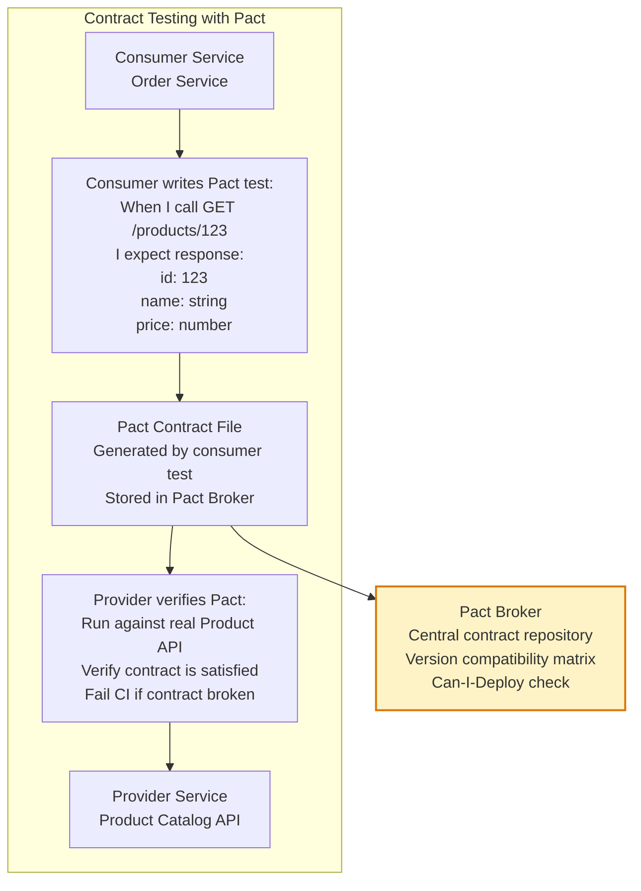
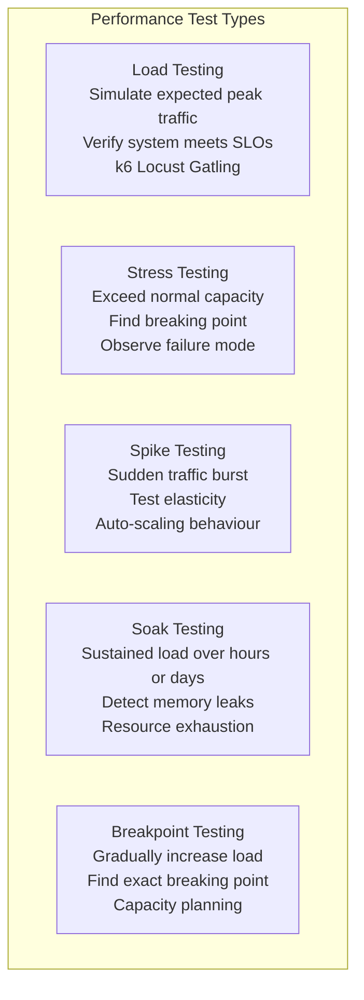
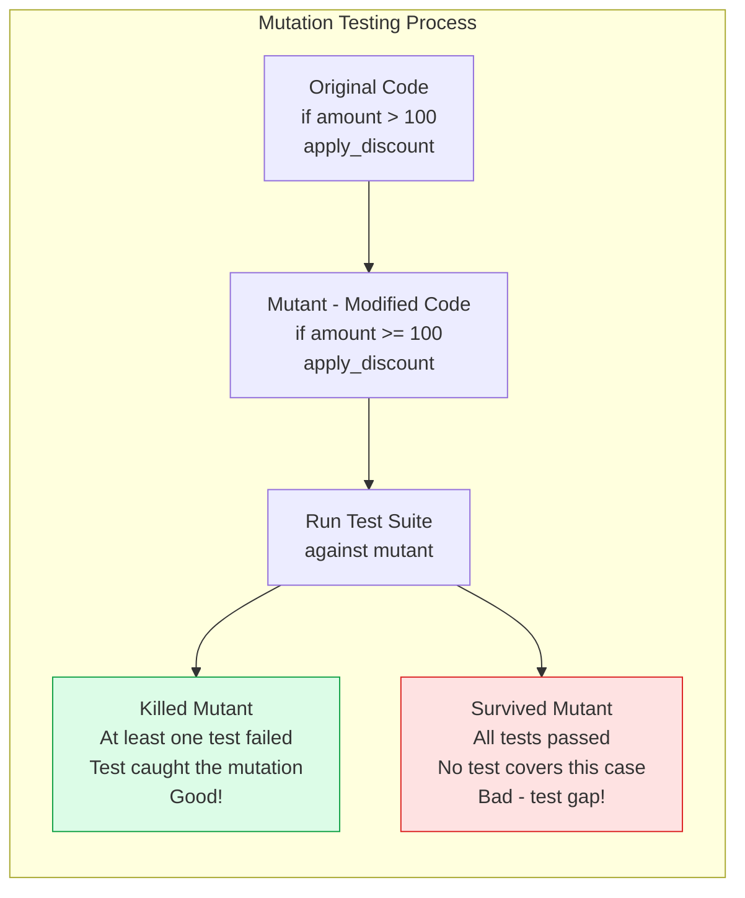

Beyond the standard testing pyramid, specialized testing techniques address specific quality dimensions: service contract compatibility (contract testing), production-condition robustness (chaos testing), performance under load (performance testing), and test coverage gaps (mutation testing).

## Contract Testing



## Performance Testing Types



## Mutation Testing



## Property-Based Testing

```mermaid
graph TD
    subgraph PBTComparison[Example-Based vs Property-Based]
        ExampleBased[Example-Based Test:\nassert sort(list 3 1 2) equals list 1 2 3\nassert sort(empty list) equals empty list\nassert sort(list 1) equals list 1\nTests specific examples you thought of]

        PropertyBased[Property-Based Test:\nFor all lists:\nassert sorted(sort(l)) is true\nassert len(sort(l)) equals len(l)\nassert set(sort(l)) equals set(l)\nTools generate 100s of random inputs\nFinds edge cases you didn't think of]

        style ExampleBased fill:#fef3c7,stroke:#d97706
        style PropertyBased fill:#dcfce7,stroke:#16a34a
    end
```

## Key Concepts

- **Contract Testing**: Verifies that API contracts between services are honoured, without deploying both services simultaneously. The consumer defines what it needs from the provider in a Pact contract. The provider verifies it satisfies those contracts in isolation. Enables independent service deployment while catching integration regressions.

- **Pact Broker**: A central repository for Pact contracts. Services publish their contracts and verify provider contracts. The "can-I-deploy" check queries whether a particular version of service A is compatible with a particular version of service B before deployment.

- **Load Testing**: Simulates expected user load (e.g., 10,000 concurrent users, 5,000 requests/second) against a staging environment to verify the system meets SLO targets under normal conditions. k6, Locust (Python), and Gatling (Scala/JVM) are popular tools.

- **Stress Testing**: Increases load beyond expected capacity to find the point at which the system breaks and understand how it fails (graceful degradation vs catastrophic failure). Helps answer: at what point does the database become the bottleneck? When does the queue start to grow?

- **Soak Testing**: Runs the system under moderate load for an extended period (24-72 hours) to detect gradual resource exhaustion — memory leaks, connection pool exhaustion, disk space accumulation. Many bugs only appear after hours of continuous operation.

- **Mutation Testing**: Automatically introduces small code changes (mutations) — flipping `>` to `>=`, changing `+` to `-` — and verifies that at least one test fails for each mutation. A surviving mutant indicates a test gap. Pitest (Java), Mutmut (Python), and Stryker (JavaScript) are popular tools. Mutation score = killed / total mutants.

- **Property-Based Testing**: Instead of defining specific examples, define properties (invariants) that must hold for all inputs. The testing framework generates random inputs and tries to find counter-examples. Hypothesis (Python) and QuickCheck (Haskell/Erlang) are the canonical tools. Excellent for finding edge cases in parsing, sorting, encoding, and mathematical functions.

## Trade-offs

| Technique | Effort | Value | When Valuable |
|-----------|--------|-------|---------------|
| Contract testing | Medium | Very High | Microservices with multiple teams |
| Load testing | Medium | High | Before scaling events, launches |
| Mutation testing | Low setup, High CI cost | Medium-High | Mature codebases with test gaps |
| Property testing | Medium | High | Algorithmic code, parsers, encoding |
| Chaos testing | High | High | Production-ready mature systems |

## When to Apply

- **Contract testing**: All service-to-service APIs with consumer and provider owned by different teams
- **Load testing**: Before every major launch, before expected traffic spikes (Black Friday, product launches)
- **Mutation testing**: When test coverage looks good on paper but confidence is low — mutation score reveals blind spots
- **Property-based testing**: Mathematical functions, parsers, serializers, any code that should satisfy clear invariants