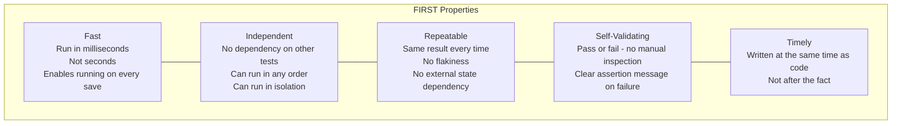
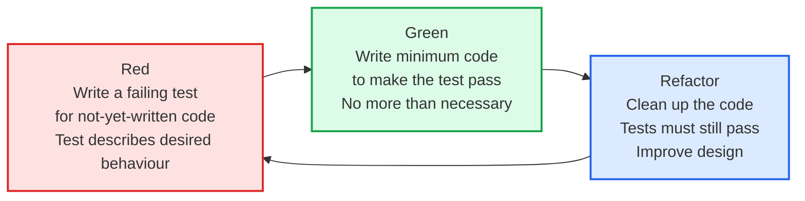
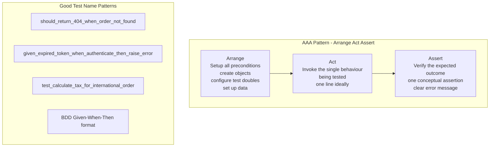

# Test Design Principles

Good tests are not just "tests that pass" — they are tests that clearly express intent, fail precisely when something is wrong, and are easy to maintain. Test design principles provide the vocabulary and heuristics for writing tests that remain valuable as the codebase evolves.

## FIRST Properties of Good Tests



## Test Doubles

```mermaid
graph TD
    subgraph TestDoubles[Test Doubles Taxonomy - Meszaros]
        Dummy[Dummy\nPassed but never used\nFills parameter lists\ndef test(): service = Service(dummy_logger)]
        Stub[Stub\nReturns pre-configured responses\nno behaviour logic\nstub.get_user = lambda id: User(name=Alice)]
        Spy[Spy\nWraps real object\nrecords calls for assertion\nassert spy.send_email.called_once_with email]
        Mock[Mock\nPre-programmed expectations\nverifies interactions\nmock.expects(get_order).returns(order)]
        Fake[Fake\nWorking implementation\nshortcuts for testing\nFakeUserRepository in memory]
    end

    Dummy --> Stub --> Spy --> Mock --> Fake
    style Fake fill:#dcfce7,stroke:#16a34a
```

## TDD Cycle



## Test Organization



## Key Concepts

- **FIRST**: The canonical properties of a well-designed test suite. Fast tests enable tight feedback loops — developers run them on every change. Independent tests can run in any order (parallelism) and in isolation (debugging). Repeatable tests don't depend on time, random seeds, or external services. Self-validating tests produce binary pass/fail without manual result inspection.

- **Dummy**: A test double passed to a function to satisfy type requirements but never actually used. Example: passing a null logger when the code under test doesn't call logging.

- **Stub**: A test double that returns pre-configured responses to calls. No logic — just returns values. Used to control the indirect inputs to the code under test. Example: `UserRepository.find_by_id(123)` returns a pre-built User object.

- **Mock**: A test double pre-programmed with expectations about which calls will be made. The test fails if expected calls aren't made. Used to verify interactions (that the code calls the right methods with the right parameters). Example: verify that `EmailService.send_welcome_email(user.email)` is called exactly once.

- **Spy**: Like a mock but wraps the real implementation and records calls for later assertion. Useful when you want the real behaviour but also need to verify interactions.

- **Fake**: A working implementation of a dependency that takes shortcuts suitable for testing. Example: `FakeUserRepository` stores users in an in-memory dict rather than a database. Fakes are more complex to build but more realistic than mocks and avoid fragile call verification.

- **TDD (Test-Driven Development)**: Write a failing test first (Red), then write the minimum code to make it pass (Green), then clean up the code (Refactor). TDD produces testable design by forcing you to think about the interface before the implementation. Benefits: guaranteed test coverage, design feedback, regression suite built alongside code.

- **BDD (Behavior-Driven Development)**: Extends TDD by writing tests in a natural language format (Given-When-Then) that domain experts can read. Cucumber, Behave (Python), and SpecFlow are popular BDD frameworks. Best for acceptance tests that specify business requirements.

- **Test Isolation**: Each test must set up its own state and tear down after itself. Tests that share state produce order-dependent failures that are extremely difficult to debug. Use `setUp`/`tearDown` or test fixtures for clean state on every test.

## Trade-offs

| Approach | Feedback Speed | Design Benefit | Maintenance |
|----------|--------------|---------------|-------------|
| TDD | Fastest | Highest | Medium |
| Test-after | Moderate | Low | Medium |
| BDD | Slower (more setup) | Medium | High (readability) |
| Mocks | Fast | Medium | High (brittle) |
| Fakes | Fast | High | Medium (build upfront) |

## When to Apply

- **TDD**: Default for all new business logic — the upfront investment pays back quickly through reduced debugging time
- **Fakes over mocks**: For dependencies with complex interactions — fakes are less fragile and test real integration
- **BDD**: For acceptance criteria on complex business workflows where business stakeholder review is valuable
- **Test naming**: Always include the scenario in the test name — a failing test name should tell you exactly what broke
