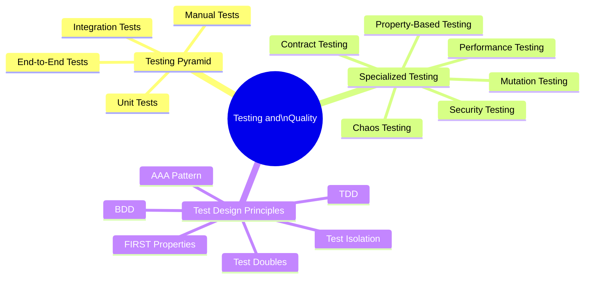

# Testing and Quality

Testing is the practice of verifying that software behaves correctly. Quality engineering goes beyond finding bugs — it designs systems that are inherently verifiable, instruments code for testability, and creates feedback loops that catch regressions before they reach users.

## Overview

## Topics in This Section

| File | Topic | Key Concepts |
|------|-------|--------------|
| [01_testing_pyramid.md](01_testing_pyramid.md) | Testing Pyramid | Unit, integration, E2E testing strategies |
| [02_specialized_testing.md](02_specialized_testing.md) | Specialized Testing | Contract, chaos, performance, mutation |
| [03_test_design_principles.md](03_test_design_principles.md) | Test Design | TDD, test doubles, FIRST, AAA |
