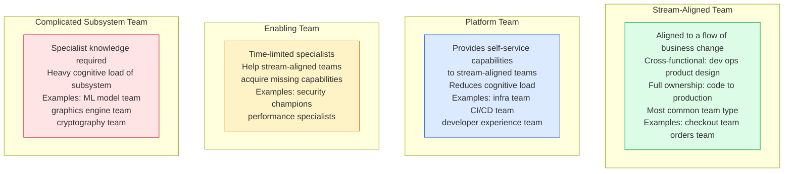
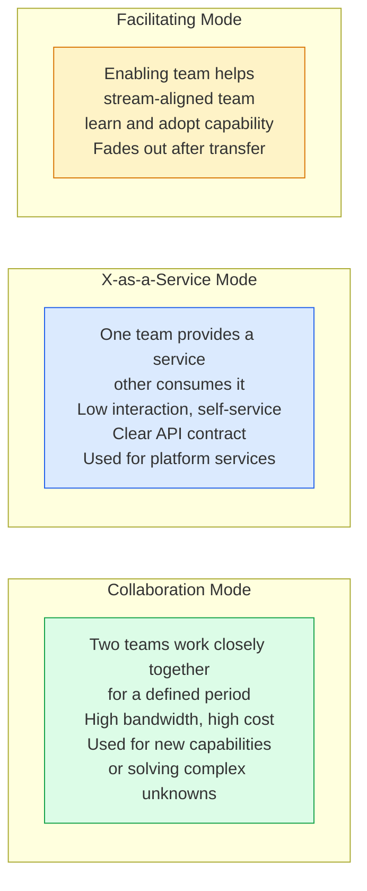
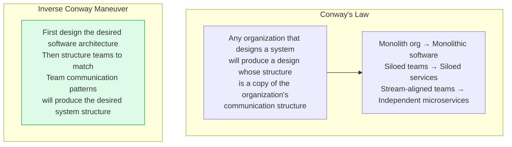
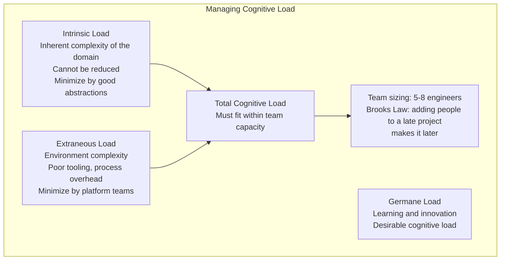

# Team Topologies

Team Topologies (Matthew Skelton and Manuel Pais) provides a framework for organizing teams to optimize software delivery flow. It identifies four fundamental team types and three interaction modes, with the goal of reducing cognitive load and enabling fast, independent delivery.

## Four Team Types

## Three Interaction Modes

## Conway's Law and Inverse Conway Maneuver

## Cognitive Load and Team Size

## Key Concepts

- **Stream-Aligned Team**: A cross-functional team (engineering, product, design, operations) aligned to a stream of business change — a product, feature, or user journey. The team has full end-to-end ownership from code to production metrics. This is the most common and most important team type.

- **Platform Team**: Builds and maintains internal platforms (Kubernetes infrastructure, CI/CD pipelines, shared libraries, developer portals) that reduce the cognitive load on stream-aligned teams. The platform team's customers are other engineering teams. The platform must be self-service — stream-aligned teams should not need to contact the platform team for every infrastructure change.

- **Enabling Team**: A temporary team of specialists that helps stream-aligned teams acquire capabilities they currently lack (Kubernetes expertise, security best practices, performance optimization). Unlike a centre of excellence, enabling teams intend to transfer knowledge and make themselves unnecessary for any given team.

- **Cognitive Load**: The mental effort required to understand a system and perform a task. Brook's Law describes the maximum cognitive load a team can sustainably maintain. Platform teams reduce cognitive load for stream-aligned teams by abstracting away infrastructure complexity.

- **Conway's Law**: Mel Conway (1967) observed that organizations tend to produce systems that mirror their own communication structure. A siloed organization with separate frontend, backend, and DBA teams tends to produce a three-tier monolith. The implication: if you want a certain architecture, design the team structure first.

- **Inverse Conway Maneuver**: Deliberately structure teams to match the desired target architecture. If the goal is microservices, create stream-aligned teams with end-to-end ownership of services before the code is decomposed — the architecture will follow.

- **Team Cognitive Load Limit**: A team can sustainably own a bounded set of services and domains. When a team's cognitive load exceeds their capacity, quality, velocity, and wellbeing suffer. The solution is to split the team or invest in platform tooling that reduces incidental complexity.

## Trade-offs

| Structure | Delivery Speed | Cognitive Load | Coordination |
|-----------|--------------|----------------|-------------|
| Feature teams | High | High | Low |
| Functional teams | Low | Low | High |
| Stream-aligned (Topologies) | High | Managed | Medium |
| Monolithic team | Variable | High | Low initially |

## When to Apply

- Team Topologies is most valuable when an organization grows beyond 30-50 engineers and informal coordination breaks down
- Invest in platform teams when stream-aligned teams spend more than 30% of time on infrastructure and toil
- Use enabling teams for time-limited capability transfer, not for permanent gatekeeping
- Measure team cognitive load through surveys and team health checks
