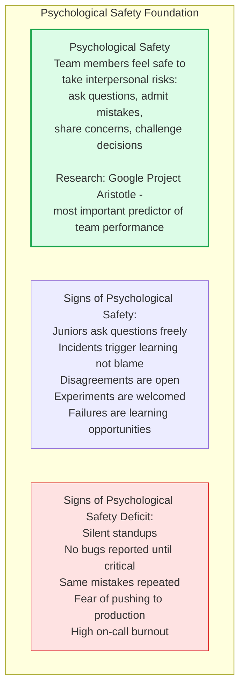
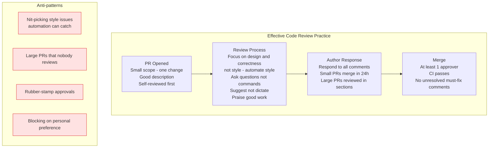
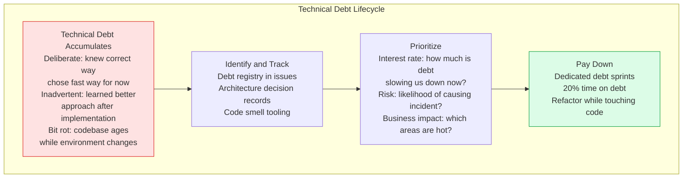

# Engineering Culture

Engineering culture is the set of shared values, behaviors, and practices that shape how a team builds software. Culture determines whether engineers raise problems early or hide them, whether they take appropriate risks or avoid all change, and whether the team improves continuously or repeats the same mistakes.

## Psychological Safety

## Code Review Culture

## Technical Debt Management

## Key Concepts

- **Psychological Safety**: The belief that one will not be punished or humiliated for speaking up with ideas, questions, concerns, or mistakes. Google's Project Aristotle research found psychological safety to be the single most important factor in team effectiveness — more important than individual talent or team composition.

- **Blameless Culture**: Post-incident reviews and root cause analyses focus on system failures, not individual failures. The person who caused an incident was working within a system that allowed it to happen — fix the system. Blame cultures cause engineers to hide problems, avoid risk, and not report near-misses.

- **Learning Organization**: A team that continuously improves by learning from successes and failures. Practices include: regular retrospectives, postmortems with action items, learning from other teams' incidents, technology radar reviews, and investment in skill development.

- **Documentation Culture**: High-performing engineering teams document their systems, decisions, and processes — not because they're told to, but because they know future-them and colleagues will need it. Architecture Decision Records (ADRs), runbooks, and onboarding guides are the core artifacts.

- **Code Review as Learning**: Code reviews are not just quality gates — they are the primary mechanism for knowledge transfer, mentoring, and maintaining collective code ownership. Juniors learn by reviewing seniors' code; seniors learn from juniors' fresh perspectives.

- **Technical Debt**: The accumulated shortcuts, outdated patterns, and suboptimal designs that slow future development. Like financial debt, it accrues interest — the longer it's held, the more it costs to service. Healthy teams track, prioritize, and systematically pay down technical debt alongside feature work.

- **On-Call Culture**: How a team manages production incidents and on-call rotation reveals its engineering culture. Healthy: incidents are learning opportunities, on-call burden is shared fairly, runbooks exist, alerts are actionable. Unhealthy: on-call is feared, few people know production, alerts are noisy and frequent.

## Trade-offs

| Culture Investment | Benefit | Cost |
|-------------------|---------|------|
| Psychological safety | Higher quality, faster learning | Requires leader modeling |
| Blameless postmortems | Honest reporting, real fixes | Harder to hold individuals accountable |
| Code review rigor | Fewer defects, knowledge sharing | Slower merges |
| Debt reduction investment | Higher velocity long-term | Slower feature delivery short-term |
| Documentation | Faster onboarding, fewer silos | Time investment upfront |

## When to Apply

- Psychological safety is the foundation — invest in it before any technical practice
- Start blameless postmortem practice immediately after the first significant incident
- Establish code review standards (PR size, review SLA, required approvals) early in team formation
- Track technical debt formally when it starts to noticeably impact delivery velocity
