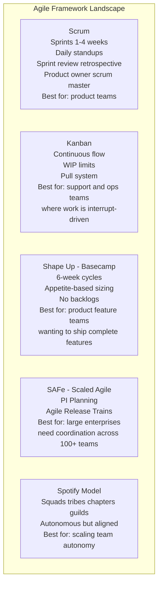
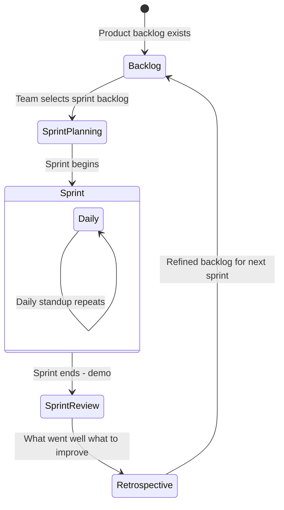
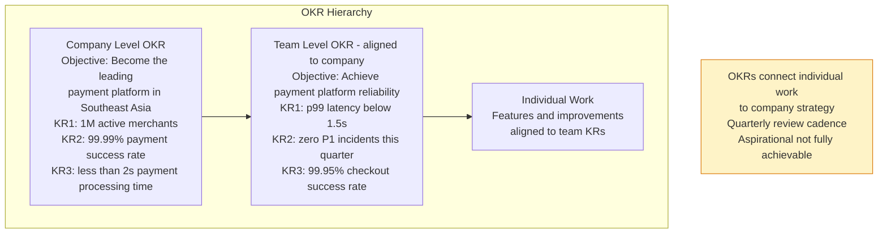

# Agile and Lean at Scale

Agile methodologies provide frameworks for iterative, collaborative software development. Lean principles (from manufacturing) focus on eliminating waste and maximizing value flow. At scale, these principles require adaptation to coordinate dozens or hundreds of teams while maintaining delivery speed.

## Agile Framework Landscape

## Scrum Sprint Cycle

## OKRs - Objectives and Key Results

## Key Concepts

- **Scrum**: A framework (not a methodology) for iterative development in time-boxed sprints (1-4 weeks). Roles: Product Owner (what to build), Scrum Master (process facilitator), Development Team. Ceremonies: Sprint Planning, Daily Standup, Sprint Review (demo), Retrospective.

- **Kanban**: A continuous flow method using a board with WIP (work-in-progress) limits. Work flows through columns (To Do → In Progress → In Review → Done). WIP limits prevent multitasking and expose bottlenecks. Excellent for operations and support teams where work is interrupt-driven.

- **Shape Up (Basecamp)**: An alternative to Scrum that uses 6-week cycles with a 2-week cooldown. Teams work on shaped (scoped and designed) projects with a fixed appetite (time budget). No backlogs, no sprint planning overhead. Teams decide how to build within the shape. Favored for shipping complete, polished features.

- **SAFe (Scaled Agile Framework)**: A framework for scaling agile to large organizations (50+ teams). Uses Agile Release Trains (ARTs) — groups of 50-125 engineers working in Program Increments (PI). PI Planning (a 2-day event) aligns all teams on a shared roadmap. Criticized for heavyweight ceremony; loved by enterprises that need coordination.

- **Spotify Model**: An organizational model (not a methodology) using Squads (autonomous teams), Tribes (squads with related missions), Chapters (people with same function across squads), and Guilds (communities of interest). Provides autonomy with alignment. Often mis-applied as a rigid prescription.

- **OKRs (Objectives and Key Results)**: A goal-setting framework (from Intel via Google) where Objectives are ambitious qualitative goals and Key Results are measurable outcomes. OKRs cascade from company to team to individual, creating alignment. Good OKRs are stretch goals — 70% achievement is considered success.

- **Lean Software Development**: Applying Toyota Production System principles to software: eliminate waste (unnecessary features, defects, delays), amplify learning, decide as late as possible, deliver as fast as possible, empower the team, build integrity in, see the whole.

- **Batch Size and Lead Time**: Lean's most valuable insight for software: smaller batches (smaller features, smaller PRs, more frequent releases) dramatically reduce cycle time, risk, and feedback delay. Large batches accumulate risk and delay learning.

## Trade-offs

| Framework | Overhead | Predictability | Autonomy | Best For |
|-----------|---------|---------------|---------|---------|
| Scrum | Medium | High | Medium | Product development |
| Kanban | Low | Low | High | Operations/support |
| Shape Up | Low | Medium | High | Product feature teams |
| SAFe | Very High | Very High | Low | Large enterprise coordination |

## When to Apply

- **Scrum**: Default for new product development teams — familiar, well-understood, provides structure
- **Kanban**: Operations teams, support teams, teams with interrupt-driven work
- **Shape Up**: Product teams that want to ship complete features without sprint ceremony overhead
- **OKRs**: Any team beyond 5-10 engineers where alignment with company strategy needs to be explicit
- **SAFe**: Only when coordination across truly many teams is required — the ceremony overhead is significant
