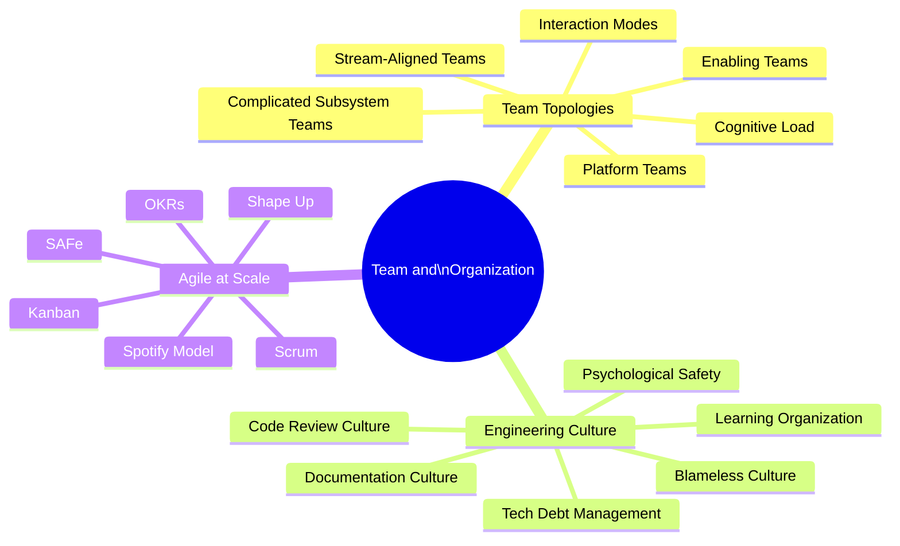

# Team and Organizational Patterns

Software is built by people organized into teams. Team structure, communication patterns, and engineering culture have as much impact on software quality and delivery speed as any technical decision. Conway's Law states that systems mirror the communication structures of the organizations that build them.

## Overview

## Topics in This Section

| File | Topic | Key Concepts |
|------|-------|--------------|
| [01_team_topologies.md](01_team_topologies.md) | Team Topologies | Stream-aligned, platform, enabling teams |
| [02_engineering_culture.md](02_engineering_culture.md) | Engineering Culture | Psychological safety, learning, code review |
| [03_agile_lean_scale.md](03_agile_lean_scale.md) | Agile at Scale | SAFe, Spotify, Shape Up, OKRs |
