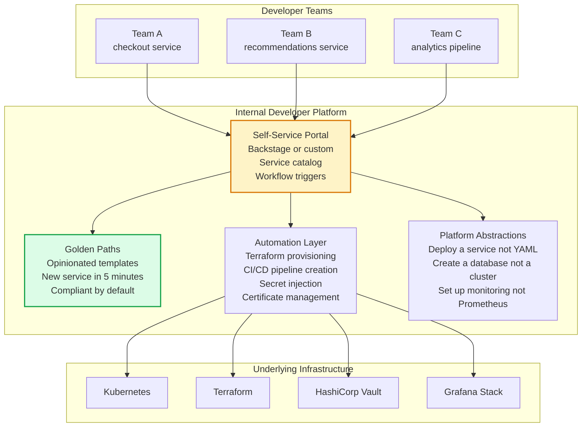
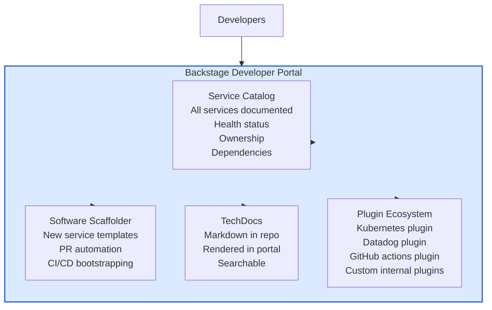
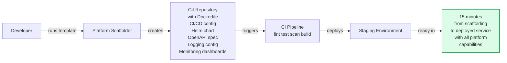

# Platform Engineering

Platform Engineering is the discipline of building and operating Internal Developer Platforms (IDPs) that reduce cognitive load on product engineers. Platform teams create golden paths — opinionated, paved roads for common tasks — enabling developers to deploy, observe, and scale applications without deep infrastructure expertise.

## Internal Developer Platform Architecture

## Backstage Architecture

## Golden Path Example

## Key Concepts

- **Internal Developer Platform (IDP)**: The sum of all technical and non-technical components — tools, services, knowledge, and processes — that developers use to deliver software. A well-designed IDP reduces the cognitive load on product teams by abstracting infrastructure complexity and providing self-service capabilities.

- **Golden Path**: An opinionated, supported path for common development tasks. Instead of offering infinite configuration options, platform teams design golden paths that are secure, observable, and scalable by default. Developers can deviate from the golden path when needed, but the path of least resistance leads to the right outcome.

- **Self-Service Infrastructure**: Developers provision infrastructure (databases, queues, Kubernetes namespaces, TLS certificates) through automated workflows without requiring a ticket to the platform team. Self-service is the antidote to the platform team bottleneck.

- **Backstage (Spotify/CNCF)**: An open-source developer portal framework used by hundreds of companies to build their IDP. Provides a service catalog, software scaffolder, TechDocs (documentation), and a plugin ecosystem. Teams register their services in Backstage, making ownership and dependencies explicit.

- **Developer Experience (DX)**: The quality of the experience developers have when building software — how fast they can set up a new service, how quickly CI provides feedback, how easy it is to understand a production incident. DX improvements have a direct and measurable impact on engineering velocity.

- **Platform as a Product**: Platform teams should treat their platform as a product with product management discipline — user research (talking to developer teams), roadmap, metrics (developer time saved, onboarding time, number of golden path adoptions), and continuous iteration.

- **Cognitive Load Reduction**: The primary metric of platform success. How much does a developer need to know to deploy a new service? To add observability? To rotate a secret? Each reduction in required knowledge is a platform win.

## Trade-offs

| Approach | Developer Productivity | Platform Team Investment | Flexibility |
|----------|----------------------|------------------------|------------|
| No platform (each team owns all) | Low (reinventing wheels) | None | High |
| Thin platform (shared tools) | Medium | Medium | High |
| Full IDP with golden paths | High | High | Medium |
| Rigid locked-down platform | Medium (no customization) | High | Low |

## When to Apply

- Platform engineering investment pays off when 30+ engineers are spending significant time on infrastructure toil
- Start with golden paths for the most common task (new service setup) before building a full portal
- Backstage is valuable when the service catalog becomes unmanageable via wikis or spreadsheets
- Treat every platform capability as a product — if engineers aren't using it, it isn't the right solution
