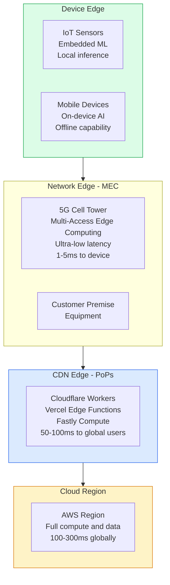
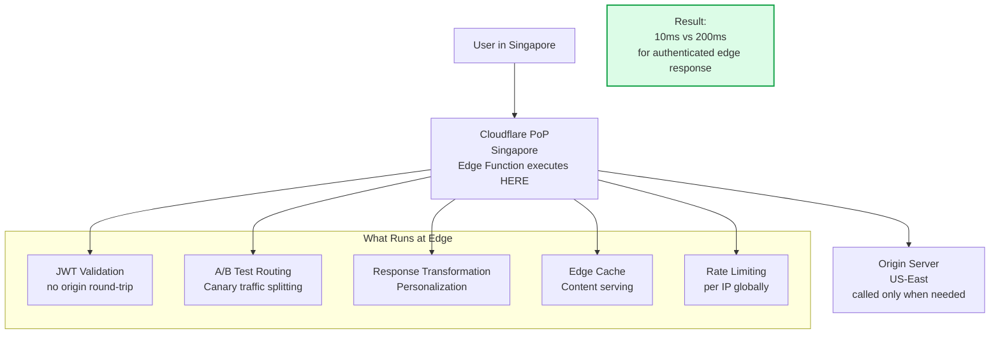
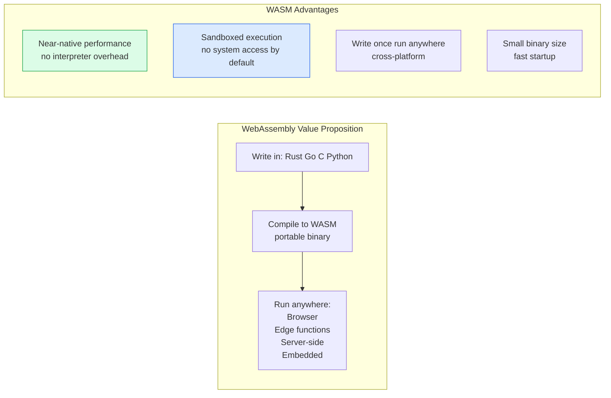

Edge computing moves computation closer to where data is generated and consumed — end users, IoT devices, and geographically distributed systems. This reduces latency dramatically and enables new application patterns that were impossible when all computation was centralized.

## Edge Compute Hierarchy

## CDN Edge Computing (Cloudflare Workers)

## WebAssembly (WASM) at the Edge

## Key Concepts

- **Edge Computing**: Processing data at or near the source of data generation rather than in a centralized cloud region. Reduces latency by bringing compute closer to users, reduces bandwidth costs by processing data locally before sending to the cloud, and enables offline-capable applications.

- **CDN Edge Functions**: Serverless functions that run within CDN points of presence (PoPs) globally. Cloudflare Workers, Vercel Edge Functions, and Fastly Compute at Edge execute JavaScript, TypeScript, and WASM at hundreds of locations worldwide. Enables sub-10ms response times for authenticated, personalized responses.

- **Multi-Access Edge Computing (MEC)**: ETSI standard for deploying compute within cellular network infrastructure (at or near cell towers). Enables ultra-low latency (1-5ms) applications for autonomous vehicles, augmented reality, and real-time industrial control that require more than CDN edge can provide.

- **WebAssembly (WASM)**: A binary instruction format for a stack-based virtual machine. Designed as a portable compilation target for high-level languages (Rust, C++, Go). Runs at near-native speed in browsers and server-side runtimes. WASM + WASI (system interface) enables portable server-side compute without containers.

- **Offline-First**: Application design where the application is fully functional without internet connectivity. Data is stored locally (IndexedDB, SQLite via SQLite WASM) and synchronized when connectivity is available. Conflict resolution is required. CRDTs enable conflict-free offline-first sync.

- **Durable Objects (Cloudflare)**: Stateful compute at the edge. Single-instance JavaScript objects that run at the closest edge location to the client, maintaining state across requests. Enables real-time collaboration (shared cursors, chat), game servers, and rate limiting without a central data store.

## Trade-offs

| Approach | Latency | Compute Power | Data Consistency | Cost |
|----------|---------|--------------|-----------------|------|
| Cloud-only | High | Unlimited | Strong | Low (scale) |
| CDN edge | Low | Limited | Eventual | Medium |
| MEC | Very low | Moderate | Eventual | High |
| On-device | Near-zero | Very limited | Local | Hardware |

## When to Use

- **CDN edge functions**: Authentication, A/B testing, personalization, bot protection — request-scoped logic that doesn't need database writes
- **Full edge compute**: Real-time applications requiring ultra-low latency (gaming, AR/VR, industrial IoT)
- **WASM at edge**: Compute-intensive tasks (image processing, ML inference) that exceed JavaScript performance limits
- **Offline-first**: Consumer mobile apps where poor connectivity is expected (developing regions, mobile use cases)