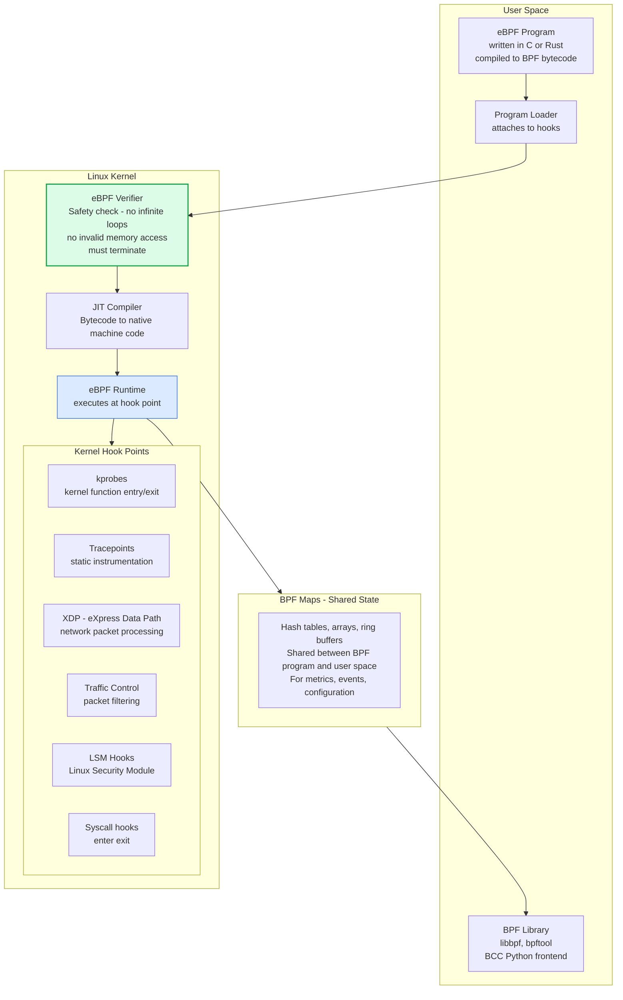
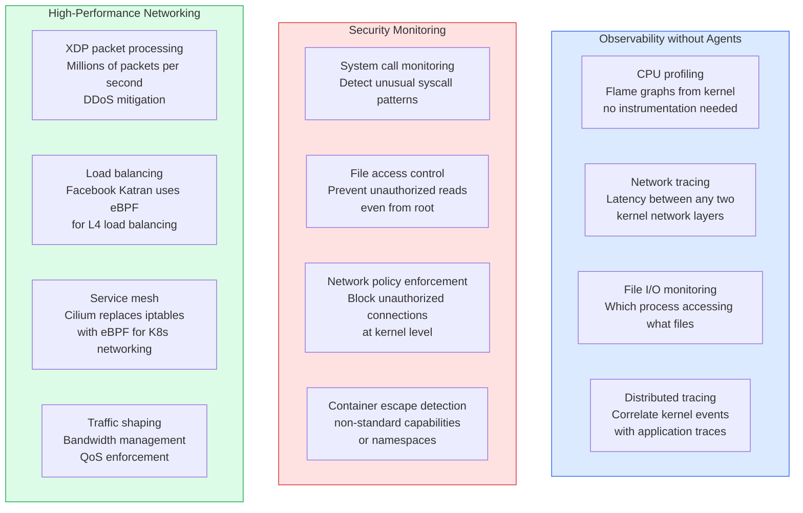
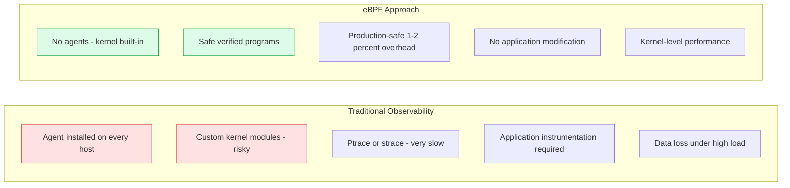

# eBPF (Extended Berkeley Packet Filter)

eBPF is a revolutionary kernel technology that allows safely running sandboxed programs in the Linux kernel without modifying kernel source code or loading kernel modules. It enables powerful observability, networking, and security capabilities with minimal overhead.

## eBPF Architecture

## eBPF Use Cases

## eBPF vs Traditional Approaches

## Key Concepts

- **eBPF Verifier**: Before any eBPF program runs, the kernel's verifier checks it for safety: no unbounded loops (guaranteed termination), no invalid memory accesses, no accessing other processes' memory, and no kernel instability. This makes eBPF safe to run in production — unlike kernel modules, a buggy eBPF program cannot crash the kernel.

- **JIT Compilation**: After verification, the BPF bytecode is compiled to native machine code by the kernel's JIT compiler. eBPF programs run at near-native speed with minimal overhead (typically 1-2% CPU overhead for comprehensive observability).

- **XDP (eXpress Data Path)**: An eBPF hook point that processes network packets at the earliest possible point in the kernel network stack, before any memory allocation. Enables packet processing at millions of packets per second. Used by Facebook's Katran load balancer and DDoS mitigation systems.

- **Cilium**: A Kubernetes networking and security plugin (CNI) that replaces iptables with eBPF for all network policy enforcement and service networking. eBPF-based networking is significantly faster and more observable than iptables.

- **Tetragon**: A Kubernetes security observability and runtime enforcement tool by Isovalent/Cilium. Uses eBPF to detect and optionally block security events (privilege escalation, unauthorized network connections, sensitive file access) at the kernel level.

- **BPF Maps**: Key-value stores in the kernel that eBPF programs and user-space applications use to exchange data. Ring buffers (perf buffers) enable high-throughput event streaming from eBPF programs to user space. Hash maps store aggregated metrics.

- **Continuous Profiling**: Using eBPF-based profilers (Parca, Pyroscope, Grafana Phlare) to continuously profile production applications at low overhead. Generates always-on flame graphs showing where CPU time is spent, enabling performance regression detection without sampling bias.

## Trade-offs

| Approach | Performance | Safety | Portability | Kernel Version |
|---------|------------|--------|------------|----------------|
| Kernel module | Highest | Low (can crash) | Low | Any |
| eBPF | Very High | High (verified) | Medium (kernel 5.x+) | 5.x+ |
| ptrace/strace | Low | High | High | Any |
| User-space agent | Medium | High | High | Any |

## When to Apply

- **Production observability**: Replace sampling profilers with continuous eBPF profiling for always-on performance visibility
- **Kubernetes networking**: Adopt Cilium for better performance and native network policy visibility vs iptables
- **Security monitoring**: eBPF-based runtime security (Falco, Tetragon) provides kernel-level visibility that application agents cannot match
- **DDoS mitigation**: XDP-based packet processing at line rate before the kernel networking stack
- **Requires Linux 5.x+**: eBPF features improve rapidly with kernel versions; check capability requirements for your target kernel
