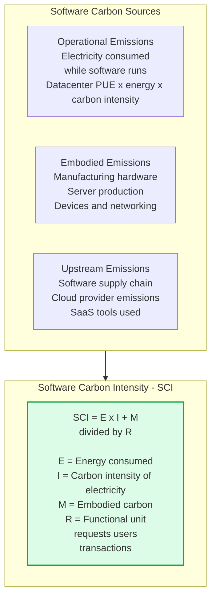
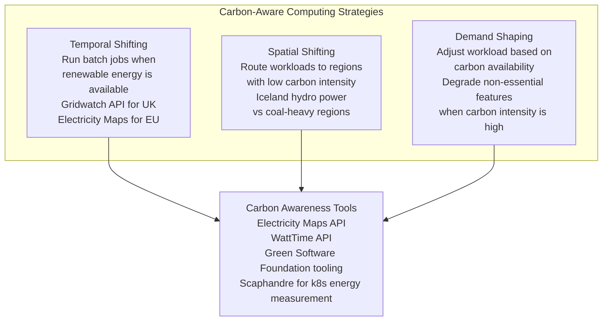

# Sustainability in Software Engineering

Green software engineering is the practice of building software systems that consume the minimum necessary energy and produce the minimum carbon footprint. As data centres represent 1-2% of global electricity consumption and AI workloads grow rapidly, sustainability becomes both an ethical and business imperative.

## Carbon Footprint of Software



## Carbon-Aware Computing



## Energy Efficiency Patterns

```mermaid
graph LR
    subgraph Efficiency[Software Energy Efficiency Patterns]
        Cache2[Aggressive Caching\nPrevent redundant computation\nEvery cache hit is energy saved]

        Efficient[Efficient Algorithms\nO(n log n) vs O(n2)\nHigher efficiency = less CPU = less energy]

        Async2[Async and Batch\nBatch small operations\nReduce idle-polling\nEvent-driven instead of polling]

        RightSize[Right-Sizing\nMatch hardware to workload\nOver-provisioned servers\nwaste energy at idle]

        Languages[Language Choice\nRust C Go: 10-100x more efficient\nthan interpreted languages\nfor compute-intensive workloads]
    end
```

## Key Concepts

- **Green Software Engineering**: A discipline focused on building software with minimal environmental impact. The Green Software Foundation (backed by Microsoft, Google, Intel, GitHub) defines the principles: energy efficiency, carbon awareness, and hardware efficiency.

- **Software Carbon Intensity (SCI)**: A metric defined by the Green Software Foundation for measuring the carbon intensity of software: SCI = (E × I + M) / R, where E is energy consumed, I is carbon intensity of the electricity grid, M is embodied carbon of hardware, and R is the functional unit (per request, per user, per transaction).

- **Energy Proportionality**: An ideal computer uses energy proportional to its work — 0% utilization uses 0% energy. Real servers consume 30-50% of peak power even at idle. Serverless and containerization improve energy proportionality by packing more work onto fewer machines.

- **Temporal Shifting**: Delaying batch workloads to times when the electricity grid has higher renewable energy availability. Running ML training jobs overnight when solar is unavailable but wind is high, or scheduling jobs in regions where renewables are more prevalent. The Electricity Maps API provides real-time carbon intensity data.

- **Spatial Shifting**: Routing workloads to cloud regions with lower carbon intensity electricity. Iceland runs datacenters on nearly 100% renewable geothermal energy; some US regions rely heavily on coal. A workload moved from a coal region to a renewable region can have 10x lower carbon emissions.

- **Hardware Efficiency**: Maximizing the utilization of hardware to amortize embodied carbon over more useful work. 80% server utilization vs 20% utilization means 4x more work from the same hardware manufacturing emissions. Containers and serverless improve hardware utilization.

- **Power Usage Effectiveness (PUE)**: A measure of data center energy efficiency: PUE = Total facility energy / IT equipment energy. A PUE of 1.0 is perfect (all power goes to compute). Industry average: 1.5. Google/Microsoft: ~1.1. Lower PUE means more energy going to actual compute.

## Trade-offs

| Strategy | Carbon Reduction | Performance Impact | Complexity |
|----------|----------------|-------------------|-----------|
| Temporal shifting | High (2-5x) | Low (deferred jobs) | Medium |
| Spatial shifting | High (2-10x) | Low | Medium |
| Algorithm optimization | High | Positive (faster too) | High |
| Right-sizing | Medium | Neutral | Low |
| Serverless (vs VMs) | Medium | Variable | Low |
| Demand shaping | Variable | Intentional degradation | High |

## When to Apply

- **Temporal and spatial shifting**: For batch ML training, data processing, and non-latency-sensitive workloads — significant carbon reduction with minimal user impact
- **Algorithm and data structure efficiency**: Always — efficiency improvements simultaneously reduce cost, improve performance, and reduce energy
- **Right-sizing**: Audit cloud resource utilization regularly — over-provisioned servers are both wasteful and expensive
- **SCI measurement**: Adopt SCI as a metric for significant services to make sustainability visible and improvable
- **Green cloud regions**: Consider carbon intensity alongside cost and latency when selecting cloud regions for new deployments
