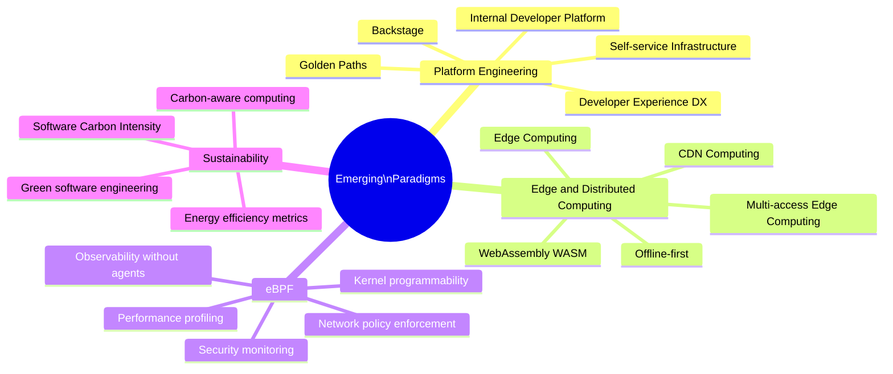

Emerging paradigms represent the leading edge of software engineering practice — new approaches that are reshaping how we build, deploy, and operate systems. Understanding these trends early provides competitive advantage and prepares engineers for the systems they will maintain.

## Overview

## Topics in This Section

| File | Topic | Key Concepts |
|------|-------|--------------|
| [01_platform_engineering.md](01_platform_engineering.md) | Platform Engineering | IDP, golden paths, self-service, Backstage |
| [02_edge_distributed_computing.md](02_edge_distributed_computing.md) | Edge Computing | CDN compute, WASM, offline-first |
| [03_ebpf.md](03_ebpf.md) | eBPF | Kernel programmability, observability, security |
| [04_sustainability.md](04_sustainability.md) | Sustainability | Green software, carbon-aware computing |