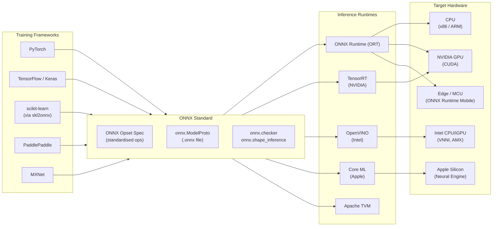
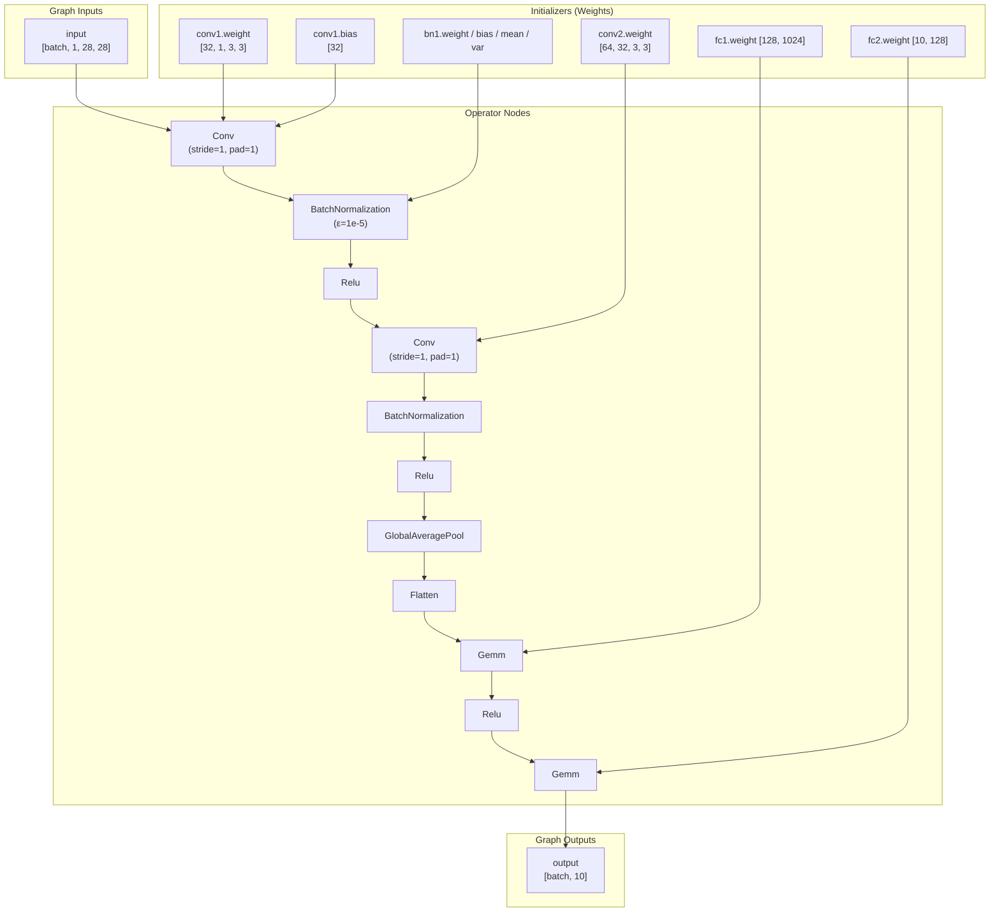
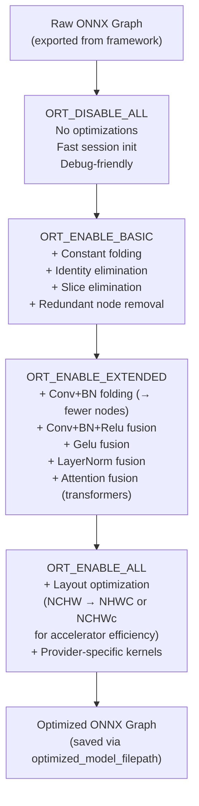
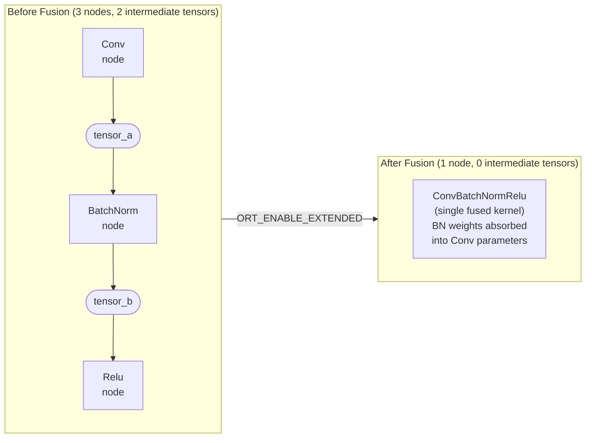
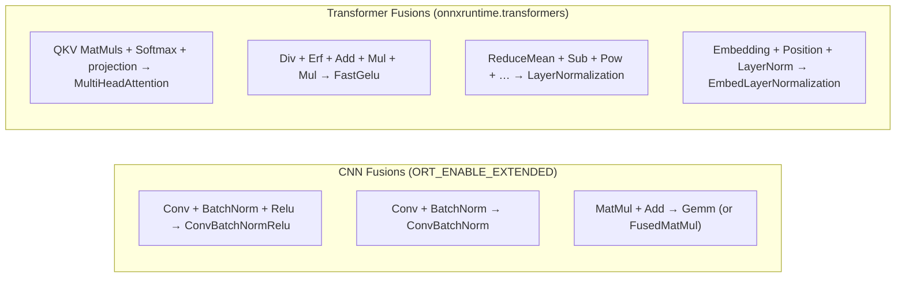
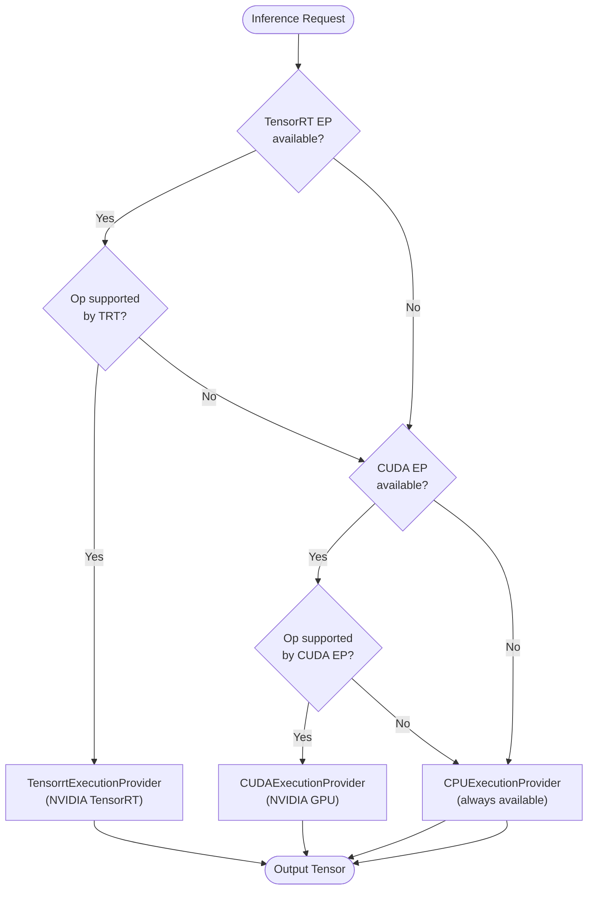
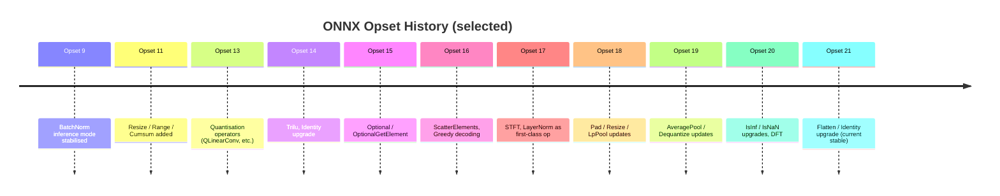

This document explains core ONNX concepts with diagrams, tables, and worked examples.
Every diagram is rendered as a Mermaid block so it displays natively in GitHub, GitLab,
and most modern Markdown viewers.

---

## 1. The ONNX Ecosystem

ONNX (Open Neural Network Exchange) is an open standard that decouples model training
from deployment.  A model trained in any supported framework can be exported to a single
`.onnx` file and executed on any compliant runtime across diverse hardware.



---

## 2. ONNX Graph Structure

An ONNX model is a **directed acyclic graph (DAG)**.  Every element has a precise role:

| Element | Description |
|---------|-------------|
| **Node** | An operator (Conv, Relu, MatMul …). Has typed inputs/outputs. |
| **Edge** | A named tensor flowing between nodes. |
| **Initializer** | A constant tensor (weight, bias). Stored in the model file. |
| **Graph Input** | External data fed at runtime (e.g., image batch). |
| **Graph Output** | Results returned to the caller. |
| **value_info** | Shape/type annotations on intermediate tensors (added by shape inference). |



---

## 3. ORT Optimization Pipeline

ONNX Runtime applies graph-level optimizations before running any inference.
The four levels are cumulative — each higher level includes all optimizations from lower levels.



### Optimization Level Reference Table

| Level | Constant Folding | Redundant Elimination | Op Fusion | Layout Opt | Use Case |
|-------|:---:|:---:|:---:|:---:|----------|
| `ORT_DISABLE_ALL` | - | - | - | - | Debugging, profiling raw graph |
| `ORT_ENABLE_BASIC` | Yes | Yes | - | - | Minimal safe optimisation |
| `ORT_ENABLE_EXTENDED` | Yes | Yes | Yes | - | Production CPU inference |
| `ORT_ENABLE_ALL` | Yes | Yes | Yes | Yes | Maximum throughput (EP-specific) |

---

## 4. Operator Fusion Patterns

Fusion merges multiple small kernels into one, eliminating intermediate tensor writes and
reducing kernel-launch overhead.



### BatchNorm Folding - What Happens Mathematically

BatchNorm at inference (running statistics, not per-batch) computes:

```
y = (x - mean) / sqrt(var + ε) * γ + β
```

This is a linear transform that can be folded into the preceding Conv:

```
W_fused = W_conv * (γ / sqrt(var + ε))
b_fused = b_conv * (γ / sqrt(var + ε)) + β - mean * (γ / sqrt(var + ε))
```

After folding: `y = W_fused * x + b_fused` — one fewer node, no intermediate tensor.

### Common Fusion Patterns



---

## 5. Execution Provider Selection Flow

ORT selects operators for each EP in priority order.  Unsupported ops fall through
to the next provider in the list (ultimately always CPU).



### Execution Provider Reference Table

| EP | Package | Hardware | Notes |
|----|---------|----------|-------|
| `CPUExecutionProvider` | `onnxruntime` | Any CPU | Always available. Uses MLAS. |
| `CUDAExecutionProvider` | `onnxruntime-gpu` | NVIDIA GPU | Requires CUDA + cuDNN. |
| `TensorrtExecutionProvider` | `onnxruntime-gpu` | NVIDIA GPU | Best throughput; requires TensorRT. |
| `ROCmExecutionProvider` | `onnxruntime-rocm` | AMD GPU | Requires ROCm stack. |
| `CoreMLExecutionProvider` | `onnxruntime` | Apple Silicon | macOS / iOS. Neural Engine delegate. |
| `OpenVINOExecutionProvider` | `onnxruntime-openvino` | Intel CPU/GPU/VPU | Requires OpenVINO toolkit. |
| `DirectMLExecutionProvider` | `onnxruntime-directml` | Windows GPU | DirectX 12. Windows only. |
| `QNNExecutionProvider` | `onnxruntime-qnn` | Qualcomm NPU | Snapdragon NPU / HTP. |

---

## 6. ONNX Opset Versioning

An opset version specifies which set of operator definitions the model uses.
Higher opsets add new operators and may change semantics of existing ones.



**Rule of thumb**: use `opset_version=17` for broad ORT compatibility.
PyTorch `torch.onnx.export` supports up to the current opset automatically.

---

## 7. Key ONNX Python APIs

```python
import onnx
import onnx.shape_inference

# Load a model
model = onnx.load("model.onnx")

# Structural validation (raises on error)
onnx.checker.check_model(model)

# Shape inference — fills value_info for all intermediate tensors
model = onnx.shape_inference.infer_shapes(model)

# Inspect the graph
graph = model.graph
for node in graph.node:
    print(node.op_type, node.input, node.output)

# Inspect initializers (weights)
for init in graph.initializer:
    print(init.name, list(init.dims))

# Access input/output shapes
for vi in graph.input:
    for dim in vi.type.tensor_type.shape.dim:
        print(dim.dim_value or dim.dim_param)
```

```python
import onnxruntime as ort

# Create a session with optimization
opts = ort.SessionOptions()
opts.graph_optimization_level = ort.GraphOptimizationLevel.ORT_ENABLE_ALL
opts.optimized_model_filepath = "optimized.onnx"

session = ort.InferenceSession("model.onnx", sess_options=opts,
                                providers=["CPUExecutionProvider"])
# Run inference
outputs = session.run(None, {"input": input_array})
```