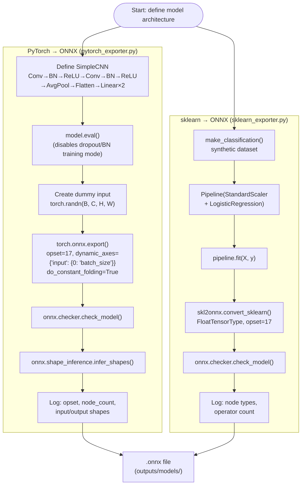
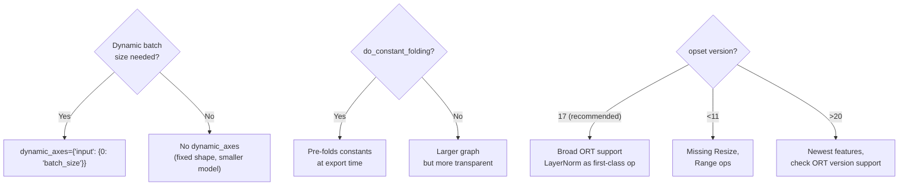
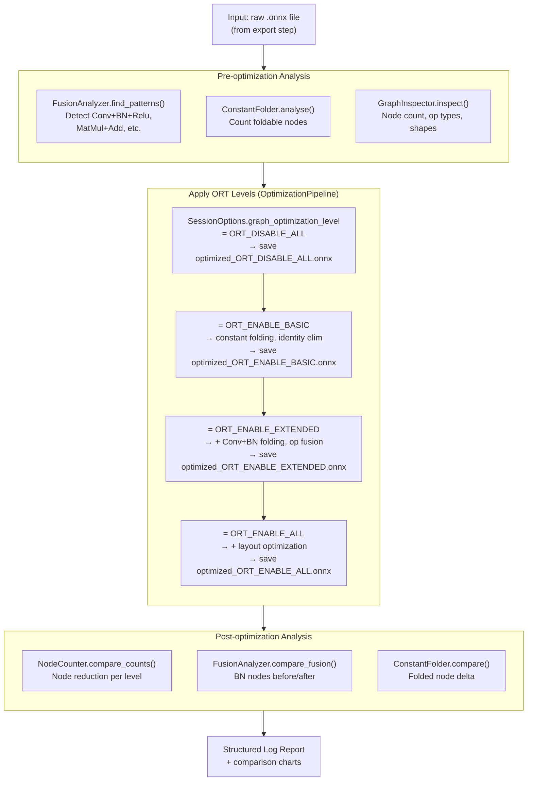
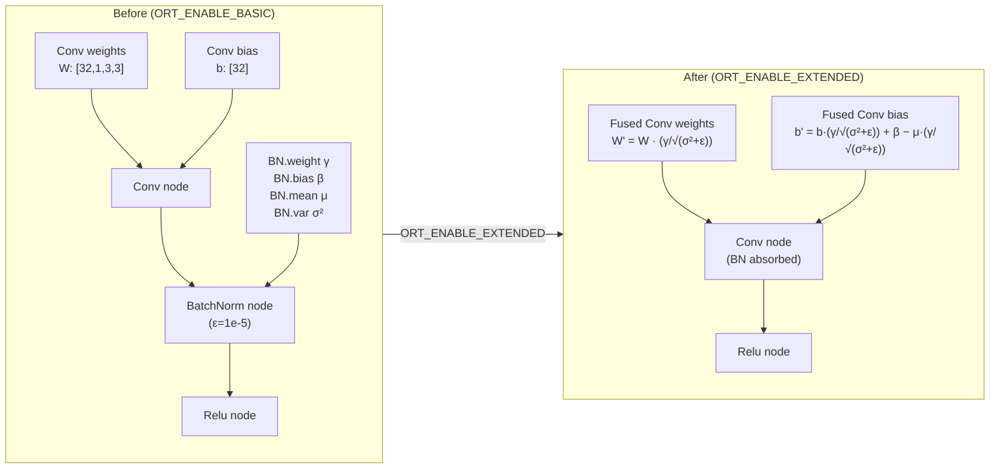
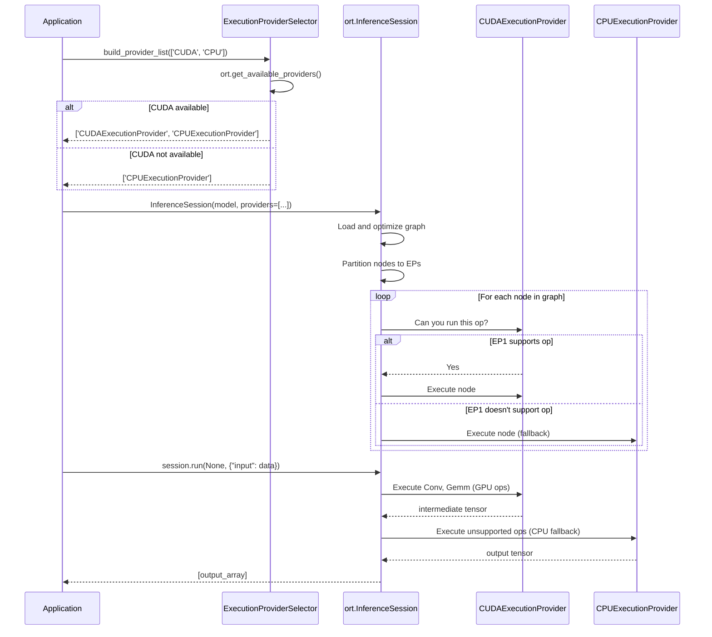
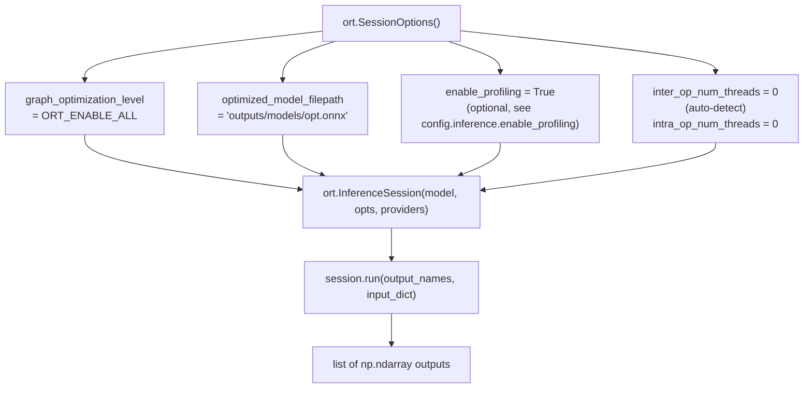
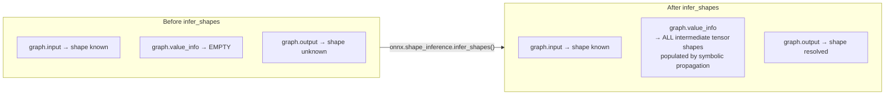
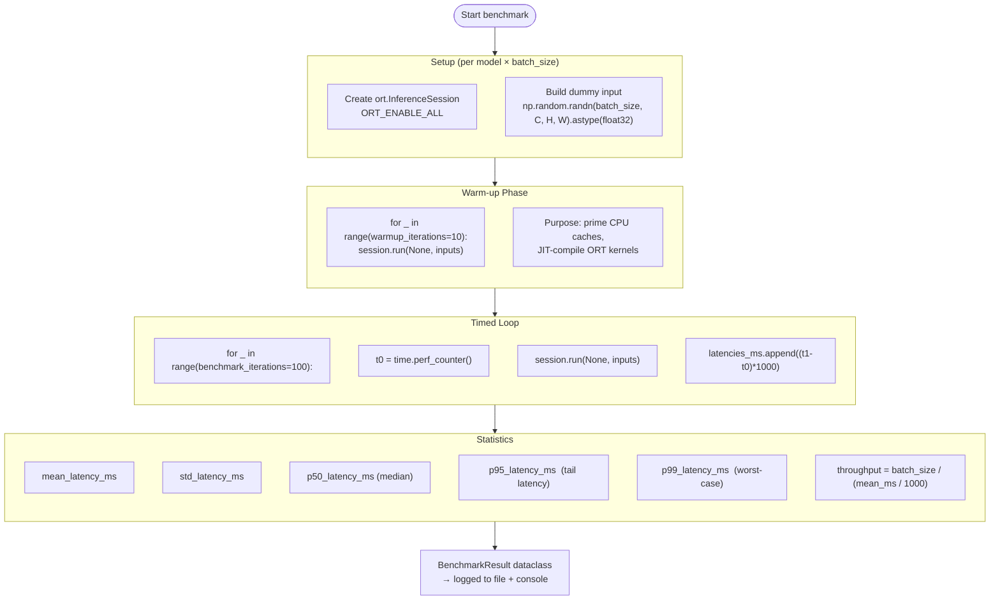
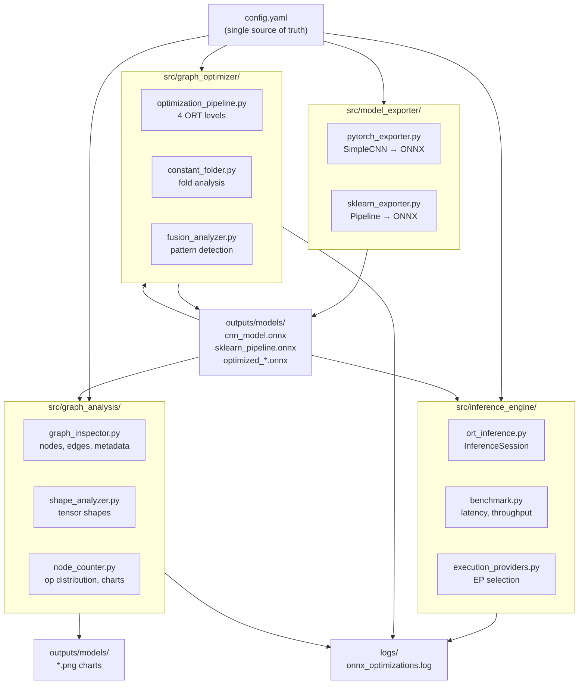

Detailed workflow diagrams for every stage of the ONNX optimization lifecycle.
Each diagram corresponds directly to code in the `src/` modules.

---

## 1. Model Export Pipeline

This flow covers `src/model_exporter/pytorch_exporter.py` and
`src/model_exporter/sklearn_exporter.py`.

### Export Key Decision Points

---

## 2. Graph Optimization Pipeline

This flow covers `src/graph_optimizer/optimization_pipeline.py`,
`constant_folder.py`, and `fusion_analyzer.py`.

### BatchNorm Folding - Node-level Detail

---

## 3. Inference Request Flow with EP Selection

This flow covers `src/inference_engine/ort_inference.py` and
`src/inference_engine/execution_providers.py`.

### Session Options Configuration Flow

---

## 4. Graph Analysis Workflow

This flow covers `src/graph_analysis/graph_inspector.py`,
`shape_analyzer.py`, and `node_counter.py`.

```mermaid
flowchart TD
    ONNX_FILE[".onnx file"]

    subgraph Load["Load & Validate"]
        direction TB
        LD["onnx.load(path)"]
        SI["onnx.shape_inference.infer_shapes()\n→ fills value_info with tensor shapes"]
        CHK["onnx.checker.check_model()\n→ raises on structural errors"]
    end

    subgraph Structure["Structural Inspection (GraphInspector)"]
        direction TB
        META["Log metadata:\n  ir_version, opset, graph name"]
        IOS["Log inputs/outputs:\n  name, shape, dtype"]
        INITS["Log initializers:\n  name, shape, numel, dtype\n  total_parameters count"]
        NODES["Inspect nodes:\n  op_type, name, inputs, outputs\n  attributes (kernel_size, strides…)"]
        OPP["Detect optimization opportunities:\n  unfused Conv+BN+Relu patterns\n  Dropout at inference"]
    end

    subgraph Shapes["Shape Propagation (ShapeAnalyzer)"]
        direction TB
        MAP["Build shape_map:\n  tensor_name → [dims]"]
        PROP["Print per-node:\n  [idx] op_type  in=[x:shape]  →  out=[y:shape]"]
        DYN["Find dynamic dimensions:\n  symbolic dims (batch_size, seq_len)"]
    end

    subgraph Counting["Operator Counting (NodeCounter)"]
        direction TB
        CNT["Count by op_type:\n  Conv×2, BN×2, Relu×3 …"]
        SORT["Sort descending by count"]
        CHART1["plot_distribution()\n  → horizontal bar chart\n  → saved to outputs/models/"]
        CHART2["compare_counts(models_dict)\n  → grouped bar across opt levels"]
    end

    ONNX_FILE --> Load
    Load --> Structure
    Load --> Shapes
    Load --> Counting
```

### Shape Inference Detail

---

## 5. End-to-End Benchmarking Flow

This flow covers `src/inference_engine/benchmark.py`.

### Benchmark Interpretation Guide

| Metric | When to care | What it tells you |
|--------|-------------|-------------------|
| `mean_latency_ms` | Always | Average cost per inference call |
| `p50_latency_ms` | Steady-state systems | Typical latency (50% of calls faster) |
| `p95_latency_ms` | SLA-bound services | Latency seen by 95% of requests |
| `p99_latency_ms` | Latency-sensitive APIs | Near-worst-case; affects tail users |
| `throughput_samples_per_s` | Batch workloads | Maximum data processing rate |

**Throughput vs Latency trade-off**: Larger batch sizes increase throughput
but also increase p99 latency.  Choose batch size based on your SLA.

---

## 6. Complete System Architecture

