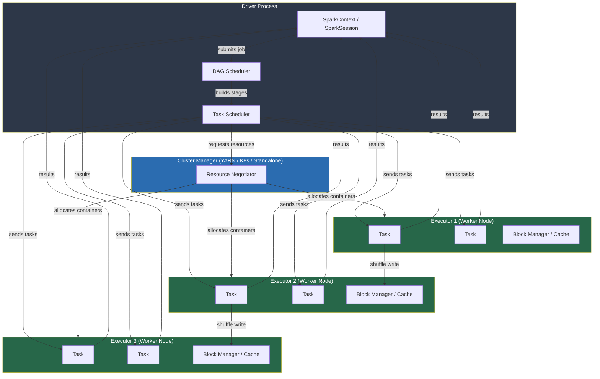
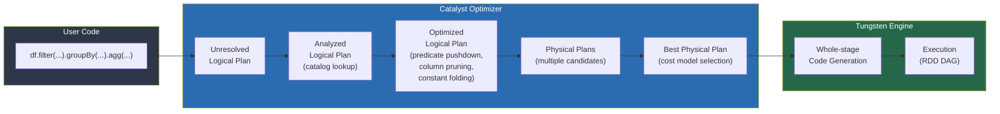
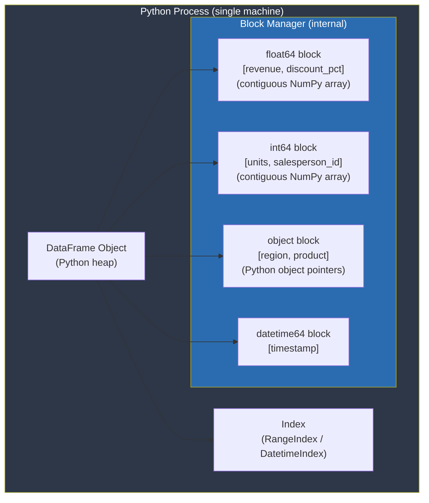
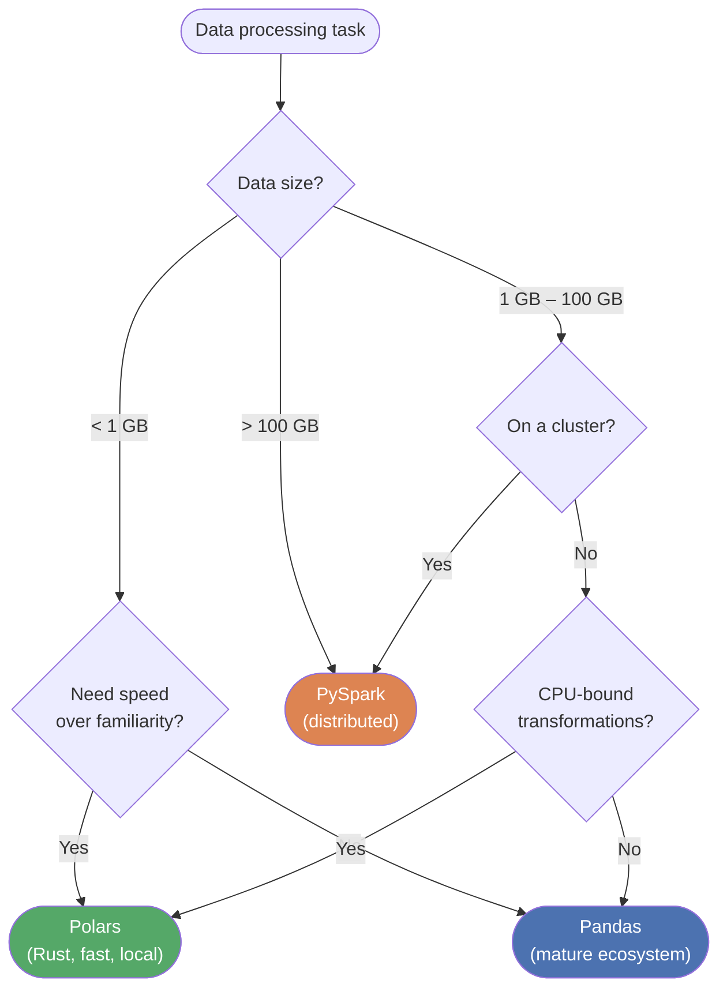

## 1. PySpark Cluster Architecture



**Key roles:**
- **Driver**: the process running your Python script. Owns the SparkContext, constructs the DAG, and coordinates execution.
- **DAG Scheduler**: breaks the logical plan into *stages* separated by shuffle boundaries.
- **Task Scheduler**: allocates individual *tasks* (one per partition) to executor slots.
- **Cluster Manager**: negotiates physical resources (YARN / Kubernetes / Spark Standalone).
- **Executor**: JVM process that runs tasks and stores cached RDD/DataFrame partitions in its Block Manager.

---

## 2. Catalyst Optimizer Pipeline



**Optimisation rules applied:**
| Rule | Example |
|---|---|
| Predicate Pushdown | Move `.filter()` as close to data source as possible |
| Column Pruning | Only read columns referenced downstream |
| Constant Folding | Evaluate `1 + 1` at plan time |
| Join Reordering | Place smaller table on the build side |
| Broadcast Join | Auto-broadcast tables smaller than `autoBroadcastJoinThreshold` |

---

## 3. Pandas Memory Model



**Memory optimisation strategies:**
1. **Category dtype**: replaces repeated string objects with integer codes + a small lookup table. Saves up to 90% for low-cardinality columns.
2. **Numeric downcast**: `int64` (8 bytes) -> `int8` (1 byte) when range allows. `float64` -> `float32`.
3. **Chunked reading**: process large files in `chunksize` slices to avoid loading everything into RAM.
4. **Copy-on-write (pandas ≥ 2.0)**: slices share memory until mutated, reducing unnecessary copies.

---

## 4. Pandas vs PySpark vs Polars — Comparison Table

| Concept | Pandas | PySpark | Polars |
|---|---|---|---|
| **Execution model** | Eager (immediate) | Lazy (DAG, action triggers) | Eager default / `.lazy()` available |
| **Scale** | Single machine | Distributed cluster | Single machine (multi-threaded) |
| **Memory** | NumPy blocks (mutable) | Immutable partitioned RDDs | Apache Arrow columnar (immutable) |
| **Backend language** | Python / NumPy (C) | Python API → JVM (Scala/Java) | Python API → Rust |
| **GroupBy** | `df.groupby().agg()` | `df.groupBy().agg()` | `df.group_by().agg()` |
| **Window functions** | `df.rolling()` / `expanding()` | `Window.partitionBy()` | `pl.col(...).rolling_mean()` |
| **Join** | `df.merge(other)` | `df.join(other)` | `df.join(other)` |
| **UDFs** | Native Python | Python UDF (slow) / Pandas UDF (fast) | Native Rust expressions |
| **SQL** | `pandasql` / DuckDB | `spark.sql(...)` | `pl.SQLContext` |
| **Schema** | Inferred, loose | `StructType`, strict | Inferred / declared, strict |
| **Streaming** | No | Structured Streaming | No |
| **Serialisation** | Pickle / CSV / Parquet | Kryo / Parquet / ORC | IPC / Parquet / CSV |
| **Best for** | < 1 GB, exploration | > 1 GB, distributed ETL / ML | < 50 GB, fast local transforms |
| **Installation** | `pip install pandas` | `pip install pyspark` | `pip install polars` |

---

## 5. Key API Cross-Reference

```mermaid
mindmap
  root((Data Operations))
    Filtering
      Pandas: df[mask]
      Pandas: df.query()
      PySpark: df.filter(F.col() > x)
      Polars: df.filter(pl.col() > x)
    GroupBy
      Pandas: groupby().agg()
      Pandas: groupby().transform()
      PySpark: groupBy().agg()
      Polars: group_by().agg()
    Windows
      Pandas: rolling / ewm / expanding
      PySpark: Window.partitionBy().orderBy()
      Polars: rolling_mean / over()
    Joins
      Pandas: merge(how=inner/left/right/outer)
      PySpark: join(how=inner/left/right/outer)
      PySpark: broadcast(df)
      Polars: join(how=...)
    Reshaping
      Pandas: melt / pivot / stack / unstack
      PySpark: stack / unpivot
      Polars: melt / pivot
    IO
      CSV: read_csv / spark.read.csv / pl.read_csv
      Parquet: read_parquet / spark.read.parquet / pl.read_parquet
      JSON: read_json / spark.read.json / pl.read_json
```

---

## 6. When to Use Which Framework

