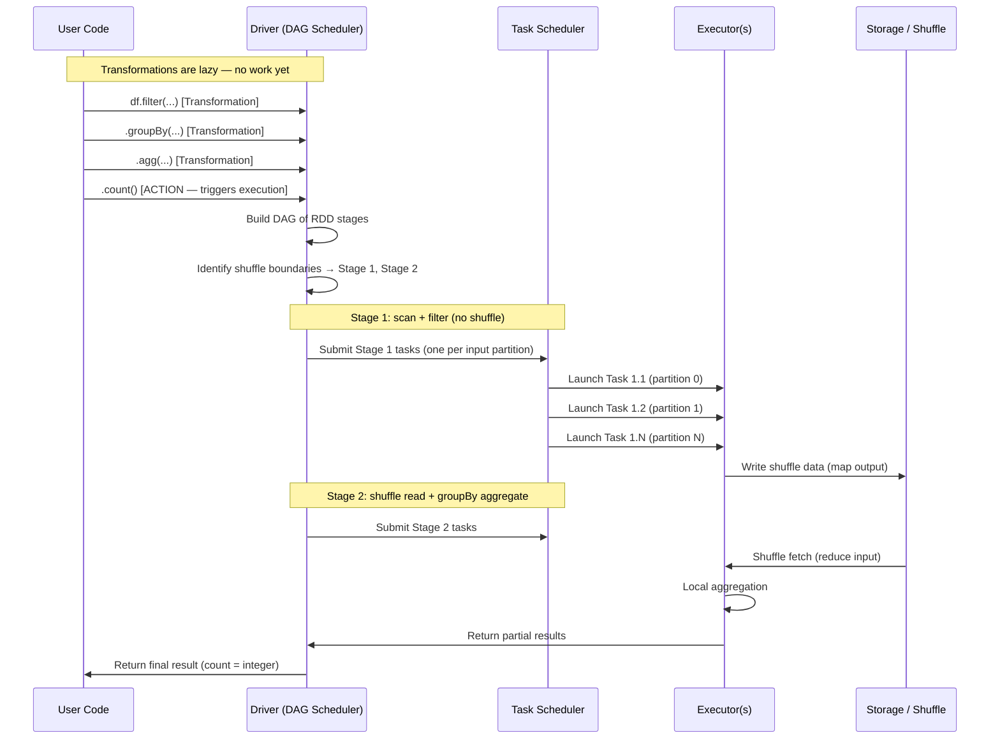
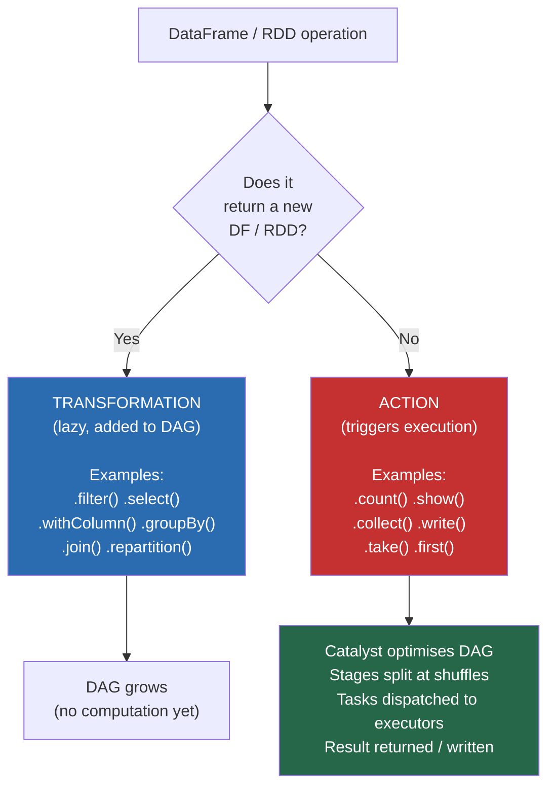
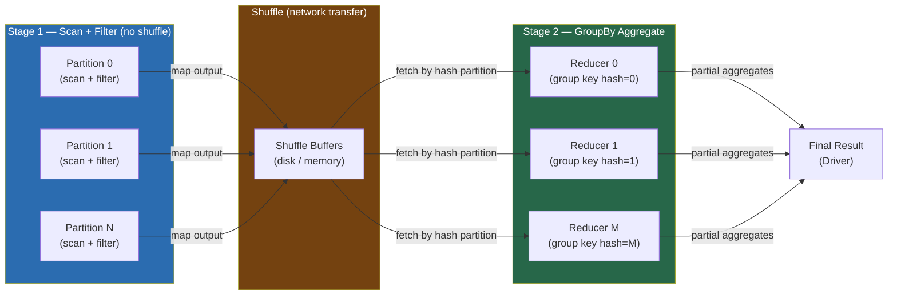
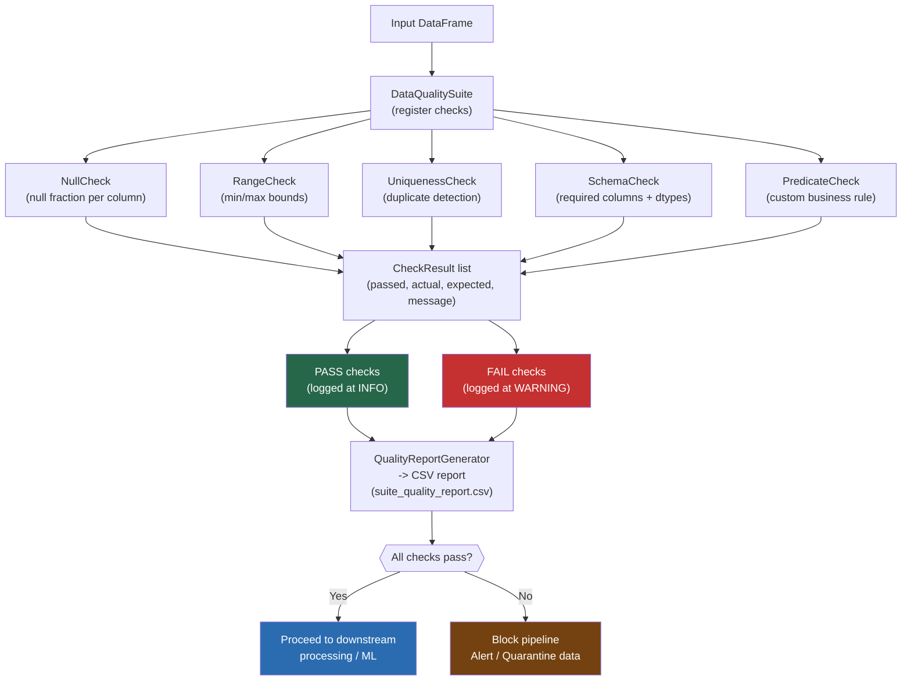
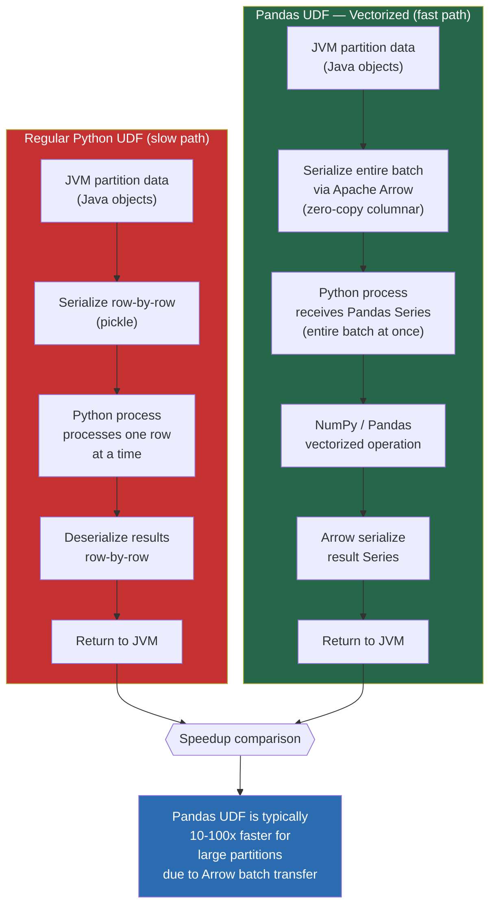
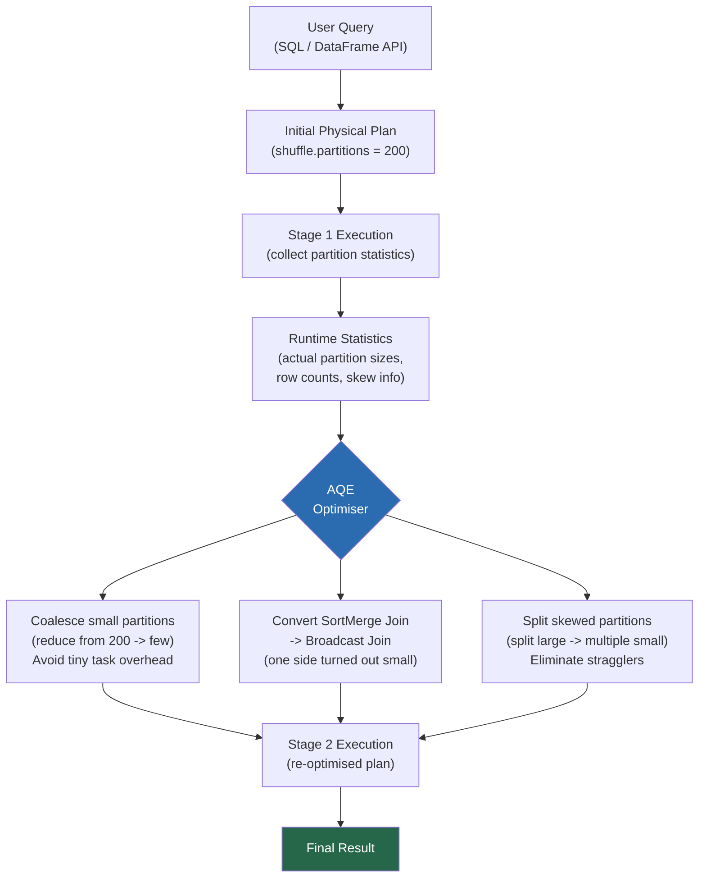

# Flow Diagrams — Pandas & PySpark

## 1. Spark Job Execution Flow

From user code to task execution — showing how transformations and actions produce stages and tasks.

---

## 2. Transformation vs Action Decision Tree

---

## 3. Spark Stage and Shuffle Flow

---

## 4. ML Pipeline Flow

```mermaid
flowchart LR
    subgraph Input["Raw Data"]
        RAW["DataFrame\nregion, product, age,\nrevenue, units, label"]
    end

    subgraph FeatureEng["Feature Engineering Pipeline (fit on train only)"]
        SI["StringIndexer\nregion -> region_index\nproduct -> product_index"]
        OHE["OneHotEncoder\nregion_index -> region_ohe\nproduct_index -> product_ohe"]
        VA["VectorAssembler\n[ohe cols + numeric cols]\n-> raw_features"]
        SS["StandardScaler\nraw_features -> features\n(mean=0, std=1)"]
    end

    subgraph Training["Model Training"]
        SPLIT["Train / Test Split\n(80% / 20%)"]
        GBT["GBTClassifier\nor RandomForest\n(Pipeline API)"]
        CV["CrossValidator\n+ ParamGridBuilder\n(k-fold)"]
    end

    subgraph Eval["Evaluation & Persistence"]
        PRED["Predictions\n(probability, prediction)"]
        EVAL["BinaryClassificationEvaluator\nAUC-ROC"]
        SAVE["model.write().save(path)"]
        LOAD["PipelineModel.load(path)"]
    end

    RAW --> SPLIT
    SPLIT -->|train set| SI --> OHE --> VA --> SS --> GBT
    GBT --> CV --> EVAL
    SPLIT -->|test set| PRED
    CV -->|best model| PRED --> EVAL --> SAVE --> LOAD

    style Input fill:#2d3748,color:#fff
    style FeatureEng fill:#2b6cb0,color:#fff
    style Training fill:#276749,color:#fff
    style Eval fill:#744210,color:#fff
```

---

## 5. Data Quality Check Flow

---

## 6. Pandas UDF vs Python UDF Data Flow

---

## 7. Adaptive Query Execution (AQE) Flow

