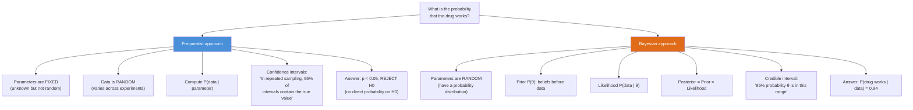
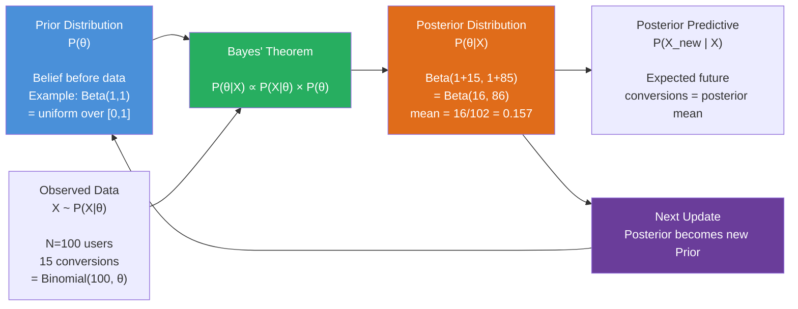
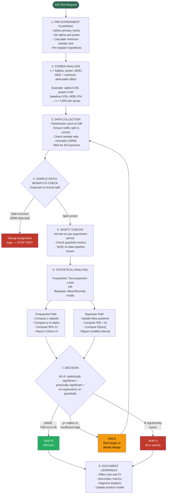

This document covers the foundational statistical concepts implemented in this project,
with diagrams, formal definitions, and practical intuition.

---

## Table of Contents

1. [Central Limit Theorem](#central-limit-theorem)
2. [P-values and Significance](#p-values-and-significance)
3. [Confidence Intervals](#confidence-intervals)
4. [Bayesian vs. Frequentist Statistics](#bayesian-vs-frequentist)
5. [Statistical Hypothesis Testing Decision Tree](#hypothesis-testing-decision-tree)
6. [Bayesian Updating Process](#bayesian-updating-process)
7. [A/B Test Analysis Workflow](#ab-test-analysis-workflow)
8. [Descriptive Statistics Reference](#descriptive-statistics-reference)
9. [Effect Sizes](#effect-sizes)
10. [Multiple Testing Problem](#multiple-testing-problem)

---

## Central Limit Theorem

**Definition**: For independent, identically distributed (i.i.d.) random variables X₁, X₂, ..., Xₙ with mean μ and finite variance σ², the standardised sample mean converges in distribution to the standard normal:

```
√n · (X̄ - μ) / σ  →  N(0, 1)  as n → ∞
```

**Practical implication**: Even if the underlying data is skewed (e.g., revenue, wait times), the **sampling distribution of the mean** becomes approximately normal for n ≥ 30, enabling parametric t-tests and z-tests.

**When CLT breaks down**:
- Heavy-tailed distributions with infinite variance (Cauchy distribution)
- Very small samples from highly skewed distributions
- Dependent observations (time series without proper handling)

---

## P-values and Significance

**P-value definition**: P(T ≥ t_obs | H₀ is true)

The probability of observing a test statistic at least as extreme as the one computed from our data, **assuming the null hypothesis is true**.

**Common misconceptions**:

| Wrong interpretation | Correct interpretation |
|---|---|
| P(H₀ is true) = p-value | The p-value is not the probability H₀ is true |
| p < 0.05 means the effect is large | p depends on sample size; d/h measures effect size |
| p > 0.05 means H₀ is true | It means insufficient evidence to reject H₀ |
| p < 0.05 means practically significant | Statistical significance ≠ practical significance |

**The dance of p-values**: Under H₀, p-values are uniformly distributed on [0, 1]. Under H₁, they concentrate near 0. A histogram of many p-values can reveal the proportion of true effects.

---

## Confidence Intervals

A **95% frequentist confidence interval** means: if we repeated the experiment many times, 95% of such intervals would contain the true parameter.

**It does NOT mean** there is a 95% probability the true parameter lies in this specific interval — once computed, the interval either contains the true value or it doesn't.

### Frequentist CI vs Bayesian Credible Interval

| Property | Frequentist 95% CI | Bayesian 95% Credible Interval |
|---|---|---|
| Interpretation | 95% of such intervals contain θ | P(θ ∈ CI \| data) = 0.95 |
| Prior | None | Requires prior P(θ) |
| Computation | Depends on sampling distribution | Derived from posterior |
| Validity | Large-sample approximation often needed | Exact for conjugate models |
| Intuition | Property of the procedure | Direct probability statement |

**Coverage simulation** (from `conjugate_priors.py`): Both methods achieve approximately 95% empirical coverage, but the Bayesian interval provides a more natural probabilistic interpretation.

---

## Bayesian vs. Frequentist Statistics



**When to use Bayesian**:
- Sequential testing (no fixed sample size required)
- Small samples (prior regularises estimates)
- Need probability statements about parameters
- Want to incorporate domain knowledge via informative priors

**When to use Frequentist**:
- Pre-registration and regulatory contexts (FDA, clinical trials)
- No prior knowledge available
- Need reproducible, objective procedures

---

## Hypothesis Testing Decision Tree

```mermaid
flowchart TD
    START([Start: What is your research question?])
    START --> Q1{How many groups?}

    Q1 -->|One group| ONE[Compare sample to\nknown/theoretical value]
    Q1 -->|Two groups| TWO[Compare two independent\nor paired groups]
    Q1 -->|3+ groups| MANY[Compare multiple groups]

    ONE --> ONE_PARAM{Data normally\ndistributed?}
    ONE_PARAM -->|Yes| ONET["One-sample t-test\nH0: μ = μ0\nEffect: Cohen's d"]
    ONE_PARAM -->|No| ONES["Wilcoxon signed-rank test\n(non-parametric)"]

    TWO --> PAIRED{Observations\npaired?}
    PAIRED -->|Yes, paired| PAIRT["Paired t-test\nH0: μ_diff = 0"]
    PAIRED -->|No, independent| TWOQ{Outcome type?}

    TWOQ -->|Continuous\nnormal| WELCH["Welch's two-sample t-test\nH0: μA = μB\nNo equal-variance assumption\nEffect: Cohen's d"]
    TWOQ -->|Continuous\nskewed or ordinal| MWU["Mann-Whitney U test\n(non-parametric)\nH0: same distribution\nEffect: rank-biserial r"]
    TWOQ -->|Binary\n(proportions)| ZPROP["Two-proportion z-test\nH0: pA = pB\nEffect: Cohen's h"]
    TWOQ -->|Categorical| CHI["Chi-squared test\nof independence\nH0: variables are independent\nEffect: Cramér's V"]

    MANY --> MANYQ{Assumptions met?}
    MANYQ -->|Yes| ANOVA["One-way ANOVA\nH0: all means equal\nPost-hoc: Tukey HSD"]
    MANYQ -->|No| KW["Kruskal-Wallis test\n(non-parametric ANOVA)"]

    ONET --> MULT{Multiple tests?}
    WELCH --> MULT
    MWU --> MULT
    ZPROP --> MULT
    CHI --> MULT
    ANOVA --> MULT
    KW --> MULT

    MULT -->|Yes| CORRECT{Correction method}
    MULT -->|No| INTERPRET[Interpret result:\np < alpha: reject H0\nReport effect size\nReport confidence interval]

    CORRECT -->|Few tests,\nFWER control| BONF["Bonferroni correction\nadj_alpha = alpha / m"]
    CORRECT -->|Many tests,\nFDR control| BH["Benjamini-Hochberg\n(FDR < alpha)"]

    BONF --> INTERPRET
    BH --> INTERPRET

    style START fill:#2d6a4f,color:#fff
    style INTERPRET fill:#1a535c,color:#fff
    style WELCH fill:#4a90d9,color:#fff
    style MWU fill:#6a3d9a,color:#fff
    style ZPROP fill:#e06c1a,color:#fff
    style CHI fill:#c0392b,color:#fff
    style BH fill:#27ae60,color:#fff
    style BONF fill:#f39c12,color:#fff
```

---

## Bayesian Updating Process

The core of Bayesian statistics is sequential updating: start with a prior belief, observe data, obtain a posterior that becomes the prior for the next observation.



### Conjugate Families

| Prior | Likelihood | Posterior | Use Case |
|---|---|---|---|
| Beta(α, β) | Binomial(n, p) | Beta(α+s, β+f) | Conversion rates, click-through |
| Normal(μ₀, σ₀²) | Normal(μ, σ²) | Normal(μₙ, σₙ²) | Continuous measurements |
| Gamma(α, β) | Poisson(λ) | Gamma(α+Σx, β+n) | Count data, event rates |
| Dirichlet(α) | Multinomial(n, p) | Dirichlet(α+counts) | Multi-category |

---

## A/B Test Analysis Workflow



---

## Descriptive Statistics Reference

### Measures of Central Tendency

| Measure | Formula | When to use | Robust to outliers? |
|---|---|---|---|
| Arithmetic mean | Σx / n | Symmetric, no outliers | No |
| Median | Middle value | Skewed data, income | Yes |
| Mode | Most frequent | Categorical data | Yes |
| Trimmed mean | Mean after removing p% tails | Outliers present | Partly |
| Geometric mean | (∏xᵢ)^(1/n) | Growth rates, ratios | No |
| Harmonic mean | n / Σ(1/xᵢ) | Rates (speed, P/E ratio) | No |

### Measures of Spread

| Measure | Formula | Interpretation |
|---|---|---|
| Variance | Σ(xᵢ-μ)² / (n-1) | Average squared deviation |
| Std deviation | √variance | Same units as data |
| IQR | Q3 - Q1 | Range of middle 50% |
| MAD | median(\|xᵢ - median\|) | Most robust scale estimator |
| CV | σ / μ | Relative variability (unitless) |

### Skewness and Kurtosis

```
Skewness > 0: Right tail is longer (mean > median)
Skewness < 0: Left tail is longer (mean < median)
Skewness = 0: Symmetric

Excess Kurtosis > 0: Heavier tails than normal (leptokurtic)
Excess Kurtosis < 0: Lighter tails than normal (platykurtic)
Excess Kurtosis = 0: Same tails as normal (mesokurtic)
```

---

## Effect Sizes

Effect sizes quantify **practical significance** — independent of sample size.

### Cohen's d (Continuous)

```
d = (μ₁ - μ₂) / σ_pooled

Benchmarks (Cohen, 1988):
  Small:  d = 0.20
  Medium: d = 0.50
  Large:  d = 0.80
```

### Cohen's h (Proportions)

```
h = 2·arcsin(√p₁) - 2·arcsin(√p₂)

Benchmarks:
  Small:  h = 0.20
  Medium: h = 0.50
  Large:  h = 0.80
```

### Cramér's V (Chi-squared)

```
V = √(χ²/ (n · (k-1)))  where k = min(rows, cols)

Benchmarks (adjusted for degrees of freedom):
  Small:  V ≈ 0.10
  Medium: V ≈ 0.30
  Large:  V ≈ 0.50
```

---

## Multiple Testing Problem

When performing m tests at significance level α, the probability of at least one false positive is:

```
P(≥1 false positive) = 1 - (1-α)^m

For m=20, alpha=0.05: P = 1 - 0.95^20 ≈ 0.64
```

### Correction Methods

**Bonferroni** (FWER control):
- Adjusted threshold: α* = α / m
- Conservative: use when any false positive is costly
- Example: clinical drug trials with multiple endpoints

**Benjamini-Hochberg** (FDR control):
- Controls the expected proportion of false discoveries
- More powerful than Bonferroni for many tests
- Procedure: sort p-values, reject p_(k) ≤ k/m · α
- Example: genomics, marketing campaign testing

```
FDR = E[False Discoveries / Total Discoveries]
```