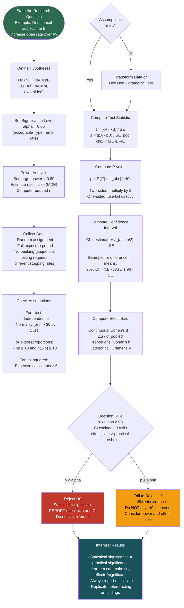
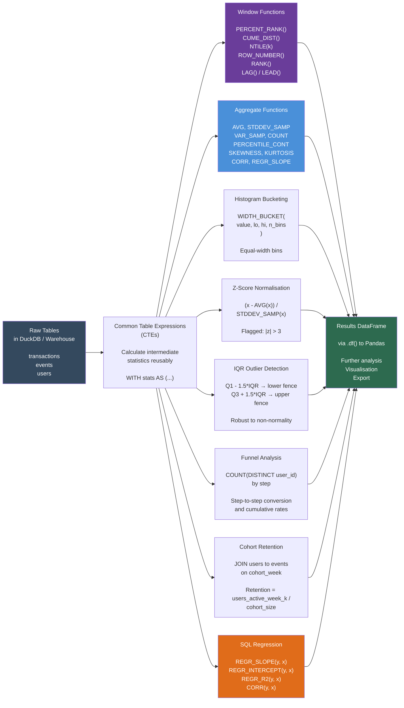

This document contains workflow diagrams for the three main analysis patterns
in this project.

---

## 1. Statistical Analysis Pipeline

The full end-to-end pipeline from raw data to actionable insights.

```mermaid
flowchart TD
    RAW["Raw Data\n(CSV, DB, API, stream)"]

    EDA["Exploratory Data Analysis\n\n- Shape and dtypes\n- Missing value audit\n- Duplicate check\n- Value distributions"]

    DESC["Descriptive Statistics\n\nstatistics_calculator.py\n\n- Central tendency: mean, median, mode\n- Spread: std, IQR, MAD, CV\n- Shape: skewness, kurtosis\n- Percentiles: P25, P50, P75, P99"]

    DIST["Distribution Analysis\n\ndistribution_analyzer.py\n\n- Fit: Normal, Log-Normal,\n  Gamma, Exponential, Beta\n- Goodness-of-fit: KS test\n- Model selection: AIC\n- QQ plot for normality check"]

    NORM{Data\nnormally\ndistributed?}

    PARAM["Parametric Methods\n\n- t-tests (Welch's)\n- ANOVA\n- Pearson correlation\n- Linear regression"]

    NONPAR["Non-parametric Methods\n\n- Mann-Whitney U\n- Kruskal-Wallis\n- Spearman correlation\n- Bootstrap CI"]

    HYPO["Hypothesis Testing\n\ntest_runner.py\n\n- Formulate H0 and H1\n- Choose test statistic\n- Compute p-value\n- Check power"]

    MULTI{Multiple\nhypotheses?}
    MTC["Multiple Testing Correction\n\n- Bonferroni (FWER)\n- Benjamini-Hochberg (FDR)"]

    EFFECT["Effect Size Analysis\n\n- Cohen's d (continuous)\n- Cohen's h (proportions)\n- Cramér's V (categorical)\n- Rank-biserial r (non-param)"]

    BAYES["Bayesian Analysis\n\nbayesian_ab_test.py\nconjugate_priors.py\n\n- Posterior distribution\n- Credible intervals\n- P(effect exists)\n- Expected loss"]

    SQL["SQL Analytics\n\nsql_statistics.py\n\n- Scalable aggregations\n- Window functions\n- Outlier detection\n- Cohort analysis"]

    VIZ["Visualisation\n\nmatplotlib / seaborn\n\n- Histograms + fitted PDFs\n- QQ plots\n- Power curves\n- Posterior distributions\n- Heatmaps"]

    REPORT["Report & Decision\n\n- Statistical significance\n- Practical significance\n- Confidence/credible intervals\n- Recommendations"]

    RAW --> EDA --> DESC --> DIST
    DIST --> NORM
    NORM -->|Yes| PARAM
    NORM -->|No| NONPAR
    PARAM --> HYPO
    NONPAR --> HYPO
    HYPO --> MULTI
    MULTI -->|Yes| MTC --> EFFECT
    MULTI -->|No| EFFECT
    EFFECT --> BAYES
    EFFECT --> SQL
    BAYES --> VIZ
    SQL --> VIZ
    VIZ --> REPORT

    style RAW fill:#34495e,color:#fff
    style REPORT fill:#2d6a4f,color:#fff
    style HYPO fill:#4a90d9,color:#fff
    style BAYES fill:#e06c1a,color:#fff
    style SQL fill:#6a3d9a,color:#fff
```

---

## 2. Hypothesis Testing Decision Flow

Step-by-step process for running a principled hypothesis test.

---

## 3. Bayesian A/B Test Workflow

End-to-end Bayesian A/B testing from prior specification to decision.

```mermaid
flowchart TD
    DEFINE(["Define A/B Test\nControl A: current version\nVariant B: new version\nMetric: conversion rate"])

    PRIOR["Specify Prior\n\nChoose Beta(alpha0, beta0)\n\nVague prior: Beta(1, 1)\n- No prior knowledge\n- Uniform over [0,1]\n\nInformative prior: Beta(10, 90)\n- Believe ~10% base rate\n- Strong prior certainty\n\nPrior mean = alpha0 / (alpha0 + beta0)"]

    DEPLOY["Deploy Experiment\n- Randomise users to A/B\n- Track conversions\n- No fixed stopping rule needed"]

    DATA["Observe Data\n\nGroup A: nA users, sA conversions\nGroup B: nB users, sB conversions"]

    UPDATE["Bayesian Update\n\nPosterior A: Beta(alpha0 + sA, beta0 + fA)\nPosterior B: Beta(alpha0 + sB, beta0 + fB)\n\nwhere fA = nA - sA, fB = nB - sB\n\nConjugate: posterior is also Beta!"]

    SUMMARIES["Posterior Summaries\n\nMean A = (alpha0+sA)/(alpha0+beta0+nA)\nMean B = (alpha0+sB)/(alpha0+beta0+nB)\n\n95% Credible Interval:\n[Beta_PPF(0.025), Beta_PPF(0.975)]"]

    MC["Monte Carlo Estimation\nDraw M=100,000 samples from each posterior\n\nsamples_A ~ Beta(posterior_A)\nsamples_B ~ Beta(posterior_B)\n\nlift_samples = samples_B - samples_A"]

    METRICS["Compute Decision Metrics\n\nP(B > A) = mean(samples_B > samples_A)\n\nExpected Loss(A) = mean(max(0, samples_B - samples_A))\nExpected Loss(B) = mean(max(0, samples_A - samples_B))\n\nCredible interval for lift:\n[P2.5(lift_samples), P97.5(lift_samples)]"]

    STOP{"Stopping Rule\n\nP(B > A) > 0.95\nOR\nP(A > B) > 0.95\nOR\nMax sample size reached"}

    CONTINUE["Continue Collecting Data\nSequential updating: no fixed n!"]

    DECIDE{"Decision\n\nWhich variant has\nlower expected loss?"}

    SHIP_B["Ship B\nExpected loss(A) > threshold\nP(B > A) > 0.95"]

    SHIP_A["Keep A\nExpected loss(B) > threshold\nP(A > B) > 0.95"]

    INCONCLUSIVE["Inconclusive\nCollect more data or\nReduce prior uncertainty"]

    COMPARE["Compare with Frequentist\n\nTwo-proportion z-test:\nz = (p̂B - p̂A) / SE_pool\np-value = 2*(1 - Phi(|z|))\n\nTypically agrees with Bayesian\nbut different interpretation"]

    DEFINE --> PRIOR --> DEPLOY --> DATA
    DATA --> UPDATE --> SUMMARIES --> MC --> METRICS --> STOP
    STOP -->|Not reached| CONTINUE --> DATA
    STOP -->|Reached| DECIDE
    DECIDE -->|"loss(A) minimal"| SHIP_B
    DECIDE -->|"loss(B) minimal"| SHIP_A
    DECIDE -->|"Both losses\nequally small"| INCONCLUSIVE
    SHIP_B --> COMPARE
    SHIP_A --> COMPARE

    style DEFINE fill:#2d6a4f,color:#fff
    style UPDATE fill:#27ae60,color:#fff
    style MC fill:#4a90d9,color:#fff
    style SHIP_B fill:#c0392b,color:#fff
    style SHIP_A fill:#f39c12,color:#000
    style INCONCLUSIVE fill:#6a3d9a,color:#fff
```

---

## 4. SQL Statistical Analysis Pipeline

How SQL-based statistics flows from raw tables to insights.

