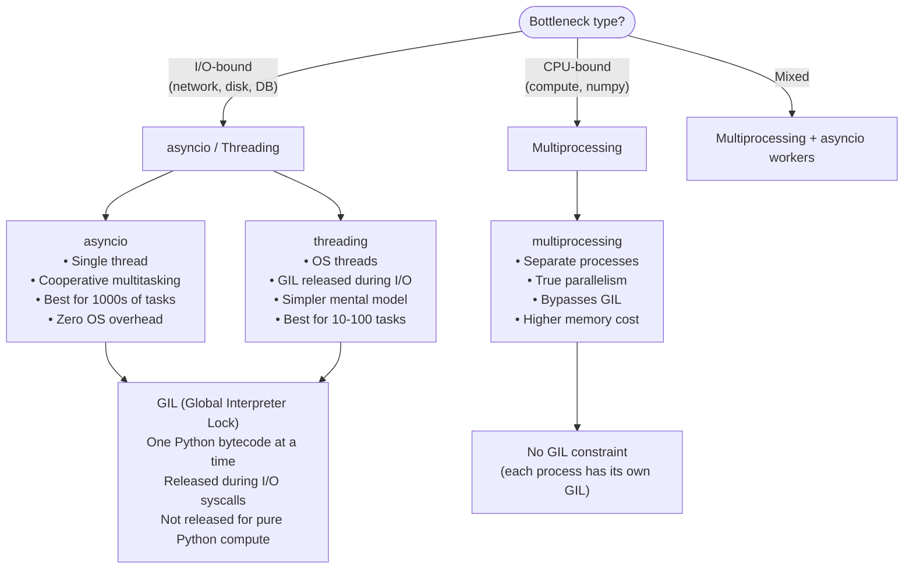
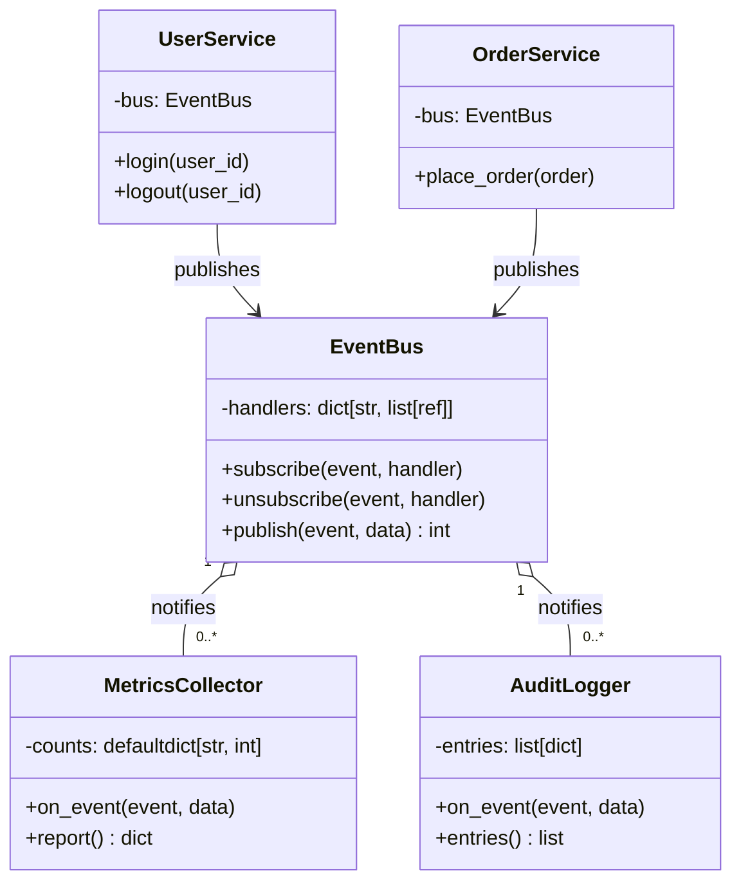
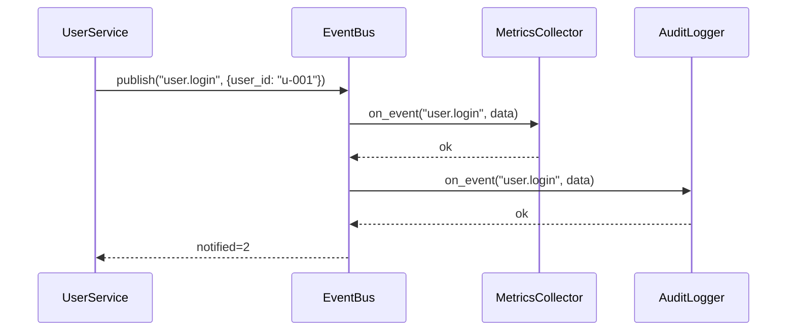
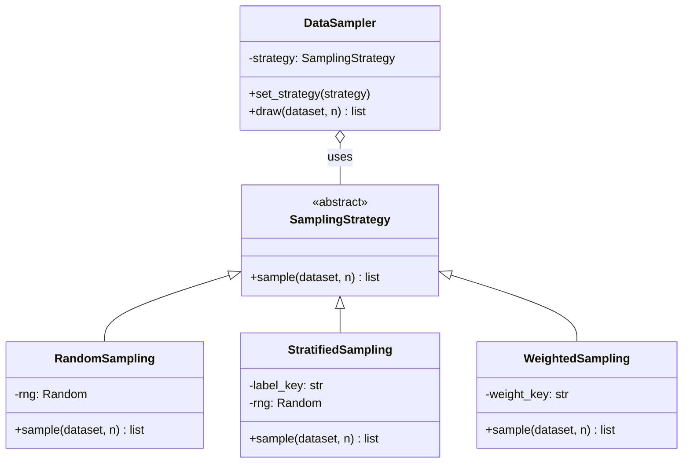
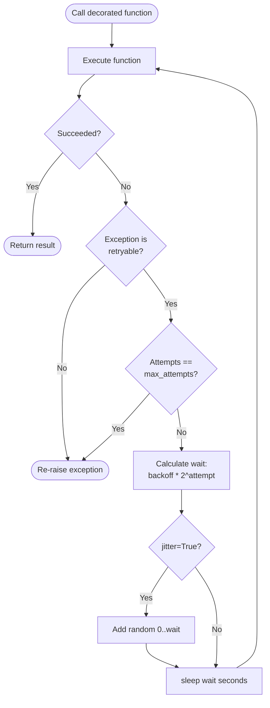
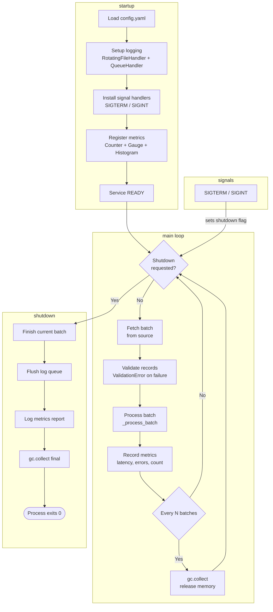
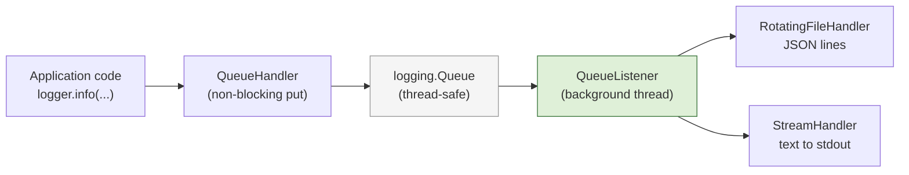

# Python Engineering Patterns – Concept Reference

This document explains when and why to use each pattern, illustrated with
Mermaid diagrams.

---

## 1. Python Concurrency Models

Python offers three concurrency primitives. The right choice depends on
whether your bottleneck is I/O, CPU, or both.

**When to use what:**

| Workload | Best tool | Why |
|----------|-----------|-----|
| HTTP requests, DB queries | `asyncio` | Cooperative, zero thread overhead |
| File I/O, subprocess | `threading` or `asyncio` | GIL released during I/O |
| Numerical computation | `multiprocessing` | True CPU parallelism |
| ML inference batch | `ProcessPoolExecutor` | Load model once per worker |
| Streaming large files | `async for` + generator | Constant memory |

---

## 2. Observer / EventBus Pattern

The Observer pattern decouples event producers from consumers. The EventBus
variant allows many-to-many subscriptions without direct object references.

**Sequence of a published event:**

**Key design choices:**
- Handlers are stored as `weakref.WeakMethod` so dead subscribers are
  automatically pruned (no memory leaks).
- Failed handlers log an error but do not prevent other handlers from running.
- The bus is synchronous; for async dispatch, wrap `publish` in `asyncio.create_task`.

---

## 3. Strategy Pattern Class Hierarchy

Strategy separates *what algorithm to use* from *how to invoke it*, making
algorithms interchangeable at runtime.

**When to use Strategy:**
- Multiple algorithms for the same task (sorting, sampling, pricing)
- Algorithm selection needs to change at runtime
- Avoiding large `if/elif` chains in business logic
- Testing individual algorithms in isolation

---

## 4. Retry Decorator – Decision Flow

**Why jitter?** Without jitter, all N clients that fail simultaneously will
retry at the same time (thundering herd). Uniform jitter `[0, wait]` spreads
retries across time, reducing peak load by ~50%.

---

## 5. Production Service Architecture

**Key properties of the production service:**
1. **Graceful shutdown**: in-flight batch completes before exit.
2. **GC control**: `gc.set_threshold()` reduces mid-batch pauses;
   explicit `gc.collect()` at batch boundaries.
3. **Structured errors**: `ValidationError` is logged and counted, not fatal.
4. **Observable**: every batch emits latency to the histogram; percentiles
   available at any time via `MetricsRegistry.report()`.
5. **Config-driven**: all tuning knobs (`batch_size`, `gc_threshold`,
   `max_workers`) live in `config.yaml`.

---

## 6. Collections Module – When to Use Each

| Type | Use case | Key advantage |
|------|----------|---------------|
| `defaultdict(list)` | Grouping / adjacency lists | No `KeyError`; auto-initialise |
| `defaultdict(int)` | Frequency counting | Cleaner than `dict.get(k, 0) + 1` |
| `Counter` | Token counting, top-N | Arithmetic operators, `most_common()` |
| `deque(maxlen=N)` | Sliding window, bounded buffer | O(1) append/pop both ends |
| `namedtuple` | Immutable record (no methods) | Lightweight, tuple-compatible |
| `NamedTuple` | Typed record with defaults | Full type annotations |
| `ChainMap` | Layered config (env > file > defaults) | Read-through, live updates |
| `OrderedDict` | LRU cache, insertion-order dict | `move_to_end()`, `popitem(last=False)` |

---

## 7. Logging Architecture

**Why `QueueHandler`?** File I/O on the hot path (inside a request handler or
tight loop) adds latency. The `QueueHandler` puts the log record onto an
in-memory queue and returns immediately. The `QueueListener` drains the queue
in a dedicated daemon thread, so disk latency never affects application code.

---

## 8. Structural Patterns Summary

| Pattern | Problem solved | Example in codebase |
|---------|---------------|---------------------|
| **Adapter** | Two incompatible interfaces | `LegacyStoreAdapter` wraps `LegacyKeyValueStore` |
| **Decorator** | Add capability without subclassing | `ValidatingReader` + `TimingReader` wrap `DataReader` |
| **Facade** | Hide subsystem complexity | `MLPipelineFacade` hides extract/predict/format |
| **Proxy** | Lazy init + caching | `CachingProxy` over `ExpensiveService` |
| **Composite** | Tree of interchangeable components | `SequentialPipeline` contains `TransformStep` nodes |
