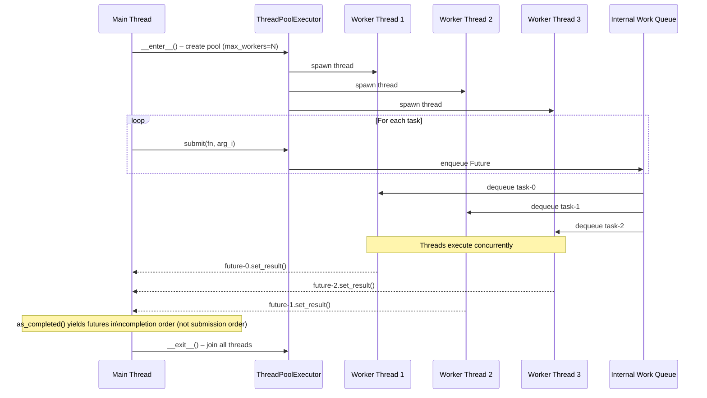
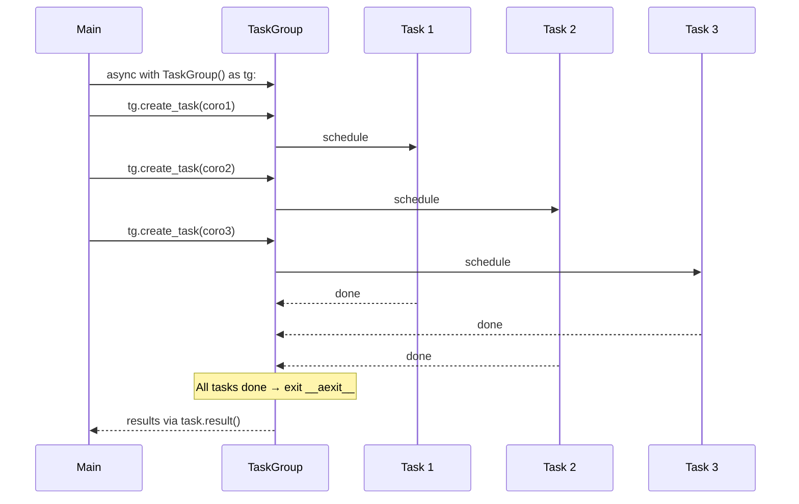
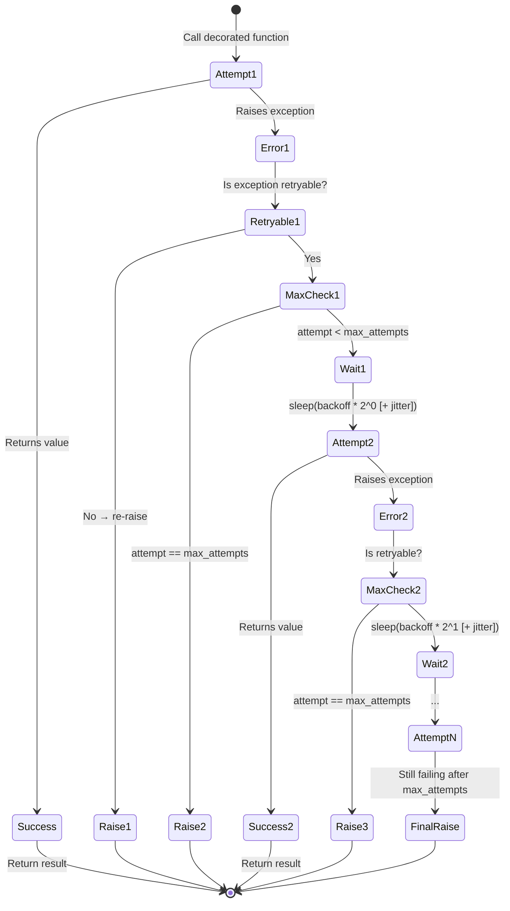
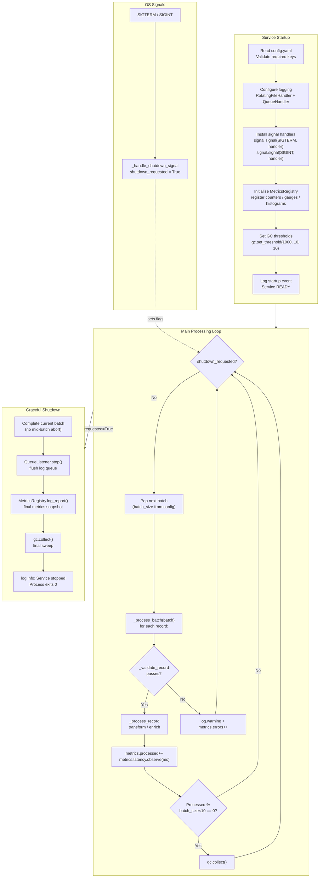
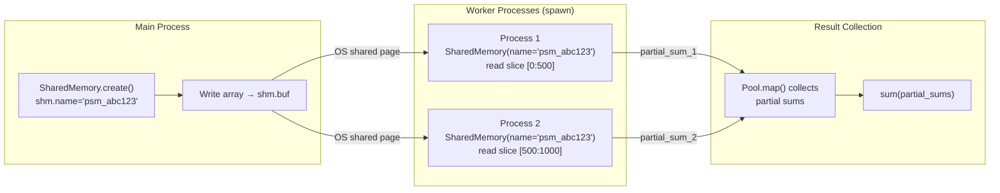

# Execution Flow Diagrams

---

## 1. Thread Pool Execution Flow



**Key points:**
- `as_completed()` yields futures as they finish, allowing progressive result
  processing without waiting for the slowest task.
- Worker threads are reused across tasks (no thread creation overhead per task).
- `max_workers` controls the concurrency limit; set to `cpu_count()` for
  CPU-bound, higher for I/O-bound workloads.

---

## 2. Asyncio Event Loop Flow

```mermaid
flowchart TD
    subgraph "Event Loop (single OS thread)"
        EL([Event Loop starts])
        RQ[Ready Queue\ncoroutines to run]
        IO[I/O Selector\nepoll / kqueue]
        CB[Callback Queue\nI/O completions]

        EL --> RQ
        RQ -->|"pop next coroutine"| Run[Resume coroutine\nat await point]
        Run -->|"hits await asyncio.sleep\nor await network"| Suspend[Suspend coroutine\nregister with selector]
        Suspend --> IO
        IO -->|"I/O ready"| CB
        CB -->|"schedule resumption"| RQ
        Run -->|"coroutine returns"| Done[Result available\nfuture.set_result()]
    end

    App["asyncio.gather(\n  coro_1(), coro_2(), ...\n)"] --> EL
    Done --> App
```

**Cooperative multitasking:** A coroutine runs until it hits an `await`
expression. At that point it suspends and the event loop picks the next
ready coroutine. This is why `asyncio` can handle thousands of concurrent
I/O operations with a single OS thread – no context-switch overhead.

**asyncio.TaskGroup (Python 3.11+):**



If **any** task raises an exception, `TaskGroup` cancels the remaining tasks
and propagates the error as an `ExceptionGroup`.

---

## 3. Retry Decorator – Full Decision Flow



**Backoff formula:**
```
wait = backoff_factor × 2^(attempt - 1)
if jitter:
    wait += uniform(0, wait)   # spreads retries ±100%
```

| attempt | backoff=2.0, no jitter | backoff=2.0, jitter range |
|---------|------------------------|---------------------------|
| 1       | 2.0 s                  | 2.0 – 4.0 s               |
| 2       | 4.0 s                  | 4.0 – 8.0 s               |
| 3       | 8.0 s                  | 8.0 – 16.0 s              |

---

## 4. Production Service Startup / Shutdown Flow



**Graceful shutdown guarantees:**
1. The current batch completes – no partial writes.
2. Log records in the queue are flushed before the process exits.
3. Final metrics are logged for post-mortem analysis.
4. Exit code is `0` for clean shutdown, non-zero for unhandled exceptions.

---

## 5. Async Producer / Consumer Flow

```mermaid
sequenceDiagram
    participant P as Producer coroutine
    participant Q as asyncio.Queue
    participant C1 as Consumer 1
    participant C2 as Consumer 2

    P->>Q: await put("item-000")
    P->>Q: await put("item-001")
    C1->>Q: await get() → "item-000"
    C2->>Q: await get() → "item-001"
    P->>Q: await put("item-002")
    C1-->>Q: task_done()
    C1->>Q: await get() → "item-002"
    P->>Q: await put(None)  [sentinel]
    C2-->>Q: task_done()
    C2->>Q: await get() → None [sentinel]
    C2->>Q: await put(None)  [re-queue for C1]
    C2-->>C2: break loop
    C1->>Q: await get() → None
    C1-->>C1: break loop
    Note over P,C2: All done; gather() returns
```

**Sentinel re-queueing pattern:** When a consumer receives `None` (the
sentinel), it immediately puts `None` back before exiting. This ensures
every consumer eventually receives the termination signal, regardless of
how many consumers share the queue.

---

## 6. Shared Memory Flow (multiprocessing)



**Zero-copy:** Worker processes map the same physical memory pages. No
serialisation (pickle) occurs for the shared buffer – only the small result
values are pickled back to the main process.
