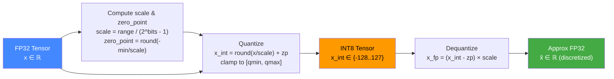
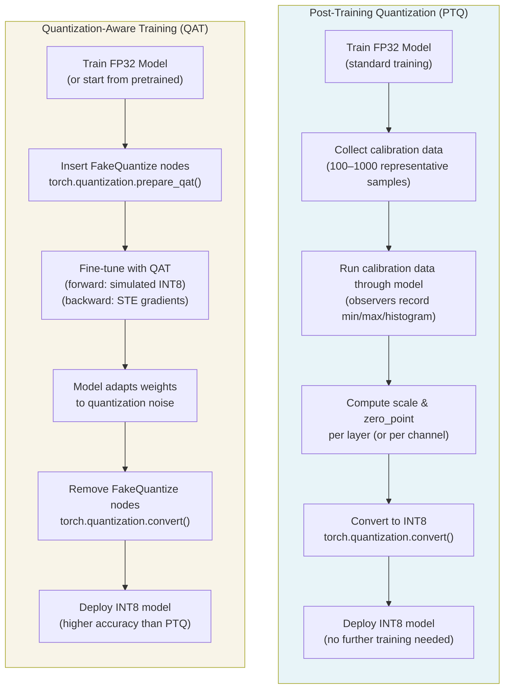
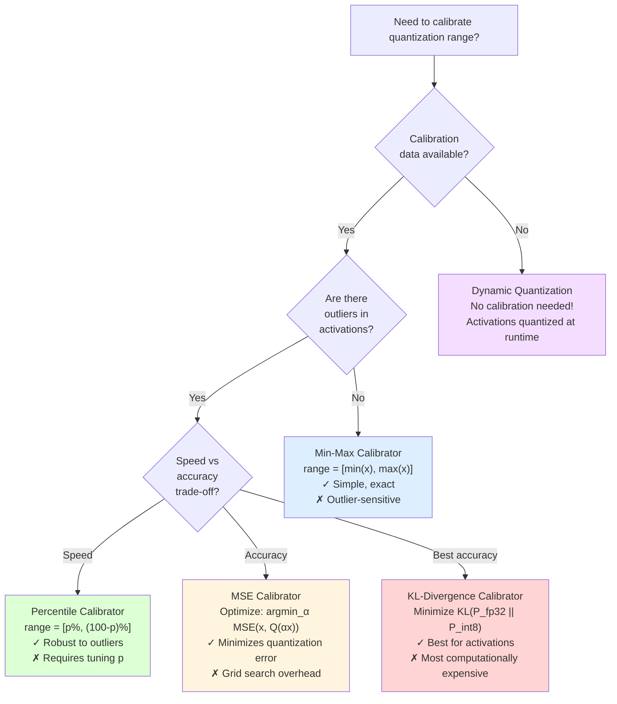
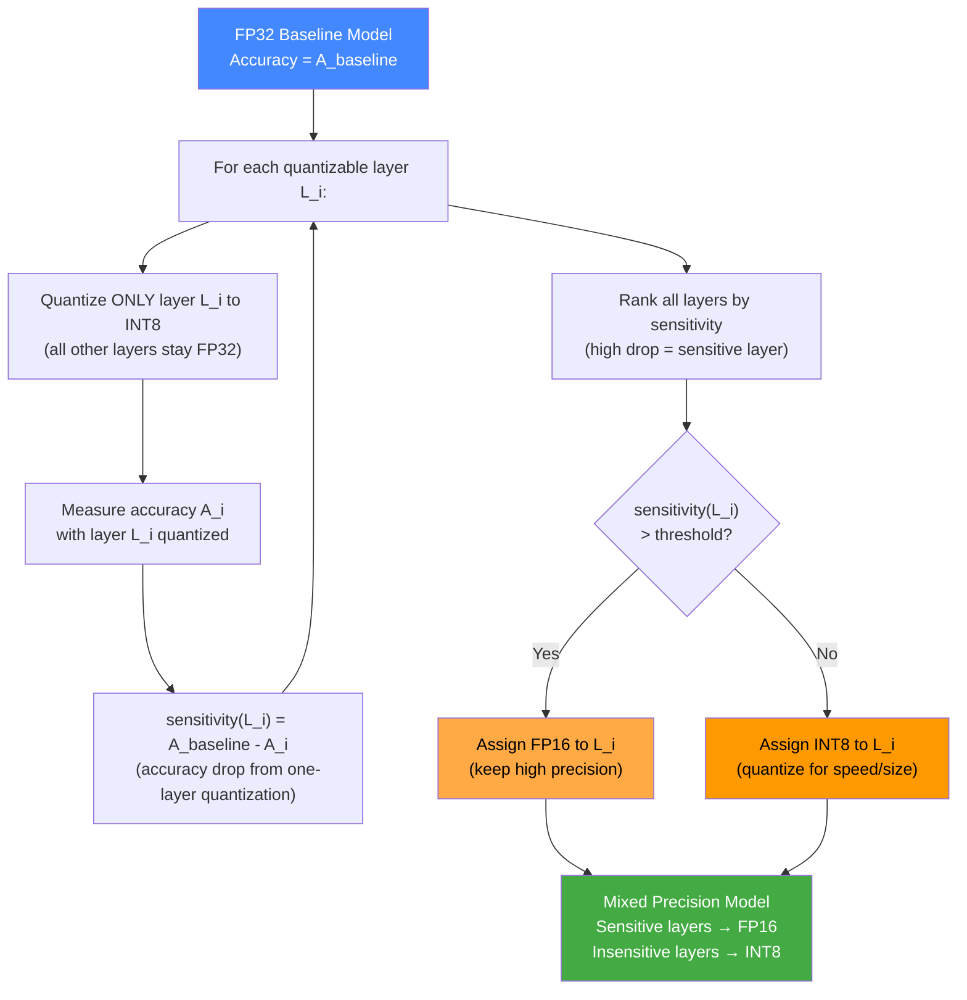
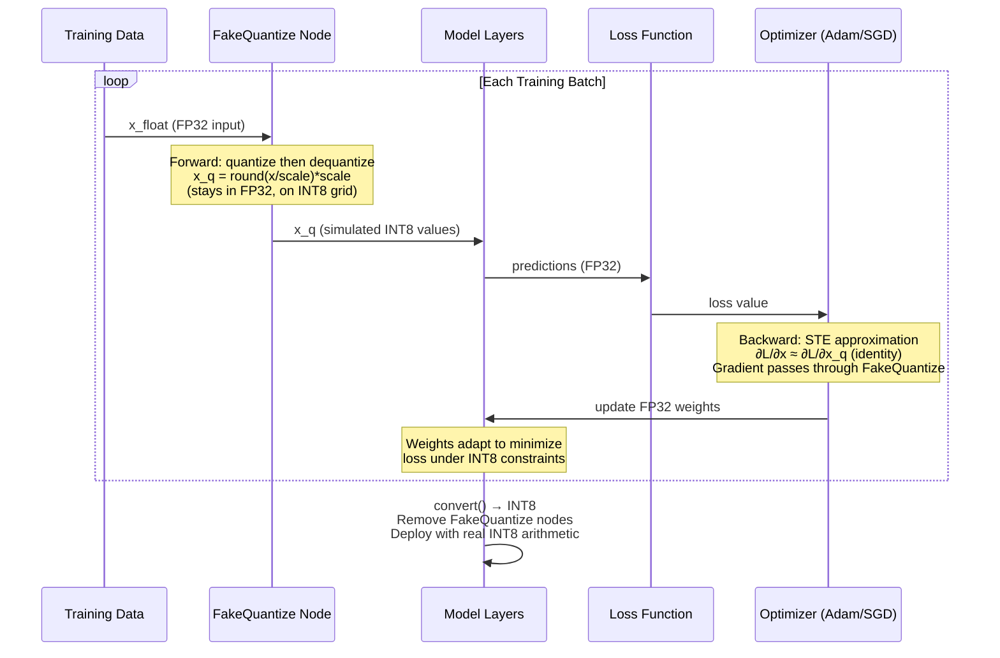

# Deep Learning Quantization Concepts

## 1. Quantization Fundamentals

Quantization maps a continuous floating-point tensor to a discrete integer representation. The core mathematical transformation is:

```
x_int = clamp(round(x_float / scale) + zero_point, quant_min, quant_max)
x_dequant = (x_int - zero_point) * scale
```

**Parameters:**
- `scale` — step size between adjacent quantization levels
- `zero_point` — integer value that represents 0.0 in float space
- `quant_min` / `quant_max` — integer range bounds (e.g., -128 to 127 for INT8)



**Quantization Error:** `ε = x_float - x_dequant`

The maximum error per value is `scale/2` (half a quantization step). Minimizing `scale` (choosing a tighter range) reduces error but increases clipping risk.

---

## 2. PTQ vs QAT Workflow Comparison



| Property | PTQ | QAT |
|----------|-----|-----|
| Training required | None (only calibration) | Yes (fine-tuning) |
| Calibration data | 100–1000 samples | Full training dataset |
| Accuracy drop | 0.5–2% typical | 0.1–0.5% typical |
| Time to quantize | Minutes | Hours |
| Best for | Quick deployment | Production accuracy |

---

## 3. Calibration Techniques Decision Tree



---

## 4. Mixed-Precision Sensitivity Analysis Flow



---

## 5. QAT Training Loop with Fake Quantization



---

## 6. Quantization Format Reference Table

| Format | Bits | Range | Use Case | Precision Loss |
|--------|------|-------|----------|----------------|
| FP32 | 32 | ±3.4×10^38 | Training, baseline | None (reference) |
| FP16 | 16 | ±65504 | Mixed-precision training | Low |
| BF16 | 16 | ±3.4×10^38 | Large model training (TPUs) | Low (wider range than FP16) |
| FP8 (E4M3) | 8 | ±448 | Training on H100 GPUs | Medium |
| FP8 (E5M2) | 8 | ±57344 | Gradient quantization | Medium |
| INT8 | 8 | -128 to 127 | Inference (PTQ/QAT) | Medium |
| INT4 | 4 | -8 to 7 | Aggressive compression, LLMs | High |
| NF4 | 4 | Normal float levels | QLoRA fine-tuning | High (structured) |
| UINT8 | 8 | 0 to 255 | Post-ReLU activations | Medium |

**Notes:**
- BF16 has the same exponent range as FP32 (good for training stability) but only 7 mantissa bits.
- NF4 (Normal Float 4) uses quantization levels optimally spaced for normally distributed weights (used in bitsandbytes / QLoRA).
- FP8 is hardware-native on NVIDIA H100 and newer.

---

## 7. Quantization Granularity Levels

| Granularity | Scope | Scale Tensors | Pros | Cons |
|-------------|-------|---------------|------|------|
| Per-tensor | Entire tensor | 1 scalar | Fastest, smallest overhead | Worst quality (one scale fits all) |
| Per-channel | Per output channel of Conv/Linear | C scalars (C = out_channels) | Good quality for weights | C times more scale storage |
| Per-group | Groups of N elements | tensor / group_size scales | Flexible, used in GPTQ/AWQ | More complex dequant |
| Per-token | Per sequence position (LLMs) | seq_len scalars | Handles token distribution variance | Only for transformers |
| Per-row | Each row of a matrix | rows scalars | Good for Linear in LLMs | More overhead than per-tensor |

**Recommendation:**
- **Weights**: Per-channel quantization (dramatically better than per-tensor for Conv layers)
- **Activations**: Per-tensor quantization (per-channel activations are expensive at runtime)
- **LLM weights**: Per-group quantization (group size 64 or 128 is common in GPTQ/AWQ)

---

## 8. SQNR Formula and Interpretation

Signal-to-Quantization-Noise Ratio measures how much of the original signal is preserved:

```
SQNR = 10 × log₁₀( E[x²] / E[(x - x̂)²] )
```

Where:
- `x` = original FP32 tensor
- `x̂` = dequantized tensor (FP32 values on INT8 grid)
- `E[x²]` = signal power
- `E[(x - x̂)²]` = noise power (quantization error power)

**Reference values:**
| SQNR | Interpretation |
|------|---------------|
| > 50 dB | Excellent — virtually no perceptible quality loss |
| 40–50 dB | Good — typical INT8 quantization quality |
| 30–40 dB | Acceptable — some accuracy degradation |
| < 30 dB | Poor — significant accuracy drop expected |
| −∞ dB | Complete signal destruction |

**Theoretical INT8 SQNR** (symmetric, uniform, Gaussian input): ~49.9 dB
**Theoretical INT4 SQNR**: ~25.8 dB
