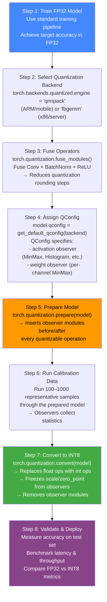
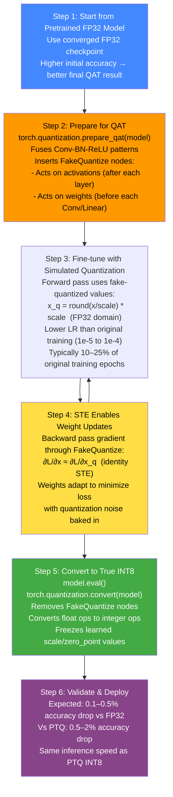
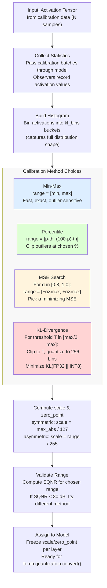
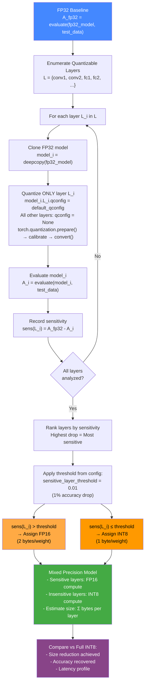
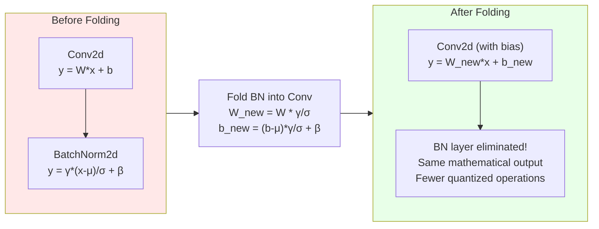

# Quantization Workflow Diagrams

## 1. Standard PTQ Workflow (8 Steps)

The Post-Training Quantization pipeline transforms a trained FP32 model into an INT8 model without retraining. The key steps are: data collection, statistics gathering, scale computation, and model conversion.



---

## 2. Standard QAT Workflow (6 Steps)

Quantization-Aware Training improves upon PTQ by adapting model weights to quantization error during training. The Straight-Through Estimator (STE) enables gradient flow through the non-differentiable rounding operation.



---

## 3. Calibration Range Selection Flow

Calibration determines the optimal clipping range [min, max] for quantizing activations. The choice of calibration method significantly impacts quantization accuracy.



---

## 4. Sensitivity Analysis → Mixed-Precision Assignment Flow

This flow identifies the optimal bit-width per layer by measuring how much each layer contributes to accuracy degradation when quantized.



---

## 5. BatchNorm Folding Workflow

BatchNorm folding eliminates the BatchNorm layer by absorbing its parameters into the preceding Conv layer. This is done before quantization to reduce the number of quantized operations.



**Mathematical derivation:**
```
BN forward:   y_bn = γ * (conv(x) - μ) / σ + β
Combined:     y = (W * γ/σ) * x + ((b - μ) * γ/σ + β)
```

Benefits:
- Removes one layer of computation (faster inference)
- Reduces number of quantization nodes
- Eliminates BN's division and addition operations from the critical path
