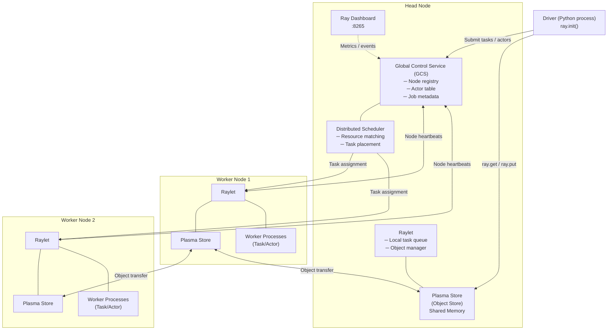
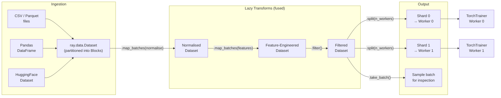
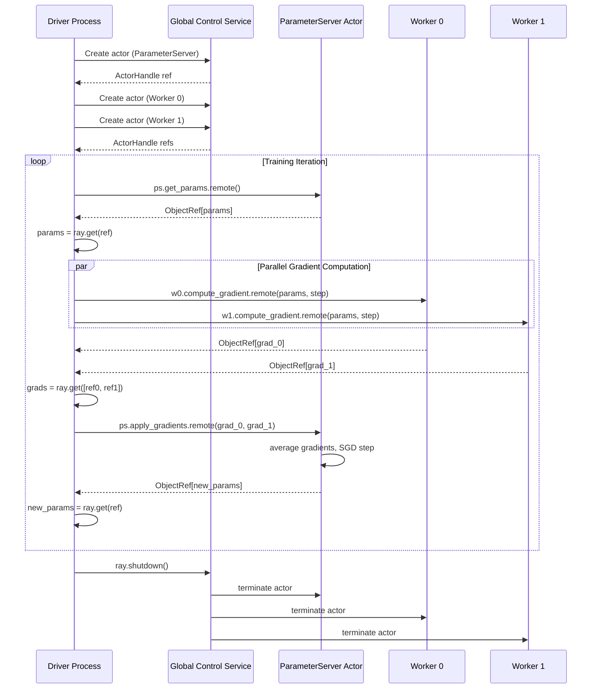
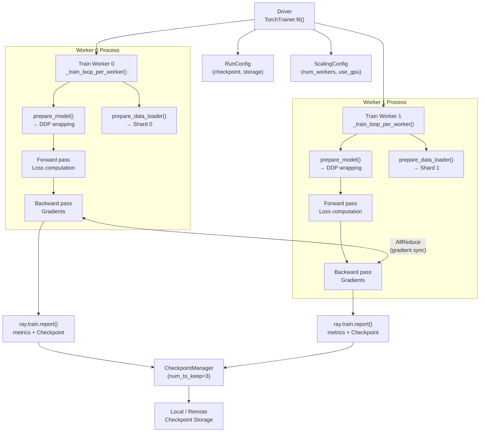
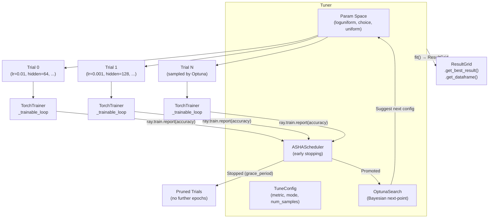
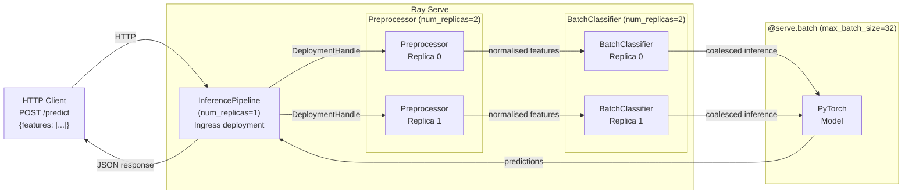

Comprehensive architectural diagrams and explanatory text covering every
major Ray subsystem implemented in this project.

---

## 1. Ray Cluster Architecture

A Ray cluster consists of a **Head Node** and one or more **Worker Nodes**.
All coordination flows through the Global Control Service (GCS) on the head
node, while actual task and object data flows directly between workers.

### Key components

| Component | Role |
|-----------|------|
| **GCS** | Single source of truth for cluster state. Stores actor handles, node liveness, job info. |
| **Raylet** | Per-node daemon. Maintains a local task queue, manages the local Plasma Store, and communicates with the GCS. |
| **Plasma Store** | Shared-memory object store (Apache Arrow format). Workers on the same node read objects via zero-copy mmap. Cross-node transfers go over the network. |
| **Distributed Scheduler** | Matches task resource requirements (`num_cpus`, `num_gpus`, custom resources) to available worker slots. |
| **Dashboard** | Web UI at `:8265` showing task throughput, actor states, object store usage, and logs. |

---

## 2. Ray Data Pipeline Architecture

Ray Data provides a lazy, parallel Dataset abstraction built on top of Ray
tasks.  Transformations are fused and executed in a streaming fashion to
avoid materialising large intermediate datasets.

### Key concepts

- **Block**: the unit of parallelism in Ray Data.  Each block is a Pandas
  DataFrame stored as a plasma object.
- **`map_batches(fn)`**: applies `fn` to each block in parallel using Ray
  tasks.  The `batch_format="numpy"` option returns NumPy arrays for
  compute-intensive transforms.
- **Lazy execution**: transformations are not executed until `.take()`,
  `.iter_batches()`, or a trainer consumes the dataset.
- **Streaming ingestion**: during training, Ray Data streams blocks from
  disk / object store directly into the training loop, avoiding OOM.

---

## 3. Actor Communication Sequence

This diagram shows the message flow when multiple workers push gradients to
a centralised ParameterServer actor.

### Why actors instead of tasks?

| | Remote Task | Actor |
|--|-------------|-------|
| **State** | Stateless – restarted fresh each call | Stateful – persists across calls |
| **Scheduling** | Re-scheduled each call (possible migration) | Pinned to a node/worker process |
| **Use case** | Pure functions, embarrassingly parallel work | Parameter servers, caches, counters, simulators |

---

## 4. Ray Train DDP Architecture

---

## 5. Ray Tune HPO Architecture

---

## 6. Ray Serve Deployment Graph

### @serve.batch behaviour

When multiple requests arrive concurrently at `BatchClassifier`, Ray Serve
coalesces them into a single call to `_batched_predict()` up to
`max_batch_size`.  The `batch_wait_timeout_s` controls how long Serve waits
to fill a batch before dispatching a partial one.

| Config key | Value | Effect |
|------------|-------|--------|
| `max_batch_size` | 32 | Maximum samples per inference call |
| `batch_wait_timeout_s` | 0.05 | Max latency penalty for batching |
| `num_replicas` | 2 | Horizontal scale-out |
| `max_concurrent_queries` | 10 | Back-pressure limit per replica |