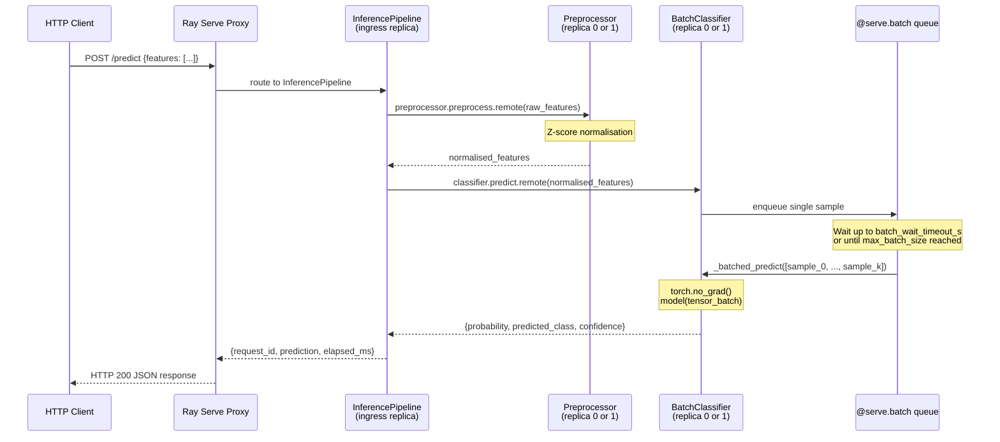
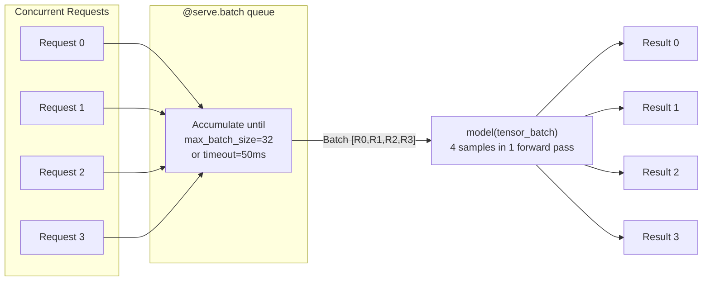

# Ray Engineering – Flow Diagrams

Detailed step-by-step flow diagrams for every major execution path in the
project.  Each diagram is paired with an explanation of the decision points
and data transformations involved.

---

## 1. Task Execution Flow

How a single `@ray.remote` task travels from Python submission to result
retrieval.

```mermaid
flowchart TD
    A([Driver calls\nfn.remote&#40;args&#41;]) --> B[Driver process\nserialises arguments\nvia Apache Arrow]
    B --> C{Are args\nObjectRefs?}
    C -->|Yes – zero-copy| D[Pass ObjectRef ID\nto scheduler]
    C -->|No – raw data| E[Store args in\nlocal Plasma Store\nGet ObjectRef]
    E --> D
    D --> F[GCS Scheduler\nmatches task to\navailable worker slot]
    F --> G{Worker on\nsame node?}
    G -->|Yes| H[Read args from\nlocal shared memory\nzero-copy mmap]
    G -->|No| I[Transfer object\nvia network to\nremote Plasma Store]
    I --> H
    H --> J[Worker process\nexecutes fn&#40;args&#41;]
    J --> K[Serialise return value\nstore in local Plasma]
    K --> L[Return ObjectRef\nto Driver]
    L --> M([Driver calls\nray.get&#40;ref&#41;])
    M --> N{Object on\nsame node?}
    N -->|Yes| O[Read from local\nPlasma Store\nzero-copy]
    N -->|No| P[Fetch object\nover network]
    P --> O
    O --> Q([Python object\nreturned to Driver])
```

### Key performance observations

- Arguments that are already `ObjectRef`s skip serialisation entirely.
- For same-node communication, plasma shared memory avoids any copy.
- `ray.wait()` lets you process results as they finish rather than blocking
  on the slowest task.

---

## 2. Ray Data Preprocessing Pipeline Flow

```mermaid
flowchart TD
    subgraph Input
        RAW["Raw Data Source\n(CSV / Parquet / Pandas)"]
    end

    RAW --> CREATE["ray.data.from_pandas&#40;df&#41;\nor read_parquet&#40;path&#41;\nPartitioned into N Blocks"]

    subgraph LazyTransforms["Lazy Transform Chain"]
        CREATE --> T1[".map_batches&#40;normalise_batch&#41;\nbatch_format=numpy\nRun in parallel Ray tasks"]
        T1 --> T2[".map_batches&#40;add_interaction_features&#41;\nDerive new columns\nRun in parallel Ray tasks"]
        T2 --> T3[".filter&#40;predicate&#41;\n&#40;optional&#41;\nRow-level filtering"]
    end

    T3 --> SPLIT[".split_at_indices&#40;[train_size]&#41;\nProduces train_ds, val_ds"]

    subgraph Training
        SPLIT --> SH0["Shard 0 → Worker 0\niter_torch_batches&#40;&#41;"]
        SPLIT --> SH1["Shard 1 → Worker 1\niter_torch_batches&#40;&#41;"]
        SH0 --> EP0["Training epoch\nfor batch in shard:"]
        SH1 --> EP1["Training epoch\nfor batch in shard:"]
    end

    subgraph Inspection
        SPLIT -->|.take_batch&#40;5&#41;| SAMPLE["Sample batch\nfor logging / EDA"]
    end
```

### Execution model

Each `.map_batches()` call is **not** executed immediately.  Ray Data builds
an execution plan and runs it lazily when data is consumed.  This allows the
runtime to fuse adjacent transforms, reducing memory pressure.

---

## 3. Distributed Training Pipeline Flow

```mermaid
flowchart TD
    Start([Driver: TorchTrainer.fit&#40;&#41;]) --> SC["ScalingConfig\nnum_workers=2\nuse_gpu=false"]
    SC --> SPAWN["Ray spawns N worker processes\nOne per training replica"]

    subgraph Worker["Each Worker Process (rank r)"]
        SPAWN --> INIT["Initialise process group\ntorch.distributed.init_process_group&#40;&#41;\n&#40;via prepare_model&#41;"]
        INIT --> MODEL["Build BinaryClassifier&#40;&#41;\nprepare_model&#40;&#41; → DDP wrap"]
        MODEL --> CKPT{Checkpoint\nexists?}
        CKPT -->|Yes| RESTORE["Restore model weights\noptimiser state\nstart_epoch"]
        CKPT -->|No| EPOCH0["Start from epoch 0"]
        RESTORE --> LOOP
        EPOCH0 --> LOOP

        subgraph LOOP["Training Loop (per epoch)"]
            L1["model.train&#40;&#41;"]
            L1 --> L2["for batch in loader:"]
            L2 --> L3["optimizer.zero_grad&#40;&#41;"]
            L3 --> L4["outputs = model&#40;X&#41;"]
            L4 --> L5["loss = BCELoss&#40;outputs, y&#41;"]
            L5 --> L6["loss.backward&#40;&#41;\n← AllReduce gradient sync ←"]
            L6 --> L7["optimizer.step&#40;&#41;"]
            L7 --> L2
        end

        LOOP --> REPORT["ray.train.report&#40;\n  metrics={loss, accuracy},\n  checkpoint=Checkpoint&#41;"]
        REPORT --> NEXTEPOCH{More\nepochs?}
        NEXTEPOCH -->|Yes| LOOP
        NEXTEPOCH -->|No| DONE
    end

    REPORT --> CKM["CheckpointManager\nKeep top-K by accuracy"]
    DONE --> RESULT([ResultGrid returned\nto Driver])
```

---

## 4. Hyperparameter Optimisation Search Flow

```mermaid
flowchart TD
    START([Tuner.fit&#40;&#41;]) --> INIT_SEARCH["OptunaSearch initialises\nTPE surrogate model"]

    INIT_SEARCH --> SAMPLE["Sample N configs\nfrom param_space:\n  lr: loguniform\n  hidden_dim: choice\n  dropout: uniform\n  batch_size: choice"]

    SAMPLE --> LAUNCH["Launch Trial 0..N-1\nin parallel\n&#40;bounded by cluster CPUs&#41;"]

    subgraph TrialLoop["Per Trial"]
        T_INIT["Receive config from Optuna"]
        T_INIT --> T_TRAIN["TorchTrainer._trainable_loop&#40;&#41;\nEpoch 1"]
        T_TRAIN --> T_REPORT["ray.train.report&#40;accuracy=...&#41;"]
        T_REPORT --> ASHA{ASHAScheduler:\nepoch >= grace_period?}
        ASHA -->|"accuracy in\nbottom 1/r"| PRUNE["Trial STOPPED\n&#40;early stopping&#41;"]
        ASHA -->|"Passes threshold"| MORE{More\nepochs?}
        MORE -->|Yes| T_TRAIN
        MORE -->|No| COMPLETE["Trial COMPLETED\nReport final metrics"]
    end

    LAUNCH --> TrialLoop
    COMPLETE --> UPDATE["OptunaSearch updates\nTPE model with\n(config, accuracy) pair"]
    UPDATE --> MORETRI{Budget\nexhausted?}
    MORETRI -->|No| SAMPLE
    MORETRI -->|Yes| GRID["ResultGrid\n.get_best_result&#40;&#41;\n.get_dataframe&#40;&#41;"]
    PRUNE --> UPDATE
    GRID --> END([Best config + checkpoint\nreturned to Driver])
```

### ASHA scheduler internals

ASHA (Asynchronous Successive Halving Algorithm) works in rungs:

1. All trials run for `grace_period` epochs.
2. The bottom `1 - 1/reduction_factor` fraction are stopped.
3. Survivors run to the next rung (grace_period × reduction_factor epochs).
4. Repeat until `max_t` epochs.

This gives near-optimal exploration-exploitation trade-off while running
fully asynchronously – fast trials do not wait for slow ones.

---

## 5. Ray Serve Request Flow

### Batching dynamics

**Throughput benefit**: a single GPU forward pass over 32 samples is
significantly faster than 32 individual forward passes due to parallelism
in matrix multiplication.  `@serve.batch` delivers this automatically
without changing the single-sample API contract seen by callers.

---

## 6. Object Store Fan-Out Pattern

```mermaid
flowchart TD
    DRIVER["Driver"]
    DATA["large_array\n= np.random.normal&#40;size=100_000&#41;"]
    PUT["ref = ray.put&#40;large_array&#41;\n─ Serialise ONCE\n─ Store in Plasma\n─ Return ObjectRef"]

    DRIVER --> DATA --> PUT

    PUT -->|"Ref passed"| T0["Task 0\nray.get&#40;ref&#41; – mmap"]
    PUT -->|"Ref passed"| T1["Task 1\nray.get&#40;ref&#41; – mmap"]
    PUT -->|"Ref passed"| T2["Task 2\nray.get&#40;ref&#41; – mmap"]
    PUT -->|"Ref passed"| T3["Task 3\nray.get&#40;ref&#41; – mmap"]

    subgraph PlasmaStore["Plasma (Shared Memory)"]
        BUF["Single buffer\n400 KB\nref-counted"]
    end

    PUT --> BUF
    T0 -. zero-copy read .-> BUF
    T1 -. zero-copy read .-> BUF
    T2 -. zero-copy read .-> BUF
    T3 -. zero-copy read .-> BUF

    ANTI["Anti-Pattern:\nTask.remote&#40;large_array&#41;\n× 4 times\n→ 4 × serialise + store"]
    ANTI -.->|"Avoid this"| T0
```

