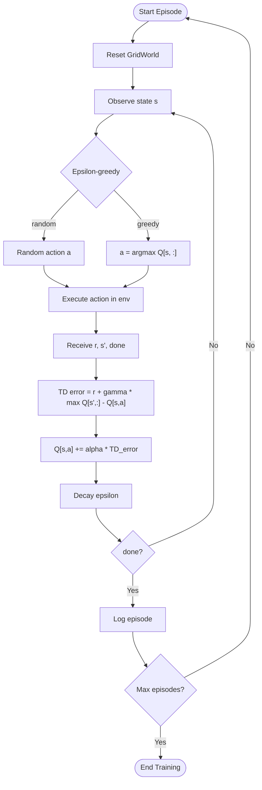

## Concept

Q-Learning is a **model-free, off-policy, tabular** reinforcement learning
algorithm introduced by Watkins (1989). It learns the optimal action-value
function Q*(s, a) directly from transitions, without a model of the
environment.

The Q-function answers: _"What is the expected discounted return if I take
action a in state s and then act optimally afterwards?"_

---

## Bellman Optimality Equation

The Bellman optimality equation defines the recursive relationship:

```
Q*(s, a) = E[ r + gamma * max_a' Q*(s', a') ]
```

Q-Learning approximates this by iterating the TD(0) update:

```
Q[s, a] <- Q[s, a] + alpha * (r + gamma * max_a' Q[s', a'] - Q[s, a])
                               ^^^^^^^^^^^^^^^^^^^^^^^^^^^^^^^^^^^^^^^
                               TD target (bootstrapped estimate)
```

The quantity `(r + gamma * max_a' Q[s', a'] - Q[s, a])` is the **TD error**
— the difference between what we expected and what we actually observed.

---

## Convergence Guarantee

Under the following conditions, Q-Learning converges to Q* with probability 1:

1. All (state, action) pairs are visited infinitely often.
2. Learning rates satisfy the Robbins-Monro conditions:
   - sum of alpha_t = infinity
   - sum of alpha_t^2 < infinity
3. Rewards are bounded.

In practice, a fixed small alpha (e.g. 0.1) works well for small problems.

---

## Epsilon-Greedy Exploration

Since Q-Learning is off-policy, it can use any exploration strategy. We use
**epsilon-greedy**:

- With probability epsilon: choose a random action (explore).
- With probability (1 - epsilon): choose argmax_a Q[s, a] (exploit).

Epsilon is decayed multiplicatively after each step:

```
epsilon <- max(epsilon_end, epsilon * epsilon_decay)
```

This trades exploration early in training for exploitation as the Q-table matures.

---

## Use Case: GridWorld Path Planning

The agent navigates a 10x10 grid from a random start cell to a random goal
cell while avoiding obstacles.

**State**: integer cell index (row * N + col), range [0, N*N - 1].  
**Actions**: 0=up, 1=down, 2=left, 3=right.  
**Q-table shape**: [100, 4] (for a 10x10 grid).  

Because the state space is small (100 cells), a tabular Q-table is exact and
efficient. No neural network is needed.

---

## Flow Diagram



---

## Key Config Parameters

| Parameter | Location | Description |
|-----------|----------|-------------|
| `training.alpha` | `01_q_learning.yaml` | Learning rate (TD step size) |
| `training.gamma` | `01_q_learning.yaml` | Discount factor [0, 1] |
| `training.epsilon_start` | `01_q_learning.yaml` | Initial exploration rate |
| `training.epsilon_end` | `01_q_learning.yaml` | Minimum exploration rate |
| `training.epsilon_decay` | `01_q_learning.yaml` | Multiplicative decay per step |
| `training.max_episodes` | `01_q_learning.yaml` | Total training episodes |
| `network.n_states` | `01_q_learning.yaml` | Q-table rows (= grid_size^2) |
| `network.n_actions` | `01_q_learning.yaml` | Q-table columns (= 4) |
| `env.grid_size` | `01_q_learning.yaml` | Grid side length N |
| `env.num_obstacles` | `01_q_learning.yaml` | Number of obstacle cells |

---

## Expected Learning Curve

- **Episodes 0–200**: high epsilon; agent explores randomly; rewards are
  strongly negative (many wall collisions, rarely reaches goal).
- **Episodes 200–800**: epsilon decays; agent starts exploiting learned paths;
  mean episode reward rises toward 0 and then positive.
- **Episodes 800–2000**: epsilon near `epsilon_end`; agent reliably finds the
  goal; mean reward converges near `reward_goal - step_penalty * path_length`.

A well-trained Q-Learning agent on a 10x10 grid with 10 obstacles typically
achieves a mean episode reward of 7–9 (out of a maximum of 10).

---

## Limitations vs DQN

| Aspect | Q-Learning | DQN |
|--------|-----------|-----|
| State space | Must be small and discrete | Can be large, continuous |
| Generalisation | None (table lookup only) | Neural network generalises |
| Memory | O(|S| * |A|) table | O(network params + buffer) |
| Scalability | Does not scale | Scales to Atari, robotics |
| Convergence | Proven (with conditions) | Empirical; can diverge |
| Training speed | Very fast on CPU | Requires GPU for large problems |

Q-Learning is the ideal starting point for understanding RL fundamentals.
Use DQN when the state space cannot fit in a table.