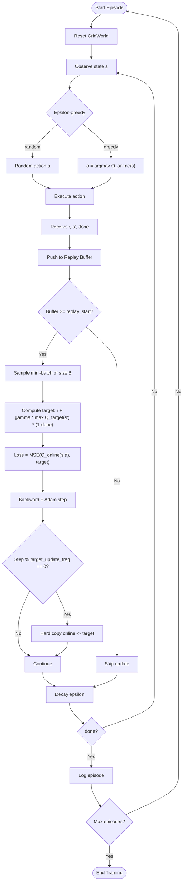

## Concept

DQN (Mnih et al., 2015) extends Q-Learning to large, continuous state spaces
by replacing the tabular Q-table with a **deep neural network** that maps
states to Q-values for all actions.

The key insight: if we just plug a neural network into the Q-Learning update
rule, training is unstable because:
1. Consecutive transitions are highly correlated (non-i.i.d. data).
2. The TD target changes every update step (moving target problem).

DQN introduces two innovations that fix both issues.

---

## DQN Innovations

### 1. Experience Replay

All transitions `(s, a, r, s', done)` are stored in a **replay buffer**
(circular queue of capacity N). Mini-batches are sampled uniformly at random
for each gradient step.

Benefits:
- Breaks temporal correlation between consecutive transitions.
- Each transition can be replayed multiple times (data efficiency).
- Stable, i.i.d.-like training signal for the neural network.

### 2. Target Network

A separate **target network** Q_target (a frozen copy of the online network)
is used to compute the TD target:

```
target = r + gamma * max_a' Q_target(s', a') * (1 - done)
loss   = MSE( Q_online(s, a), target )
```

The target network parameters are hard-copied from the online network every
`target_update_freq` steps. Between copies, the target is stationary, which
greatly stabilises training.

---

## Network Architecture

```
input_dim  -->  Linear(input_dim, 128)  -->  ReLU
           -->  Linear(128, 128)        -->  ReLU
           -->  Linear(128, output_dim)
```

Output: Q-values for all actions simultaneously. Action selection uses
`argmax` over the output vector.

No batch normalisation. No dropout. Keep it simple.

---

## Use Case: Path Planning (Continuous State)

Unlike Q-Learning, DQN takes the raw continuous observation vector as input:
`[row/N, col/N, goal_row/N, goal_col/N]`. This means the same agent
architecture scales to much larger grids or even pixel-based observations.

**Observation dim**: 4  
**Action dim**: 4 (discrete)  
**Network input**: float32 vector of shape [4]  

---

## Flow Diagram



---

## Key Config Parameters

| Parameter | Description |
|-----------|-------------|
| `network.input_dim` | Observation vector size (4 for GridWorld) |
| `network.output_dim` | Number of discrete actions (4) |
| `network.hidden_dims` | Hidden layer widths, e.g. [128, 128] |
| `training.batch_size` | Mini-batch size (64) |
| `training.learning_rate` | Adam learning rate (0.001) |
| `training.gamma` | Discount factor (0.99) |
| `training.epsilon_start` | Initial epsilon (1.0) |
| `training.epsilon_end` | Minimum epsilon (0.01) |
| `training.epsilon_decay_steps` | Linear annealing over N steps (10000) |
| `training.target_update_freq` | Hard update every N gradient steps (500) |
| `training.replay_start` | Minimum buffer size before learning (1000) |
| `buffer.capacity` | Replay buffer size (50000) |

---

## Comparison to Q-Learning

| Aspect | Q-Learning | DQN |
|--------|-----------|-----|
| State representation | Discrete integer index | Continuous float vector |
| Function approximator | Lookup table | Deep neural network |
| Memory | O(N * A) table | Replay buffer + network weights |
| Exploration | Epsilon-greedy (multiplicative decay) | Epsilon-greedy (linear decay) |
| Update | Online TD(0) after every step | Mini-batch from replay buffer |
| Target stability | Immediate update (can oscillate) | Frozen target network |
| Scalability | Small discrete spaces only | Continuous, high-dimensional |
| Training stability | High (exact) | Moderate (can diverge) |
| GPU requirement | None | Beneficial for large networks |