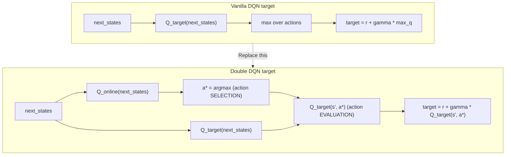

## Concept

Double DQN (van Hasselt et al., 2015) addresses a systematic overestimation
bias in standard DQN by decoupling the **selection** of the best next action
from its **evaluation**.

---

## The Overestimation Bias in DQN

In vanilla DQN, the TD target is computed as:

```
target = r + gamma * max_a' Q_target(s', a')
```

The `max` operator applied to noisy Q-value estimates introduces a positive
bias: even if individual Q(s', a') estimates have symmetric noise, taking the
maximum of many noisy values is systematically higher than the true maximum.

Over many updates, this bias accumulates and inflates Q-values, leading to:
- Overconfident value estimates.
- Suboptimal policies that prefer high-variance actions.
- Training instability in environments with many actions.

---

## The Double DQN Fix

Double DQN modifies the target computation to use **two different networks**
for the two roles:

```
Vanilla DQN:
    a* = argmax_a  Q_target(s', a)    # target selects action
    target = r + gamma * Q_target(s', a*)  # target evaluates action
    (same network does both -> correlated bias)

Double DQN:
    a* = argmax_a  Q_online(s', a)    # online net selects action
    target = r + gamma * Q_target(s', a*)  # target net evaluates action
    (different networks -> bias largely cancelled)
```

Because the two networks are independently updated, their errors are
approximately uncorrelated, and the resulting estimator has much lower bias.

---

## Implementation

Double DQN inherits `DQNAgent` and overrides only `update()`.
The change is a single line in the target computation:

```python
# DQN:
best_q = q_target(next_states).max(dim=1).values

# Double DQN:
best_actions = q_online(next_states).argmax(dim=1)      # online selects
best_q = q_target(next_states).gather(1, best_actions)  # target evaluates
```

All other components (replay buffer, target network hard update, epsilon
decay, checkpointing) are identical to DQN.

---

## Flow Diagram — Difference vs DQN



The `mean_bias_vs_vanilla` diagnostic is logged at DEBUG level each update:
```
[DEBUG] double_dqn_update: mean_bias_vs_vanilla=0.031423
```
A positive value means vanilla DQN would have overestimated.

---

## Expected Improvement Over DQN

On the 10x10 GridWorld with 10 obstacles:

| Metric | DQN | Double DQN |
|--------|-----|-----------|
| Mean Q-value at convergence | Overestimates by ~5–15% | Closer to true value |
| Policy quality (mean eval reward) | Good | Equal or slightly better |
| Training stability | Moderate | More stable (less overestimation noise) |
| Convergence speed | Baseline | Similar or slightly faster |

The improvement is most pronounced in environments with many actions or sparse
rewards, where the overestimation bias is largest.

---

## Key Config Parameters

Identical to DQN (`02_dqn.yaml`), with only the algorithm identifier changed:

```yaml
algorithm: double_dqn    # was: dqn
```

All network, training, buffer, and env parameters are shared with DQN for
a clean apples-to-apples comparison.

---

## Summary

Double DQN is a minimal, high-impact improvement to DQN:
- One extra `argmax` call on the online network.
- No additional parameters or memory.
- Removes a fundamental statistical bias.
- Directly applicable to any DQN-based algorithm (Dueling DQN, Rainbow, etc.).