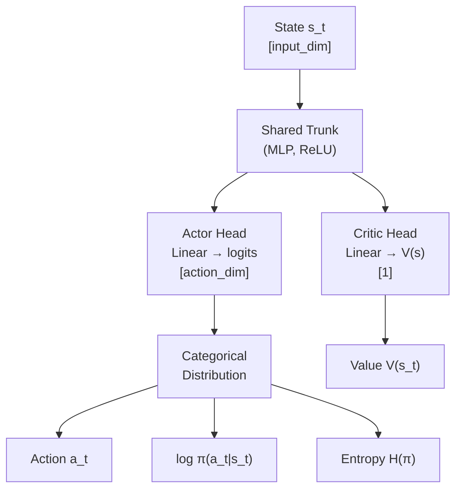

# A2C — Advantage Actor-Critic

## Concept

A2C (Advantage Actor-Critic) is a synchronous, on-policy algorithm that
simultaneously learns a **policy** (the actor) and a **value function** (the
critic). It extends REINFORCE by using the critic's value estimate to compute
an **advantage** — how much better an action was compared to what was expected —
rather than raw cumulative return. This variance reduction is the key insight
that makes A2C more sample-efficient than REINFORCE.

The "synchronous" in A2C means all parallel workers (if any) are updated in
lock-step after every rollout, as opposed to A3C which uses asynchronous
gradient updates.

---

## Advantage Estimation

For a rollout of T steps the **n-step return** is computed backwards:

```
G_t = r_t + γ·r_{t+1} + γ²·r_{t+2} + ... + γ^{T-t}·V(s_T)
```

where `V(s_T)` is the bootstrap value from the critic (zero if the episode ended).

The **advantage**:

```
A_t = G_t - V(s_t)
```

`A_t > 0` means action `a_t` led to a better-than-expected outcome; the actor
is pushed to make it more probable. `A_t < 0` reduces its probability.

---

## Actor-Critic Architecture



The **shared trunk** extracts features used by both heads. This reduces total
parameters and encourages the actor and critic to learn complementary representations.

---

## Combined Loss

```
L_actor  = -E[log π(a|s) · A_t] - α_H · H(π)
L_critic = α_V · MSE(V(s_t), G_t)
L_total  = L_actor + L_critic
```

| Term          | Role                                    |
|---------------|-----------------------------------------|
| Policy gradient | Push actions with positive advantage |
| Entropy bonus  | Prevent premature convergence to a deterministic policy |
| Critic MSE     | Improve the accuracy of the baseline V(s) |

---

## Comparison to REINFORCE

| Property            | REINFORCE             | A2C                          |
|---------------------|-----------------------|------------------------------|
| Baseline            | None (or simple mean) | Learned value function V(s)  |
| Variance            | High                  | Lower (advantage reduces noise) |
| Bias                | Zero                  | Small (bootstrap bias)       |
| Update frequency    | End of episode        | Every n_steps steps          |
| Sample efficiency   | Low                   | Moderate                     |
| Implementation cost | Very low              | Low                          |

The critic acts as a **control variate**: subtracting V(s_t) from the return
does not change the expected gradient but significantly reduces its variance,
leading to faster, more stable learning.

---

## Synchronous vs Asynchronous (A3C)

| Aspect              | A2C (Synchronous)        | A3C (Asynchronous)           |
|---------------------|--------------------------|------------------------------|
| Workers             | Wait for each other      | Update independently         |
| Reproducibility     | High                     | Low (non-deterministic)      |
| GPU utilisation     | Better (batched updates) | Worse (CPU-heavy)            |
| Modern preference   | Yes (simpler, GPU-friendly)| Less common today           |

Modern hardware favours A2C's batched GPU updates over A3C's CPU-heavy async scheme.

---

## Use Case: Path Planning

A2C is well-suited to discrete navigation tasks (grid-world path planning):

- **Short episodes** (200 steps) mean n-step returns are not excessively long.
- **Discrete actions** (up/down/left/right) fit the Categorical policy naturally.
- **Obstacles** in the grid create a non-trivial reward landscape that benefits
  from the critic's learned value function.
- The entropy bonus keeps the policy exploring different routes, avoiding local
  optima caused by the first feasible path found.

---

## Config Parameters

| Parameter          | Default | Effect                                              |
|--------------------|---------|-----------------------------------------------------|
| `learning_rate`    | 3e-4    | Adam step size; too high → unstable, too low → slow |
| `gamma`            | 0.99    | Discount; lower values prioritise immediate rewards |
| `n_steps`          | 20      | Rollout length; longer → less bias, more variance   |
| `entropy_coef`     | 0.01    | Exploration drive; increase if policy collapses     |
| `value_loss_coef`  | 0.5     | Balances critic vs actor gradient magnitudes        |
| `max_grad_norm`    | 0.5     | Gradient clipping threshold                         |
| `hidden_dims`      | [128,128]| Shared trunk capacity                              |

---

## Expected Performance

On a 10×10 grid world with 10 obstacles:
- **Random baseline**: ~5% success rate per episode.
- **A2C after 500 episodes**: typically 50–70% success rate.
- **A2C at convergence (2000 episodes)**: 85–95% success rate.
- **Training time**: ~2–5 minutes on CPU for 2000 episodes.

The advantage baseline typically reduces the variance of gradient estimates by
3–10× compared to vanilla REINFORCE on this task.
