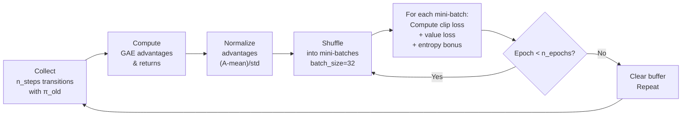

# PPO — Proximal Policy Optimization

## Motivation: Trust Region Without the Constraint

Policy gradient methods suffer from a fundamental instability: a single bad
gradient step can collapse the policy into a degenerate distribution, and
on-policy data collection means the collapsed policy generates all future data,
making recovery impossible.

**Trust Region Policy Optimization (TRPO)** addresses this by constraining each
update to stay within a KL-divergence ball:

```
max  E[r_t(θ) · A_t]   subject to   KL[π_old || π_new] ≤ δ
```

But TRPO requires computing the Fisher Information Matrix, making it expensive.

**PPO replaces the KL constraint with a clipped objective** — simpler, faster,
and nearly as stable:

```
L_clip(θ) = E[ min( r_t(θ)·A_t,  clip(r_t(θ), 1-ε, 1+ε)·A_t ) ]
```

where `r_t(θ) = π_θ(a|s) / π_old(a|s)` is the probability ratio.

The `min` and `clip` together prevent large updates: if the ratio strays far
from 1, the objective stops improving, acting as an implicit trust region.

---

## Clip Objective: Mathematical Intuition

For a positive advantage (`A_t > 0`, action was good):
- We want to increase `π(a|s)`, so `r_t > 1`.
- Clip prevents ratio from exceeding `1 + ε` → limits how much we increase.

For a negative advantage (`A_t < 0`, action was bad):
- We want to decrease `π(a|s)`, so `r_t < 1`.
- Clip prevents ratio from going below `1 - ε` → limits how much we decrease.

```
r_t values:    0.5    0.8    1.0    1.2    1.5    2.0
                 ↕             ↕             ↕
clip range:  [1-ε=0.8 ─────── 1.0 ─────── 1+ε=1.2]
```

Values outside the clip range are treated as constants — their gradient is zero —
so the policy cannot move too far in a single update.

---

## Generalized Advantage Estimation (GAE)

GAE (Schulman et al. 2016) interpolates between TD(0) (low variance, high bias)
and Monte Carlo returns (high variance, zero bias) via the parameter `λ`:

```
δ_t    = r_t + γ·V(s_{t+1})·(1-done_t) - V(s_t)   ← TD residual
A_t^GAE = δ_t + (γλ)·δ_{t+1} + (γλ)²·δ_{t+2} + ...
```

Computed efficiently backwards:

```
A_t = δ_t + γλ(1-done_t)·A_{t+1}
```

| λ value | Bias     | Variance | Behaviour           |
|---------|----------|----------|---------------------|
| λ = 0   | High     | Low      | TD(0) advantage     |
| λ = 1   | Zero     | High     | Full MC advantage   |
| λ = 0.95| Low      | Low      | Typical sweet spot  |

---

## Mini-Batch Update Cycle



Each rollout of `n_steps` transitions is reused for `n_epochs` epochs of
mini-batch gradient updates. This is what distinguishes PPO from A2C
(which uses each rollout only once).

---

## Full PPO Objective

```
L(θ) = L_clip(θ) - c_v · MSE(V(s), G_t) + c_H · H(π)
```

| Term          | Coefficient | Role                         |
|---------------|-------------|------------------------------|
| `L_clip`      | 1.0         | Clipped policy gradient      |
| Value loss    | c_v = 0.5   | Critic accuracy              |
| Entropy bonus | c_H = 0.01  | Exploration encouragement    |

---

## VLM Finetuning Use Case (RLHF Connection)

PPO is the backbone algorithm of **InstructGPT** and many RLHF pipelines:

```
Prompt p → LLM π_θ → Response y → Reward Model r(p, y) → PPO update
```

This tutorial environment models the same structure:

| Production RLHF        | Tutorial VLMEnv                      |
|------------------------|--------------------------------------|
| Tokenized prompt       | 128-dim question embedding           |
| Full token sequence    | Single choice index (0-3)            |
| Reward model score     | +1.0 (correct) / -0.5 (wrong)       |
| LLM being fine-tuned   | Small MLP policy                     |
| KL penalty to ref model| Entropy bonus (approximate analogue) |

The key connection: PPO prevents the policy from collapsing to always picking
choice 0 (mode collapse), just as it prevents an LLM from generating repetitive
or degenerate text.

---

## Key Hyperparameters and Their Effect

| Parameter       | Default | Too High                      | Too Low                  |
|-----------------|---------|-------------------------------|--------------------------|
| `clip_epsilon`  | 0.2     | Large policy swings → unstable | Very slow learning       |
| `n_epochs`      | 4       | Overfitting old data → diverge | Underutilising rollout   |
| `gae_lambda`    | 0.95    | High variance advantages      | Biased advantages        |
| `learning_rate` | 3e-4    | Unstable updates              | Very slow convergence    |
| `n_steps`       | 128     | Delayed updates, staleness    | High update overhead     |
| `entropy_coef`  | 0.01    | Policy stays random           | Premature convergence    |

The `approx_kl` metric logged during updates is the key diagnostic: values
consistently above 0.05 suggest `clip_epsilon` or `learning_rate` is too high.

---

## Comparison to A2C

| Property           | A2C                  | PPO                              |
|--------------------|----------------------|----------------------------------|
| Data reuse         | None (1 pass)        | n_epochs passes per rollout      |
| Stability mechanism| Gradient clipping    | Clipped surrogate objective      |
| Advantage estimate | n-step returns       | GAE (lower variance)             |
| Computation/update | Lower                | Higher (multiple epochs)         |
| Sample efficiency  | Moderate             | Higher                           |
| Typical use        | Fast prototyping     | Production RL, RLHF              |

PPO is generally preferred over A2C when sample efficiency matters (real-world
rollouts are expensive) or when stability is critical (LLM finetuning).
