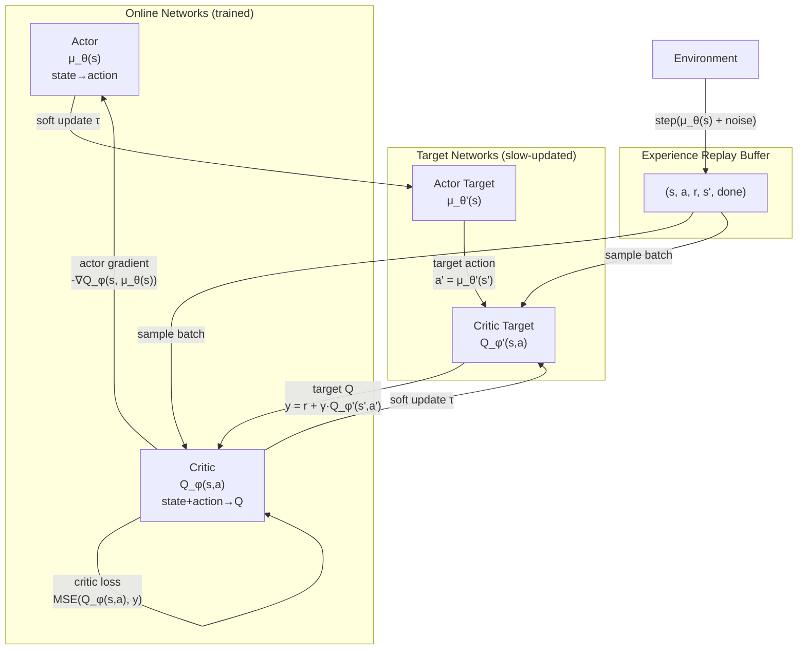

# DDPG — Deep Deterministic Policy Gradient

## Deterministic Policy Gradient Theorem

Standard policy gradient methods work with **stochastic policies** π(a|s) and
require integration over the action space. For high-dimensional continuous
actions this integral becomes computationally intractable.

The **Deterministic Policy Gradient (DPG)** theorem (Silver et al. 2014) shows
that the gradient of a deterministic policy μ_θ(s) can be computed as:

```
∇_θ J(μ_θ) = E_ρ[ ∇_θ μ_θ(s) · ∇_a Q^μ(s,a)|_{a=μ_θ(s)} ]
```

This is the chain rule through the critic: move the action in the direction
that increases Q-value, then move the policy parameters to produce that action.

DDPG (Lillicrap et al. 2016) scales this to deep networks by combining:
1. **Deterministic policy** (no action sampling needed).
2. **Off-policy learning** via experience replay.
3. **Target networks** for stable Bellman targets.

---

## Actor-Critic for Continuous Actions



---

## Experience Replay

DDPG is **off-policy**: transitions are stored in a replay buffer and sampled
uniformly at random for training. This provides two benefits:

1. **Break temporal correlations**: consecutive environment steps are highly
   correlated; random mini-batches decorrelate the training data.
2. **Data reuse**: each transition can be used for multiple gradient updates,
   improving sample efficiency.

The `replay_start` parameter delays training until the buffer has enough
diverse transitions to form meaningful mini-batches.

---

## Target Networks

Without target networks, the Bellman backup target:

```
y = r + γ · Q(s', μ(s'))
```

is computed using the same network being updated. This creates a moving target
and causes oscillations or divergence.

Target networks provide stable targets by updating slowly:

```
θ' ← τ·θ + (1-τ)·θ'    (Polyak averaging, τ ≪ 1)
```

With `τ = 0.005`, the target network changes ~0.5% per step — providing smooth,
lag-stable Bellman targets.

---

## Ornstein-Uhlenbeck (OU) Noise for Exploration

Because the policy is deterministic, explicit exploration noise must be added
during training. OU noise generates **temporally correlated** exploration:

```
dx_t = θ(μ - x_t)dt + σ·dW_t
```

Where:
- `θ = 0.15`: mean-reversion speed (noise returns to μ = 0)
- `σ = policy_noise`: noise intensity (from config)
- `dW_t ~ N(0,1)`: Wiener process increment

For vehicle control, temporally correlated noise is more realistic than i.i.d.
Gaussian noise — a steering perturbation that persists for a few steps explores
different driving trajectories more effectively than random jitter.

---

## Autonomous Vehicle Use Case

DDPG maps naturally to vehicle control:

| RL Component | Vehicle Domain                            |
|--------------|-------------------------------------------|
| State (7-dim) | position (x,y), velocity (vx,vy), heading, distance to goal, obstacle proximity |
| Action (2-dim)| throttle/brake [-1,1], steering angle [-1,1] |
| Reward       | progress toward goal - collision penalty - energy use |
| Done         | reached goal, collision, or max_steps     |

The continuous action space is essential: discrete throttle/steering levels
would create jerky, unrealistic vehicle behaviour.

---

## Key Hyperparameters

| Parameter     | Default | Effect                                               |
|---------------|---------|------------------------------------------------------|
| `actor_lr`    | 1e-3    | Actor learning rate; often lower than critic_lr      |
| `critic_lr`   | 1e-3    | Critic learning rate                                 |
| `tau`         | 0.005   | Soft update speed; too high → unstable targets       |
| `gamma`       | 0.99    | Discount; high for long-horizon navigation           |
| `policy_noise`| 0.1     | OU noise sigma; higher → more exploration            |
| `replay_start`| 1000    | Buffer warm-up steps before training begins          |
| `batch_size`  | 256     | Mini-batch size; larger → more stable gradients      |
| `action_scale`| 1.0     | Tanh output scale (max action magnitude)             |
| `hidden_dims` | [400,300]| Network width; 400 first layer, 300 second          |

The `[400, 300]` architecture follows the original DDPG paper's recommendation
for continuous control tasks.

---

## Limitations

DDPG's main weakness is **Q-value overestimation**: the actor is trained to
maximise the critic's Q-values, but the critic tends to overestimate, leading
the actor toward poor actions that the critic incorrectly rates as good. This
is addressed by TD3 (see `07_td3.md`).
