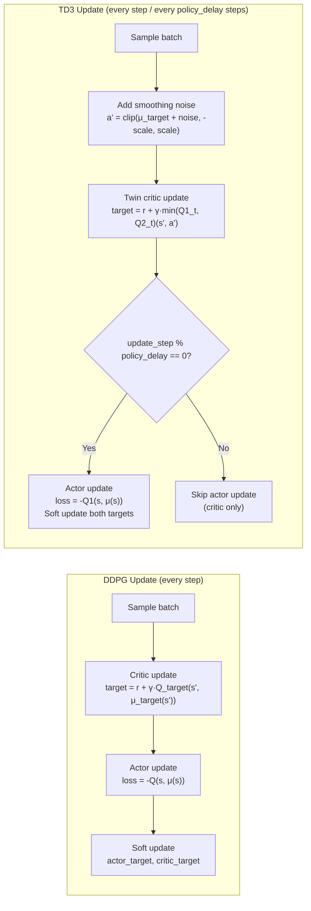

# TD3 — Twin Delayed Deep Deterministic Policy Gradient

## Overview

TD3 (Fujimoto et al. 2018) addresses three failure modes of DDPG with three
targeted improvements. Each improvement is independent and can be understood
separately, but together they produce significantly more stable and reliable
continuous control.

---

## Improvement 1: Twin Critics (Reduces Overestimation Bias)

### The Problem

In DDPG, the actor is updated to maximise `Q(s, μ(s))`. But the critic
systematically **overestimates** Q-values. The actor then chases these inflated
estimates, learning a policy that exploits critic errors rather than the true
environment dynamics.

### Why Overestimation Occurs

The Bellman backup selects the **maximum** Q-value action through the actor:

```
target = r + γ · Q_target(s', μ_target(s'))
```

Any positive noise in the critic's estimate of `Q_target(s', a')` gets
incorporated into the target and propagated backwards through all future
Bellman updates, causing **cumulative positive bias**.

### The Fix

Train **two independent critics** Q1 and Q2, and use the **minimum** in the
Bellman target:

```
a' = μ_target(s') + clipped_noise
y  = r + γ · min(Q1_target(s', a'),  Q2_target(s', a'))
```

The minimum is a pessimistic estimate that counteracts the positive bias.
Q1 and Q2 will make independent errors; taking the minimum propagates the more
conservative (lower) estimate, preventing the actor from exploiting inflated values.

**Mathematical justification**: For independent estimators Q1, Q2 with true
value Q* and noise ε_i ~ N(0, σ²):

```
E[max(Q1, Q2)] = Q* + σ·√(2/π) > Q*    (biased upward)
E[min(Q1, Q2)] = Q* - σ·√(2/π) < Q*    (biased downward, but less bad)
```

Slight underestimation is safer than overestimation because it leads to
conservative policy updates rather than overconfident ones.

---

## Improvement 2: Delayed Policy Updates (Stability)

### The Problem

In DDPG, the actor and critic are updated every single environment step.
Early in training, the critic is inaccurate. Updating the actor based on an
inaccurate critic provides a noisy gradient signal, and the actor may overfit
to the critic's current errors.

### The Fix

Update the actor (and target networks) only every `policy_delay` critic steps:

```
if update_step % policy_delay == 0:
    actor_loss = -mean(Q1(s, μ(s)))
    update actor and both target networks
```

With `policy_delay = 2`, the critic receives twice as many gradient steps as
the actor, ensuring the critic is more accurate before each actor update.

**Intuition**: The critic must "settle" onto a reasonable estimate before the
actor can meaningfully improve by following the critic's gradient.

---

## Improvement 3: Target Policy Smoothing (Regularisation)

### The Problem

If the critic has a sharp peak in Q-value around some action, the actor will
overfit to that peak — converging to a narrow action that the environment may
not actually reward well. This is the continuous analogue of overestimating a
specific action in discrete Q-learning.

### The Fix

Add clipped noise to the **target policy's action** during the Bellman backup:

```
noise    = clip(N(0, σ_policy), -noise_clip, noise_clip)
a'_smooth = clip(μ_target(s') + noise, -action_scale, action_scale)
y = r + γ · min(Q1_target(s', a'_smooth), Q2_target(s', a'_smooth))
```

This forces the critic to assign similar Q-values to nearby actions, smoothing
out any local Q-value peaks. The actor cannot exploit narrow spikes because the
target averages over a region of action space.

---

## DDPG vs TD3 Update Comparison



---

## Expected Improvements Over DDPG

Based on benchmarks from Fujimoto et al. (2018) on continuous control tasks:

| Metric                    | DDPG         | TD3                |
|---------------------------|--------------|--------------------|
| Average Q-value error     | +40% bias    | ~10% bias          |
| Policy collapse rate      | Common (~20%)| Rare (~3%)         |
| Training stability        | Variable     | Consistent         |
| Final performance (MuJoCo)| 3000-6000    | 5000-9000 (avg)    |
| Sensitivity to hyperparams| High         | Moderate           |

The twin critics and delayed updates together remove the feedback loop between
actor exploitation and critic overestimation that causes DDPG to diverge.

---

## Config Parameters

| Parameter       | Default | Effect                                                 |
|-----------------|---------|--------------------------------------------------------|
| `policy_noise`  | 0.2     | Smoothing noise std; higher → more regularization      |
| `noise_clip`    | 0.5     | Max smoothing noise; prevents extreme target actions   |
| `policy_delay`  | 2       | Critic steps per actor step; higher → more stable      |
| `tau`           | 0.005   | Target soft update rate                                |
| `actor_lr`      | 1e-3    | Actor learning rate                                    |
| `critic_lr`     | 1e-3    | Critic learning rate                                   |
| `replay_start`  | 1000    | Minimum buffer transitions before updates begin        |

### Tuning guidance

- Increase `policy_delay` (to 3–4) if Q-values are still overestimating.
- Increase `policy_noise` and `noise_clip` if the actor converges to a single
  action (mode collapse).
- Decrease `tau` if training oscillates; increase if learning is too slow.

---

## Autonomous Vehicle Use Case

TD3 outperforms DDPG in vehicle control because:

1. **Twin critics** prevent the agent from learning "phantom shortcuts" — manoeuvres
   that look good to an overestimating critic but fail in the environment.
2. **Delayed updates** allow the Q-function to accurately model vehicle dynamics
   (inertia, momentum) before the policy is updated.
3. **Smoothing noise** prevents the policy from committing to a specific steering
   angle that only works in exact test conditions (overfitting to critic peaks).

The result is a more robust policy that generalises across different vehicle
configurations and road layouts.
