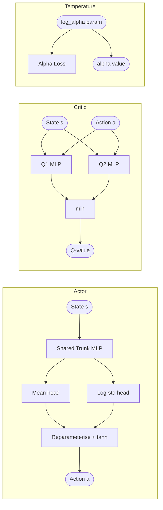

# SAC — Soft Actor-Critic

**Use case:** Autonomous vehicle continuous control  
**Type:** Off-policy, maximum entropy, model-free RL  
**Action space:** Continuous

---

## Overview

Soft Actor-Critic (SAC) [Haarnoja et al., 2018] extends the standard RL objective with an entropy
bonus, encouraging the policy to remain as stochastic as possible while maximising cumulative
reward. This maximum entropy framework yields significantly better exploration and robustness
compared to purely reward-maximising algorithms such as DDPG or TD3.

---

## Maximum Entropy RL Framework

The standard RL objective maximises expected discounted return:

```
J(pi) = E[ sum_t gamma^t * r_t ]
```

SAC augments this with a per-step entropy bonus:

```
J_MaxEnt(pi) = E[ sum_t gamma^t ( r_t + alpha * H(pi(.|s_t)) ) ]
```

where `H(pi(.|s)) = -E_{a~pi}[log pi(a|s)]` is the policy entropy and `alpha` is the
temperature parameter controlling the entropy-reward trade-off.

Benefits of the entropy term:
- Encourages exploration without manual epsilon-greedy schedules
- Prevents premature collapse to a single mode
- Robust behaviour in stochastic or partially-observable environments

---

## Soft Bellman Equations

The soft Q-function satisfies a modified Bellman equation:

```
Q_soft(s,a) = r + gamma * E_{s'}[ V_soft(s') ]
V_soft(s)   = E_{a~pi}[ Q_soft(s,a) - alpha * log pi(a|s) ]
```

Combining these:

```
Q_target(s,a) = r + gamma * (1-done) * ( Q_soft(s', a') - alpha * log pi(a'|s') )
                where a' ~ pi(.|s')
```

The critic is trained to minimise the MSE between its prediction and `Q_target`.

To reduce overestimation bias (a well-known problem in actor-critic methods), SAC uses
**twin Q-networks** (originally from TD3) and takes the minimum:

```
Q_target = r + gamma * (1-done) * ( min(Q1_target, Q2_target) - alpha * log_pi )
```

---

## Automatic Temperature Tuning

A key SAC improvement is treating the temperature `alpha` as a Lagrange multiplier on a
constrained entropy objective:

```
max_pi  E[ sum_t r_t ]
s.t.    E_{pi}[ -log pi(a|s) ] >= H_target   for all t
```

The dual objective for `alpha` is:

```
alpha* = argmin_alpha E_{a~pi*}[ -alpha * log pi*(a|s) - alpha * H_target ]
```

In practice this becomes:

```
L_alpha = -mean( log_alpha * (log_pi + H_target).detach() )
```

where `H_target = -action_dim` is the heuristic target entropy for continuous actions.
`log_alpha` is the learnable parameter (ensures `alpha > 0` via exponentiation).

---

## Reparameterization Trick for Continuous Actions

SAC requires differentiating through the action sampling process. This is achieved via the
reparameterization trick:

```
u = mean(s) + std(s) * eps,   eps ~ N(0, I)
a = tanh(u)
```

The tanh squashing maps unbounded Gaussian samples to `(-1, 1)` and requires a log-probability
correction (change of variables formula):

```
log pi(a|s) = log pi(u|s) - sum_i log(1 - tanh(u_i)^2)
```

This makes the actor loss gradient-computable end-to-end.

---

## Comparison to DDPG / TD3

| Property               | DDPG     | TD3       | SAC        |
|------------------------|----------|-----------|------------|
| Policy                 | Deterministic | Deterministic | Stochastic |
| Entropy regularisation | No       | No        | Yes        |
| Twin critics           | No       | Yes       | Yes        |
| Auto temperature       | —        | —         | Yes        |
| Exploration strategy   | OU noise | noise     | policy entropy |
| Sample efficiency      | Medium   | High      | High       |
| Stability              | Low      | Medium    | High       |

---

## Autonomous Vehicle Use Case

In the `VehicleEnv`, the 2D vehicle must navigate from a random start to a goal position
while avoiding circular obstacles. The action space is `[steering_delta, acceleration]`
in `[-1, 1]`.

SAC is well-suited because:
- The entropy bonus discourages deterministic unsafe policies that overfit to training starts
- Twin critics stabilise training in the dense-reward (progress shaping) setting
- Automatic temperature tuning removes manual entropy tuning for each obstacle configuration

---

## Architecture



---

## Key Hyperparameters

| Parameter        | Default | Description |
|------------------|---------|-------------|
| `actor_lr`       | 3e-4    | Actor network learning rate |
| `critic_lr`      | 3e-4    | Critic network learning rate |
| `alpha_lr`       | 3e-4    | Temperature parameter learning rate |
| `gamma`          | 0.99    | Discount factor |
| `tau`            | 0.005   | Polyak averaging coefficient for target critic |
| `batch_size`     | 256     | Off-policy mini-batch size |
| `replay_start`   | 1000    | Number of transitions before first update |
| `target_entropy` | -2.0    | Heuristic: `-action_dim` for continuous |
| `hidden_dims`    | [256,256] | MLP layer sizes for all networks |
| `buffer.capacity`| 100000  | Replay buffer size |

---

## References

- Haarnoja, T., Zhou, A., Abbeel, P., & Levine, S. (2018). *Soft Actor-Critic: Off-Policy
  Maximum Entropy Deep Reinforcement Learning with a Stochastic Actor.* ICML 2018.
- Haarnoja, T. et al. (2018). *Soft Actor-Critic Algorithms and Applications.* arXiv:1812.05905.
- Fujimoto, S., Hoof, H., & Meger, D. (2018). *Addressing Function Approximation Error in
  Actor-Critic Methods (TD3).* ICML 2018.
