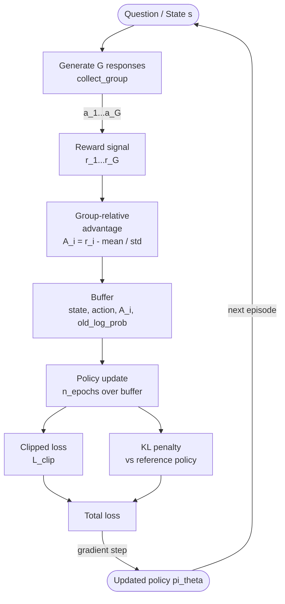

# GRPO — Group Relative Policy Optimization

**Use case:** VLM / LLM fine-tuning (e.g. DeepSeek-R1)  
**Type:** On-policy, critic-free policy gradient  
**Action space:** Discrete (response tokens / choices)

---

## Overview

Group Relative Policy Optimization (GRPO) [DeepSeek-AI, 2024] is the reinforcement learning
algorithm at the core of DeepSeek-R1, the model that demonstrated strong reasoning capability
in large language models. GRPO's central innovation is **eliminating the critic network** —
instead, it estimates policy advantages purely by comparing a group of G sampled outputs for
the same input prompt.

This makes GRPO memory-efficient and avoids the instability of training a separate value
network on high-dimensional LLM state spaces.

---

## Motivation: Why Eliminate the Critic?

In standard PPO, a learned value function `V(s)` provides the baseline for advantage estimation:

```
A_PPO(s,a) = Q(s,a) - V(s)
```

For LLMs/VLMs, training `V(s)` requires an additional model of comparable size to the policy.
This doubles memory usage and adds training instability.

GRPO replaces the per-state value baseline with a **group-level reward baseline**:

```
A_i = (r_i - mean(r_1, ..., r_G)) / (std(r_1, ..., r_G) + eps)
```

This works because:
1. For the *same input*, different outputs have different qualities. The mean is a natural baseline.
2. Normalising by group std makes advantage scale-invariant across reward functions.
3. No additional network is needed — the baseline is statistical.

---

## Connection to DeepSeek-R1

DeepSeek-R1 applies GRPO to fine-tune a language model for chain-of-thought reasoning:

1. For each math problem (state), generate G candidate solutions (responses).
2. Verify each solution against the ground-truth answer → binary reward {0, 1}.
3. Compute group-relative advantages from the G rewards.
4. Update the policy with a clipped objective + KL penalty to a reference model.

The result is a model that improves its own reasoning through self-play — no human annotation
or reward model is required beyond a verifiable reward signal.

---

## Group-Relative Advantage Formula

Given G responses `{a_1, ..., a_G}` for a single state `s`, with rewards `{r_1, ..., r_G}`:

```
mean_r = (1/G) * sum_i r_i
std_r  = sqrt( (1/G) * sum_i (r_i - mean_r)^2 )
A_i    = (r_i - mean_r) / (std_r + eps)
```

Properties:
- Sum of advantages within a group is zero (zero-mean normalisation)
- Better-than-average responses get positive advantage
- Worse-than-average responses get negative advantage
- Independent of absolute reward scale

---

## Policy Update: Clipped Objective + KL Penalty

GRPO uses the PPO clipped surrogate objective applied to group advantages:

```
ratio_i   = pi_theta(a_i | s) / pi_theta_old(a_i | s)
clip_obj_i = min( ratio_i * A_i, clip(ratio_i, 1-eps, 1+eps) * A_i )
L_clip     = -mean_i( clip_obj_i )
```

Plus a KL penalty between the updated policy and a frozen reference policy:

```
KL_approx = mean( log pi_ref(a|s) - log pi_theta(a|s) )
L_total   = L_clip + kl_coef * KL_approx
```

The reference policy is the initial (pre-fine-tuning) checkpoint, preventing the policy
from drifting into degenerate outputs during training.

---

## Comparison to PPO

| Property              | PPO                         | GRPO                        |
|-----------------------|-----------------------------|-----------------------------|
| Advantage estimation  | GAE with learned V(s)       | Group-relative normalisation |
| Critic network        | Required                    | Not needed                  |
| Memory cost           | 2x policy size              | 1x policy size              |
| Exploration           | Entropy bonus (optional)    | Group sampling diversity     |
| Baseline variance     | Low (with good V)           | Medium (depends on G)       |
| LLM applicability     | Expensive                   | Natural fit                 |

---

## VLM Fine-tuning Use Case

In the tutorial `vlm_env`, the state is a question embedding (128D) and actions are
candidate answers (4 choices). The GRPO agent:

1. Generates G=8 candidate answers for each question
2. Receives rewards (+1.0 correct, -0.5 wrong) for each
3. Computes group-relative advantages
4. Updates via clipped policy gradient with KL regularisation to the initial policy

This mimics how DeepSeek-R1 learns to reason: generating multiple hypotheses, rewarding
those that lead to correct verified answers, and updating the policy accordingly.

---

## Training Flow



---

## KL Penalty Purpose

The KL penalty `kl_coef * KL(pi_ref || pi_theta)` serves two roles:

1. **Safety**: Prevents the policy from forgetting how to generate grammatical / coherent text
   by staying close to the base model.
2. **Stability**: Limits how much the policy changes per update, analogous to a trust region
   but computed analytically rather than as a constraint.

For the tutorial discrete case, KL is approximated as:
```
KL ≈ mean( log pi_ref(a|s) - log pi_new(a|s) )
```

This is the reverse KL direction and is unbiased when averaged over many samples.

---

## Key Hyperparameters

| Parameter        | Default | Description |
|------------------|---------|-------------|
| `learning_rate`  | 1e-4    | Policy network learning rate |
| `group_size`     | 8       | G: responses per question per data collection step |
| `clip_epsilon`   | 0.2     | PPO clipping range |
| `n_epochs`       | 1       | Policy update epochs per update() call |
| `kl_coef`        | 0.04    | Coefficient for KL penalty |
| `batch_size`     | 64      | Mini-batch size during policy update |
| `hidden_dims`    | [256,128] | Policy MLP layer sizes |

---

## References

- DeepSeek-AI (2025). *DeepSeek-R1: Incentivizing Reasoning Capability in LLMs via
  Reinforcement Learning.* arXiv:2501.12948.
- Shao, Z. et al. (2024). *DeepSeekMath: Pushing the Limits of Mathematical Reasoning in
  Open Language Models.* arXiv:2402.03300.
- Schulman, J. et al. (2017). *Proximal Policy Optimization Algorithms.* arXiv:1707.06347.
