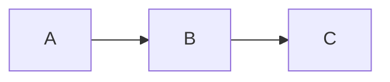

---
# =====================================================================
# COPY THIS FILE to markdowns/<category>/<your-slug>.md
# Fill in all fields, then run:  python py/build.py markdowns/.../<slug>.md
# =====================================================================

title: "Your Post Title"
subtitle: >
  A one or two sentence description shown in the post hero and as the
  HTML meta description. Keep it under 160 characters.

# Category: technical | leadership | community | growth
category: technical

# ISO date: YYYY-MM-DD
date: 2024-01-01

# Tags (lowercase, hyphenated)
tags:
  - tag-one
  - tag-two

# Estimated reading time in minutes
reading_time: 5

author: "Shreedhar Kodate"

# Output path relative to repo root — MUST match the category directory
output: "blogs/technical/posts/your-slug.html"

# CDN libraries to include (optional — builder auto-includes for technical posts)
# requires: [highlight, katex, mermaid]
---

<!--
=====================================================================
WRITING GUIDE
=====================================================================

## Section headers generate the Table of Contents automatically.
## Use ## for top-level sections, ### for sub-sections.

## Code blocks

Fenced with a language identifier for syntax highlighting:

```python
def hello():
    return "world"
```

Supported: python, javascript, bash, yaml, json, sql, r, cpp, java

## Math (KaTeX)

Inline:  $E = mc^2$
Display: $$\sum_{i=1}^{n} x_i$$

## Mermaid diagrams



## Callout boxes

> [!NOTE]
> This is a note callout.

> [!TIP]
> This is a tip callout.

> [!WARN]
> This is a warning callout.

## Blockquote with attribution

> The quote text here.
>
> — Author Name

## Inline citations

Use [^key] in the body, define at the bottom:

See prior work[^smith2020] for background.

## Tables

| Header A | Header B | Header C |
|----------|----------|----------|
| Cell     | Cell     | Cell     |

## Images with captions


*Caption text shown below the image.*
=====================================================================
-->

## Introduction

Write your opening paragraph here. Establish why this topic matters and what
the reader will take away.

## First Section

Your first major section.

### Sub-section

Details within the first section.

## Second Section

Continue building the argument or explanation.

## Conclusion

Summarise the key points and suggest what to explore next.

## References

[^key1]: Author, A. (Year). *Title of work.* Publisher. URL

[^key2]: Author, B., & Author, C. (Year). Article title.
         *Journal Name*, volume(issue), pages.
